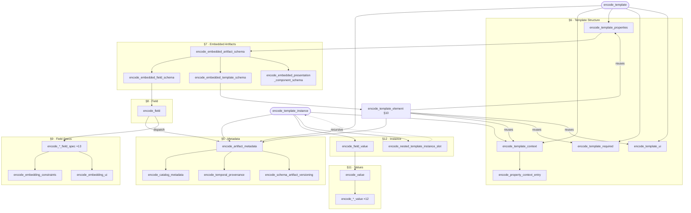

# CTM 1.6.0 Serialization Mapping

## 1. Purpose

This document specifies a one-directional, function-based mapping from the CEDAR Structural Model (defined in `spec/grammar.md`) to CTM 1.6.0 JSON-LD format. The Structural Model remains the authoritative definition of the model; this document defines how constructs in that model are encoded as CTM 1.6.0 JSON-LD values. Each encoding function takes one or more abstract grammar constructs as arguments and produces a JSON value. The functions are defined precisely enough to be directly implementable.

### What CTM 1.6.0 is

CTM 1.6.0 (CEDAR Template Model version 1.6.0) is the concrete JSON-LD format used by the CEDAR Workbench to store and exchange metadata templates and their filled-in instances. A CTM 1.6.0 document is a JSON object that simultaneously serves three roles: it is a **JSON-LD document** (it carries `@context`, `@id`, and `@type` for RDF interpretation), a **JSON Schema document** (it carries `$schema`, `type`, `properties`, and `required` so that conforming instances can be validated), and a **CEDAR-specific descriptor** (it carries `_valueConstraints` and `_ui` keys understood by CEDAR tooling). These three concerns are all mixed into the same flat JSON object rather than being kept separate.

### The abstract model vs. the serialization

The CEDAR Structural Model (`spec/grammar.md`) is the authoritative, format-independent definition of what a template *means*. It describes templates, fields, embedded artifacts, and instances in abstract terms — without committing to any particular wire format. This document defines how to translate that abstract model into CTM 1.6.0 JSON-LD. The mapping is one-directional (abstract → concrete) and lossy in places: some Structural Model constructs have no CTM 1.6.0 equivalent and are dropped (see Section 14).

> **Caution:** This mapping is not round-trippable. Encoding a Structural Model construct to CTM 1.6.0 and then decoding back will not always recover the original construct. See [Section 14](#14-known-gaps-and-lossy-areas) for a full list of known gaps and lossy areas before implementing.

### Key structural ideas

**Templates and fields are separate reusable artifacts.** In the Structural Model, a `Template` does not contain `Field` objects directly — it contains `EmbeddedField` references that point to separately-defined `Field` artifacts. When encoding, information from both the embedding (`EmbeddedField`) and the referenced definition (`Field`) must be combined. Most field schema content (value shape, value constraints, UI hints) ends up inside the template's `"properties"` object, keyed by the embedding's key identifier.

**Embedded artifact information is distributed across four top-level keys.** For each field or nested template in a template, there is no single output key that corresponds to it. Instead its information is spread across `"properties"` (the field schema), `"required"` (whether it is mandatory), `"_ui"` (display order and label overrides), and `"@context"` (the property IRI mapping for JSON-LD). Understanding this distribution is essential to reading the encoding functions correctly.

**The field object carries both schema structure and rendering hints.** Each field's entry inside `"properties"` is itself a JSON object that combines JSON Schema structure (what type of value the field holds, expressed via `"properties"`, `"required"`, `"additionalProperties"`) with CTM-specific keys (`"_valueConstraints"` for validation rules such as required/optional, numeric type, or controlled term sources; `"_ui"` for rendering instructions such as input type and visibility). These are merged into a single flat field object.

**Instance values are plain JSON-LD objects.** A template instance is a flat JSON object whose keys are the field key identifiers from the template. Each key maps to a small JSON-LD value object — typically `{ "@value": "..." }` for text and numeric fields, or `{ "@id": "..." }` for IRI-valued fields. Multi-valued fields produce a JSON array of such objects. The template's `"@context"` is reused in the instance so that each field key resolves to its property IRI for RDF interpretation.

### Call graph

The diagram below shows the main call relationships between encoding functions. Nodes marked `×N` represent a group of similar functions; see the relevant section for the individual entries. Dashed arrows indicate recursion.



---

## 2. Conventions

**Function Signature Form**

```
encode_X(x: X) → JSON-kind
```

`X` is a grammar production name, `x` is the parameter, and `JSON-kind` is one of: Object, String, Array, Number, Boolean, or null.

**JSON Notation in Function Bodies**

- `{ k₁: v₁, k₂: v₂ }` — JSON object literal
- `[ v₁, v₂ ]` — JSON array
- `"..."` — literal string
- `null` — JSON null
- `omit` — the key is absent from the output (not even present as null)

**Accessor Notation**

Dot notation is used on grammar constructs, e.g. `T.schema_artifact_metadata` or `E.embedded_artifact_key`. Where a grammar construct wraps a primitive string (e.g. `Identifier ::= identifier(string)`), write `D.identifier.string` to reach the string value.

**Helper Functions**

- `key(E)` — the ASCII identifier string of `E`'s `EmbeddedArtifactKey`; defined as `E.embedded_artifact_key.ascii_identifier`
- `iri(I)` — the IRI string of an `Iri` construct; defined as `I.iri_string`
- `merge(a, b, ...)` — merge JSON objects left-to-right; later objects take precedence on key conflicts
- `if P then k: v` — include key `k` with value `v` only when predicate `P` holds; otherwise omit
- `[ x(E) for each E in xs ]` — JSON array built by evaluating `x(E)` for each element `E` of sequence `xs`
- `{ k(E): v(E) for each E in xs }` — JSON object built from key-value pairs, one per element (inline form); `xs` must be a plain sequence with no inline filter. In multi-line blocks, the iteration clause comes first: `{ for each E in xs: k(E): v(E) }`
- `let x = expr` — within a function body, binds the name `x` to the value of `expr`; `x` may then be used in subsequent expressions in the same body
- `[ E in xs | P(E) ]` — the subsequence of `xs` retaining only those elements for which predicate `P(E)` holds; used in `let` bindings to pre-filter before passing to a comprehension
- `xs ++ ys` — concatenation of arrays `xs` and `ys`

**Cardinality Helper**

- `is_multi(E)` — true if `E.cardinality` is present and `max_cardinality` is either `UnboundedCardinality` or a `NonNegativeInteger` greater than 1

**Default Conventions**

- When `Cardinality` is absent, effective min = 1, effective max = 1 (single-valued).
- When `ValueRequirement` is absent, effective requirement is `Optional`.

---

## 3. Worked Example

This section traces a minimal template and a corresponding instance through the encoding functions. The goal is to show concretely what the abstract model constructs look like as CTM 1.6.0 JSON-LD, and which functions are responsible for each part of the output.

### 3.1 The Example Model

**Template — "Sample Record"**

| Property | Value |
|---|---|
| `template_id` | `https://repo.example.org/templates/sample-record` |
| Name | `"Sample Record"` |
| Description | `"A minimal metadata template for biological samples"` |
| Version | `1.0.0` |
| Status | `"draft"` |
| Model version | `1.6.0` |
| Created / modified | `2024-01-15T10:00:00Z` by `https://orcid.example.org/0000-0001-2345-6789` |

Two embedded fields:

| Key | Property IRI | ValueRequirement | FieldSpec |
|---|---|---|---|
| `title` | `https://schema.org/name` | `"required"` | `TextFieldSpec` (single line) |
| `count` | `https://example.org/sampleCount` | `Optional` | `IntegerNumberFieldSpec` |

**Instance — "Sample 42"**

| Property | Value |
|---|---|
| `template_instance_id` | `https://repo.example.org/instances/abc123` |
| `schema:name` | `"Sample 42"` |
| Based on | the template above |
| Created / modified | `2024-03-10T09:30:00Z` by `https://orcid.example.org/0000-0001-2345-6789` |
| `title` value | `TextValue` — `"Mouse Sample 42"` |
| `count` value | `NumericValue` — `5` (`xsd:integer`) |

---

### 3.2 Encoding the Template

`encode_template(T)` assembles the output by calling several sub-functions and merging their results. The annotations below identify the responsible function for each part.

```javascript
{
  // encode_template — fixed identity and schema keys
  "@id":    "https://repo.example.org/templates/sample-record",
  "@type":  "https://schema.metadatacenter.org/core/Template",
  "$schema": "http://json-schema.org/draft-04/schema#",
  "type":   "object",
  "title":  "Sample Record",
  "description": "A minimal metadata template for biological samples",
  "additionalProperties": false,

  // encode_template_context — STANDARD_NS plus one entry per embedded field
  // that carries a Property (both do here); encode_property_context_entry
  // returns a plain IRI string when no property_label is present
  "@context": {
    "schema":   "http://schema.org/",
    "pav":      "http://purl.org/pav/",
    "oslc":     "http://open-services.net/ns/core#",
    "bibo":     "http://purl.org/ontology/bibo/",
    "rdfs":     "http://www.w3.org/2000/01/rdf-schema#",
    "skos":     "http://www.w3.org/2004/02/skos/core#",
    "xsd":      "http://www.w3.org/2001/XMLSchema#",
    "title":    "https://schema.org/name",
    "count":    "https://example.org/sampleCount"
  },

  // encode_template_properties — fixed instance-metadata entries followed
  // by one entry per embedded artifact (encode_embedded_field_schema for each)
  "properties": {
    "@context":           { "type": ["object", "null"] },
    "@id":                { "type": "string", "format": "uri" },
    "schema:isBasedOn":   { "type": "string", "format": "uri" },
    "schema:name":        { "type": "string" },
    "schema:description": { "type": ["string", "null"] },
    "pav:createdOn":      { "type": ["string", "null"], "format": "date-time" },
    "pav:createdBy":      { "type": ["string", "null"], "format": "uri" },
    "pav:lastUpdatedOn":  { "type": ["string", "null"], "format": "date-time" },
    "oslc:modifiedBy":    { "type": ["string", "null"], "format": "uri" },
    "title": { /* encode_embedded_field_schema — see Section 3.3 */ },
    "count": { /* encode_embedded_field_schema — see Section 3.3 */ }
  },

  // encode_template_required — fixed keys plus "title" (the only required field)
  "required": [
    "@context", "@id", "schema:isBasedOn", "schema:name",
    "schema:description", "pav:createdOn", "pav:createdBy",
    "pav:lastUpdatedOn", "oslc:modifiedBy",
    "title"
  ],

  // encode_template_ui — order reflects embedded_artifacts sequence
  "_ui": { "order": ["title", "count"] },

  // encode_artifact_metadata — metadata keys merged at top level
  "schema:name":        "Sample Record",
  "schema:description": "A minimal metadata template for biological samples",
  "pav:version":        "1.0.0",
  "bibo:status":        "bibo:draft",
  "schema:schemaVersion": "1.6.0",
  "pav:createdOn":      "2024-01-15T10:00:00Z",
  "pav:createdBy":      "https://orcid.example.org/0000-0001-2345-6789",
  "pav:lastUpdatedOn":  "2024-01-15T10:00:00Z",
  "oslc:modifiedBy":    "https://orcid.example.org/0000-0001-2345-6789"
}
```

---

### 3.3 Encoding the Embedded Fields

Both fields are single-valued ([`is_multi`](#2-conventions) = false), so `encode_embedded_field_schema` returns the field object directly with no array wrapper.

**`title` field** — `encode_text_field_spec` applies `STRING_VALUE_SHAPE`. `encode_embedding_constraints` sets `requiredValue: true` (the embedding is `"required"`). `encode_text_rendering_hint` returns `"textfield"` (absent hint defaults to single-line).

```javascript
{
  "@id":    "https://repo.example.org/fields/title",
  "@type":  "https://schema.metadatacenter.org/core/TemplateField",
  "@context": { /* STANDARD_NS */ },
  "$schema": "http://json-schema.org/draft-04/schema#",
  "type":   "object",
  "title":  "Title",
  "description": "",
  "properties": {
    "@type":  { "oneOf": [{ "type": "string", "format": "uri" }, { "type": "null" }] },
    "@value": { "type": ["string", "null"] }
  },
  "required": ["@value"],
  "additionalProperties": false,
  "_valueConstraints": { "requiredValue": true },
  "_ui":   { "inputType": "textfield" },
  // encode_artifact_metadata for the field:
  "schema:name": "Title", "schema:description": null,
  "pav:version": "1.0.0", "bibo:status": "bibo:draft",
  "schema:schemaVersion": "1.6.0",
  "pav:createdOn": "2024-01-15T10:00:00Z", ...
}
```

**`count` field** — `encode_integer_number_field_spec` applies `NUMBER_VALUE_SHAPE` and emits `"xsd:integer"` for the datatype slot (an integer-number field's category is fixed). `encode_embedding_constraints` sets `requiredValue: false` (Optional).

```javascript
{
  "@id":    "https://repo.example.org/fields/count",
  "@type":  "https://schema.metadatacenter.org/core/TemplateField",
  "@context": { /* STANDARD_NS */ },
  "$schema": "http://json-schema.org/draft-04/schema#",
  "type":   "object",
  "title":  "Sample Count",
  "description": "",
  "properties": {
    "@type":  { "oneOf": [{ "type": "string", "format": "uri" }, { "type": "null" }] },
    "@value": { "type": ["number", "null"] }
  },
  "required": ["@value"],
  "additionalProperties": false,
  "_valueConstraints": { "requiredValue": false, "numberType": "xsd:integer" },
  "_ui":   { "inputType": "numeric" },
  "schema:name": "Sample Count", ...
}
```

---

### 3.4 Encoding the Instance

`encode_template_instance(I, T)` reuses the template context and maps each `FieldValue` using `encode_field_value` → `encode_value`.

```javascript
{
  // reuses encode_template_context(T) — same @context as the template
  "@context": {
    "schema": "http://schema.org/", /* ... STANDARD_NS ... */
    "title":  "https://schema.org/name",
    "count":  "https://example.org/sampleCount"
  },
  "@id":              "https://repo.example.org/instances/abc123",
  "schema:isBasedOn": "https://repo.example.org/templates/sample-record",

  // encode_artifact_metadata
  "schema:name":        "Sample 42",
  "schema:description": null,
  "pav:createdOn":      "2024-03-10T09:30:00Z",
  "pav:createdBy":      "https://orcid.example.org/0000-0001-2345-6789",
  "pav:lastUpdatedOn":  "2024-03-10T09:30:00Z",
  "oslc:modifiedBy":    "https://orcid.example.org/0000-0001-2345-6789",

  // encode_field_value → encode_text_value (no language tag)
  "title": { "@value": "Mouse Sample 42" },

  // encode_field_value → encode_integer_number_value
  "count": { "@value": "5", "@type": "xsd:integer" }
}
```

---

## 4. Standard Namespace Context Object

`STANDARD_NS` is the following JSON object. It is included in every `@context` produced by this mapping.

```json
{
  "schema":   "http://schema.org/",
  "pav":      "http://purl.org/pav/",
  "oslc":     "http://open-services.net/ns/core#",
  "bibo":     "http://purl.org/ontology/bibo/",
  "rdfs":     "http://www.w3.org/2000/01/rdf-schema#",
  "skos":     "http://www.w3.org/2004/02/skos/core#",
  "xsd":      "http://www.w3.org/2001/XMLSchema#"
}
```

`STATIC_FIELD_NS` is the smaller `@context` used by `StaticTemplateField` objects (presentation components). It omits `rdfs`, `skos`, and `xsd`.

```json
{
  "schema":   "http://schema.org/",
  "pav":      "http://purl.org/pav/",
  "bibo":     "http://purl.org/ontology/bibo/",
  "oslc":     "http://open-services.net/ns/core#"
}
```

---

## 5. Metadata Encoding Functions

### `encode_artifact_metadata(A: Artifact) → Object`

CTM 1.6.0 artifacts carry both human-readable metadata and (for schema artifacts) versioning information at the top level of their JSON object. The Structural Model factors these concerns differently: `CatalogMetadata` carries descriptive properties and lifecycle, `SchemaArtifactVersioning` is a parallel top-level slot on schema artifacts, and `Label`/`Title` are rendered-name slots that live as top-level slots on the artifact itself (`Field.label`, `Template.title`, optional `TemplateInstance.label`).

The CTM 1.6.0 encoder flattens all of these into a single flat property set on the artifact's JSON object:

```javascript
merge(
  encode_catalog_metadata(A.catalog_metadata, rendered_name_of(A)),
  encode_temporal_provenance(A.catalog_metadata.lifecycle),
  A is SchemaArtifact ? encode_schema_artifact_versioning(A.versioning) : {}
)
```

Where `rendered_name_of(A)` selects the artifact's rendered display name according to the artifact kind:

- For a `Field`: `A.label` (always present).
- For a `Template`: `A.title` (always present).
- For a `TemplateInstance`: `A.label` if present, otherwise `A.catalog_metadata.preferred_label` if present, otherwise the artifact `id` slug.
- For a `PresentationComponent`: `A.catalog_metadata.preferred_label` if present, otherwise the artifact `id` slug.

**Calls:** [`encode_catalog_metadata`](#encode_catalog_metadatac-catalogmetadata-rendered-multilingualstring-or-null--object), [`encode_temporal_provenance`](#encode_temporal_provenancep-temporalprovenance--object), [`encode_schema_artifact_versioning`](#encode_schema_artifact_versioningv-schemaartifactversioning--object)

---

### `encode_catalog_metadata(C: CatalogMetadata, rendered: MultilingualString or null) → Object`

Encodes the human-readable identity of an artifact. The `schema:name` and `schema:description` keys are always written; `schema:identifier` and `rdfs:label` appear only when set in the Structural Model.

CTM 1.6.0 requires a single-string `schema:name`. The Structural Model carries multiple candidate sources for the artifact's display name (the rendered slot `Label`/`Title` on artifacts that have one, plus the optional catalog slot `CatalogMetadata.preferred_label`). The `rendered` parameter is the rendered name chosen for this artifact by `encode_artifact_metadata`'s `rendered_name_of` rule. The encoder flattens it to a single string by selecting the `en` localization if present, else the first localization entry. The same flattened string is also written to `rdfs:label` for round-trip stability.

Returns a JSON object with the following keys:

| Key | Value | Condition |
|-----------------|---|---|
| `"schema:name"` | `flatten_to_string(rendered)` — prefer `en`, else first entry | Always present; falls back to artifact `id` slug if `rendered` is null |
| `"schema:description"` | `C.description.unicode_string` | `null` if `C.description` absent |
| `"schema:identifier"` | `C.identifier.unicode_string` | Omit if `C.identifier` absent |
| `"rdfs:label"` | `flatten_to_string(C.preferred_label)` if present, else `flatten_to_string(rendered)` | Always present |

`AlternativeLabel` values on `CatalogMetadata` have no direct CTM 1.6.0 equivalent and are omitted on encode.

**Reverse direction (CTM 1.6.0 import).** When importing a CTM 1.6.0 document into the Structural Model, the CTM 1.6.0 `schema:name` is mapped to the artifact's rendered slot — `label` for a `Field` or `TemplateInstance`, `title` for a `Template`. For a `PresentationComponent` (which has no rendered slot), `schema:name` is mapped to `CatalogMetadata.preferred_label`. If the legacy document carries a non-empty `rdfs:label` distinct from `schema:name`, the importer maps `rdfs:label` to `CatalogMetadata.preferred_label` so that the registry display name and the rendered display name can diverge after import; otherwise `preferred_label` is left absent.

---

### `encode_temporal_provenance(P: TemporalProvenance) → Object`

Records when an artifact was created and last modified, and by whom. All four keys are always present; values are ISO 8601 date-time strings and IRI strings respectively.

Returns a JSON object with the following keys:

| Key | Value |
|---|---|
| `"pav:createdOn"` | `P.created_on.iso_8601_date_time_lexical_form` |
| `"pav:createdBy"` | `iri(P.created_by)` |
| `"pav:lastUpdatedOn"` | `P.modified_on.iso_8601_date_time_lexical_form` |
| `"oslc:modifiedBy"` | `iri(P.modified_by)` |

---

### `encode_schema_artifact_versioning(V: SchemaArtifactVersioning) → Object`

Encodes the version number, publication status, and schema format version of a schema artifact. Optional `pav:previousVersion` and `pav:derivedFrom` links are included only when the Structural Model carries them.

Returns a JSON object with the following keys:

| Key | Value | Condition |
|---|---|---|
| `"pav:version"` | `V.version.semantic_version` | Always present |
| `"bibo:status"` | `encode_status(V.status)` | Always present |
| `"schema:schemaVersion"` | `V.model_version.semantic_version` | Always present |
| `"pav:previousVersion"` | `iri(V.previous_version.iri)` | Omit if `V.previous_version` absent |
| `"pav:derivedFrom"` | `iri(V.derived_from.iri)` | Omit if `V.derived_from` absent |

**Calls:** [`encode_status`](#encode_statuss-status--string)

---

### `encode_status(S: Status) → String`

Maps the two-valued `Status` enumeration to its corresponding `bibo:` vocabulary string.

Returns the string corresponding to the `Status` kind:

| `Status` kind | Returns |
|---|---|
| `"draft"` | `"bibo:draft"` |
| `"published"` | `"bibo:published"` |

---

## 6. Template Encoding

### `encode_template(T: Template) → Object`

The top-level template object is the root of a CTM 1.6.0 template document. It is produced by merging several independently constructed fragments into one flat JSON object.

A key characteristic of this encoding is that information about each embedded field is **spread across multiple top-level keys** — it does not appear under a single nested key. For each embedded field `E` referencing a field `F`:

- `"properties"` receives an entry at `key(E)` containing the full field schema (value shape, constraints, and UI hints) produced by `encode_embedded_field_schema`.
- `"required"` receives `key(E)` if the embedding's value requirement is `"required"`.
- `"_ui"` receives `key(E)` in its `"order"` array (and optionally in `"propertyLabels"`), derived from the embedding itself.
- `"@context"` receives `key(E)` mapped to the field's property IRI, if the embedding carries a `Property`.

This means the `_ui` key contains ordering and display information drawn from the *embedding* (`EmbeddedField`), while `properties[key(E)]` contains schema information drawn from the *referenced* `Field`. There is no single place in the output that corresponds one-to-one with an `EmbeddedField` — the embedding's information is hoisted and distributed across these four top-level keys.

```javascript
merge(
  {
    "@id":    iri(T.template_id),
    "@type":  "https://schema.metadatacenter.org/core/Template",
    "@context": encode_template_context(T),
    "$schema": "http://json-schema.org/draft-04/schema#",
    "type":   "object",
    "title":  T.schema_artifact_metadata.artifact_metadata.descriptive_metadata.name.unicode_string,
    "description": T.schema_artifact_metadata.artifact_metadata.descriptive_metadata.description.unicode_string
                   if description is present, else "",
    "properties":  encode_template_properties(T),
    "required":    encode_template_required(T),
    "additionalProperties": false,
    "_ui":    encode_template_ui(T)
  },
  encode_artifact_metadata(T)
)
```

**Calls:** [`encode_template_context`](#encode_template_contextt-template--object), [`encode_template_properties`](#encode_template_propertiest-template--object), [`encode_template_required`](#encode_template_requiredt-template--array), [`encode_template_ui`](#encode_template_uit-template--object), [`encode_artifact_metadata`](#encode_artifact_metadataa-artifact--object)

---

### `encode_template_context(T: Template) → Object`

The `@context` maps compact term names to full IRIs for JSON-LD interpretation. Every template context begins with `STANDARD_NS`. For each data-bearing embedded artifact that carries a `Property`, an additional entry maps the artifact's key string to its property IRI — or to a labelled mapping object if a `property_label` is also present. Artifacts without a `Property` (such as presentation components) contribute no context entry.

```javascript
let embedded_properties = [ E in T.embedded_artifacts
                           | (E is EmbeddedField or E is EmbeddedTemplate) and E.property is present ]

merge(
  STANDARD_NS,
  { key(E): encode_property_context_entry(E.property) for each E in embedded_properties }
)
```

**Calls:** [`encode_property_context_entry`](#encode_property_context_entryp-property--string-or-object)

---

### `encode_property_context_entry(P: Property) → String or Object`

Determines the form of a single entry in the template's `@context`. When only a property IRI is available the entry is a plain string. When a human-readable label is also present the entry is an object with both `@id` and `rdfs:label` to support labelled JSON-LD mapping.

| Condition | Returns |
|---|---|
| `P.property_label` absent | `iri(P.property_iri.iri)` |
| `P.property_label` present | `{ "@id": iri(P.property_iri.iri), "rdfs:label": P.property_label.unicode_string }` |

---

### `encode_template_properties(T: Template) → Object`

Produces the `"properties"` object for the template's JSON Schema layer. This is one of the primary sites where embedded artifacts are encoded — each `EmbeddedField` and `EmbeddedTemplate` in the template contributes exactly one entry here, keyed by its `EmbeddedArtifactKey`.

The output has two parts merged together:

1. **Fixed instance-metadata entries.** Nine fixed keys (`@context`, `@id`, `schema:isBasedOn`, `schema:name`, `schema:description`, and the four provenance keys) are always present. These define the schema for the instance-level metadata properties that every CTM 1.6.0 instance must carry, regardless of what fields the template defines.

2. **One entry per embedded artifact.** For each `EmbeddedArtifact E` in the template, the entry at `key(E)` is produced by `encode_embedded_artifact_schema(E)`. For an `EmbeddedField` this ultimately encodes the value shape, value constraints, and UI input type of the referenced `Field` — meaning the bulk of the field encoding (what kind of value it holds, what type annotations are required, whether it is multi-valued) is expressed here inside `properties`, not at the top level. For an `EmbeddedTemplate` the entry contains the full nested element schema. `EmbeddedPresentationComponent` entries are stubs (`{}`).

```javascript
merge(
  {
    "@context": { "type": ["object", "null"] },
    "@id":      { "type": "string", "format": "uri" },
    "schema:isBasedOn":   { "type": "string", "format": "uri" },
    "schema:name":        { "type": "string" },
    "schema:description": { "type": ["string", "null"] },
    "pav:createdOn":      { "type": ["string", "null"], "format": "date-time" },
    "pav:createdBy":      { "type": ["string", "null"], "format": "uri" },
    "pav:lastUpdatedOn":  { "type": ["string", "null"], "format": "date-time" },
    "oslc:modifiedBy":    { "type": ["string", "null"], "format": "uri" }
  },
  {
    for each E in T.embedded_artifacts:
      key(E): encode_embedded_artifact_schema(E)
  }
)
```

**Calls:** [`encode_embedded_artifact_schema`](#encode_embedded_artifact_schemae-embeddedartifact--object)

---

### `encode_template_required(T: Template) → Array`

Builds the `required` array for the template's JSON Schema. The fixed instance-metadata keys are always required. In addition, any data-bearing embedded artifact whose effective `ValueRequirement` is `"required"` contributes its key to this array.

```javascript
let required_embs = [ E in T.embedded_artifacts
                    | (E is EmbeddedField or E is EmbeddedTemplate)
                      and effective value_requirement of E is "required" ]

[ "@context", "@id", "schema:isBasedOn", "schema:name",
  "schema:description", "pav:createdOn", "pav:createdBy",
  "pav:lastUpdatedOn", "oslc:modifiedBy" ]
++ [ key(E) for each E in required_embs ]
```

---

### `encode_template_ui(T: Template) → Object`

Encodes the `_ui` object for the template. The `order` entry lists all embedded artifact keys in their sequence order, controlling display order in rendering tools. When any embedding carries a label override, a `propertyLabels` map is also included. `Header` and `Footer` on the template are encoded as `"header"` and `"footer"` string keys when present.

```javascript
let label_embs = [ E in T.embedded_artifacts | E.label_override is present ]

merge(
  { "order": [ key(E) for each E in T.embedded_artifacts ] },
  if label_embs is non-empty:
  {
    "propertyLabels": { key(E): E.label_override.label.unicode_string for each E in label_embs }
  },
  if T.header is present: { "header": T.header.unicode_string },
  if T.footer is present: { "footer": T.footer.unicode_string }
)
```

---

## 7. Embedded Artifact Schema Encoding

These functions produce the value placed at `properties[key(E)]` within the containing template or template element.

### `encode_embedded_artifact_schema(E: EmbeddedArtifact) → Object`

Selects the appropriate encoding function based on whether the embedded artifact is a field, a nested template, or a presentation component. The result becomes the value placed at the artifact's key in the parent template's `properties` object.

Dispatches to the encoding function for the `EmbeddedArtifact` kind:

| `EmbeddedArtifact` kind | Encoding function |
|---|---|
| `EmbeddedField` | `encode_embedded_field_schema(E)` |
| `EmbeddedTemplate` | `encode_embedded_template_schema(E)` |
| `EmbeddedPresentationComponent` | `encode_embedded_presentation_component_schema(E)` |

**Calls:** [`encode_embedded_field_schema`](#encode_embedded_field_schemae-embeddedfield--object), [`encode_embedded_template_schema`](#encode_embedded_template_schemae-embeddedtemplate--object), [`encode_embedded_presentation_component_schema`](#encode_embedded_presentation_component_schemae-embeddedpresentationcomponent--object)

---

### `encode_embedded_field_schema(E: EmbeddedField) → Object`

This function is the bridge between the abstract `EmbeddedField` and the CTM 1.6.0 JSON Schema representation that an instance validator will actually use. Its job is to produce the value that goes at `properties[key(E)]` in the containing template.

There are two distinct concerns to resolve here:

**1. Single-valued vs. multi-valued.** The Structural Model represents cardinality on the `EmbeddedField` (the embedding), not on the `Field` definition itself. CTM 1.6.0 expresses multi-valued fields by wrapping the field schema in a JSON Schema array object (`"type": "array", "items": ...`), with optional `minItems` and `maxItems` bounds. Single-valued fields need no wrapper — the field object is used directly. This wrapping decision is therefore made here, at the embedding level, where the cardinality information lives. The [`is_multi(E)`](#2-conventions) helper encapsulates this check.

**2. Merging embedding context into the field encoding.** The `EmbeddedField` also carries embedding-specific properties — most notably whether the field is required and whether it is hidden — that are not part of the reusable `Field` definition. These are passed down to `encode_field` via the `E` parameter so they can be incorporated into `_valueConstraints` and `_ui` within the field object itself.

```javascript
let field_obj = encode_field(referenced_field(E), E)
```

where `referenced_field(E)` is the `Field` identified by the reference in `E`.

```javascript
if is_multi(E):
  {
    "type": "array",
    "items": field_obj,
    if E.cardinality.min_cardinality is present:
      "minItems": E.cardinality.min_cardinality.non_negative_integer.integer_lexical_form (as integer),
    if E.cardinality.max_cardinality is present and not UnboundedCardinality:
      "maxItems": E.cardinality.max_cardinality.non_negative_integer.integer_lexical_form (as integer)
  }

else (single-valued):
  field_obj
```

**Calls:** [`encode_field`](#encode_fieldf-field-e-embeddedfield--object)

---

### `encode_embedded_template_schema(E: EmbeddedTemplate) → Object`

Parallel to `encode_embedded_field_schema`, but for nested template elements. Single-valued embeddings return the element object directly; multi-valued embeddings (determined by [`is_multi(E)`](#2-conventions)) wrap it in an array descriptor with cardinality bounds.

Let `elem_obj` = `encode_template_element(referenced_template(E), E)`.

```javascript
if is_multi(E):
  {
    "type": "array",
    "items": elem_obj,
    if E.cardinality.min_cardinality is present:
      "minItems": E.cardinality.min_cardinality.non_negative_integer.integer_lexical_form (as integer),
    if E.cardinality.max_cardinality is present and not UnboundedCardinality:
      "maxItems": E.cardinality.max_cardinality.non_negative_integer.integer_lexical_form (as integer)
  }

else:
  elem_obj
```

**Calls:** [`encode_template_element`](#encode_template_elementt-template-e-embeddedtemplate--object)

---

### `encode_embedded_presentation_component_schema(E: EmbeddedPresentationComponent) → Object`

Presentation components are encoded as `StaticTemplateField` objects — regular field-like objects with a specific `@type` and no value shape, required array, or `_valueConstraints`. The component's content (HTML, image URL, YouTube identifier) is stored in `_ui._content`.

```javascript
let pc_obj = encode_presentation_component(referenced_presentation_component(E), E)
```

where `referenced_presentation_component(E)` is the `PresentationComponent` identified by the reference in `E`.

```javascript
pc_obj
```

**Calls:** [`encode_presentation_component`](#encode_presentation_componentpc-presentationcomponent-e-embeddedpresentationcomponent--object)

---

### `encode_presentation_component(PC: PresentationComponent, E: EmbeddedPresentationComponent) → Object`

Produces a `StaticTemplateField` object. Unlike regular fields, this object carries no `"properties"`, `"required"`, or `"_valueConstraints"` keys — the component holds no instance data. The `@context` is the smaller `STATIC_FIELD_NS` rather than `STANDARD_NS`.

```javascript
merge(
  {
    "@id":    iri(PC.presentation_component_id),
    "@type":  "https://schema.metadatacenter.org/core/StaticTemplateField",
    "@context": STATIC_FIELD_NS,
    "$schema": "http://json-schema.org/draft-04/schema#",
    "type":   "object",
    "title":  PC.schema_artifact_metadata.artifact_metadata.descriptive_metadata.name.unicode_string,
    "description": PC.schema_artifact_metadata.artifact_metadata.descriptive_metadata.description.unicode_string
                   if present, else "",
    "additionalProperties": false,
    "_ui":    encode_presentation_component_ui(PC)
  },
  encode_artifact_metadata(PC)
)
```

**Calls:** [`encode_presentation_component_ui`](#encode_presentation_component_uipc-presentationcomponent--object), [`encode_artifact_metadata`](#encode_artifact_metadataa-artifact--object)

---

### `encode_presentation_component_ui(PC: PresentationComponent) → Object`

Returns the `_ui` object for a static field. All component kinds carry `"inputType"` and `"_content"`.

| `PresentationComponent` kind | `"inputType"` | `"_content"` |
|---|---|---|
| `PageBreakComponent` | `"page-break"` | `null` |
| `SectionBreakComponent` | `"section-break"` | `null` |
| `RichTextComponent` | `"richtext"` | `PC.html_content.unicode_string` |
| `ImageComponent` | `"image"` | `iri(PC.iri)` |
| `YoutubeVideoComponent` | `"youtube"` | `iri(PC.iri)` |

`ImageComponent.label`, `ImageComponent.description`, `YoutubeVideoComponent.label`, and `YoutubeVideoComponent.description` accessibility metadata are not surfaced in CTM 1.6.0 output (the legacy form has no slot for them). See Section 14, Known Gaps.

---

## 8. Field Encoding

### `encode_field(F: Field, E: EmbeddedField) → Object`

A CTM 1.6.0 field object merges fixed structural keys (`@id`, `@type`, `$schema`, `type`, `title`, `description`), the artifact metadata block, and the field-spec-specific encoding. The embedding `E` is passed to `encode_field_spec` because properties such as `requiredValue` and `hidden` depend on how the field is embedded rather than on the field definition itself.

```javascript
merge(
  {
    "@id":   iri(F.field_id),
    "@type": "https://schema.metadatacenter.org/core/TemplateField",
    "@context": STANDARD_NS,
    "$schema": "http://json-schema.org/draft-04/schema#",
    "type":  "object",
    "title": F.schema_artifact_metadata.artifact_metadata.descriptive_metadata.name.unicode_string,
    "description": F.schema_artifact_metadata.artifact_metadata.descriptive_metadata.description.unicode_string
                   if description is present, else ""
  },
  encode_artifact_metadata(F),
  encode_field_spec(F.field_spec, E)
)
```

`encode_field_spec(FT: FieldSpec, E: EmbeddedField) → Object` is defined per field spec in [Section 9](#9-field-spec-encoding) using a common skeleton with per-type value shape and constraint entries.

**Calls:** [`encode_artifact_metadata`](#encode_artifact_metadataa-artifact--object)

---

## 9. Field Spec Encoding

**Skeleton**

Every standard field spec encoding function returns a fragment — an object with five keys — that gets merged into the full field object by `encode_field`. The skeleton below shows the structure, with placeholders for the parts that vary per field spec:

```javascript
{
  "properties":           <value-shape>,
  "required":             <required>,
  "additionalProperties": false,
  "_valueConstraints":    merge(encode_embedding_constraints(E), <vc-extras>),
  "_ui":                  merge(encode_embedding_ui(E), <ui-extras>)
}
```

The placeholders mean:

- **`<value-shape>`** — a JSON Schema `properties` object describing the keys an instance value for this field must (or may) carry. For example, a text field's instance value is a JSON object with `"@value"` and optionally `"@type"`; a controlled term field's value uses `"@id"` and `"rdfs:label"` instead. Three named shapes (`STRING_VALUE_SHAPE`, `NUMBER_VALUE_SHAPE`, `IRI_VALUE_SHAPE`) cover most field specs; each is defined below.

- **`<required>`** — the JSON Schema `required` array listing which keys from the value shape must be present in an instance value. Most field specs require `["@value"]` or `[]`; the exact list is given per field spec.

- **`<vc-extras>`** — additional keys to merge into `_valueConstraints` beyond the base `requiredValue` flag. For example, a numeric field adds `"numberType"` here; a text field may add `"defaultValue"`, `"minLength"`, etc. When a field spec has no extras, `_valueConstraints` is just `encode_embedding_constraints(E)` directly.

- **`<ui-extras>`** — additional keys to merge into `_ui` beyond the base `hidden` flag. At minimum, every field spec adds `"inputType"` here. Temporal fields also add `"temporalGranularity"` and similar hints.

Field specs that do not follow this skeleton (multi-valued enum and attribute-value) are noted explicitly in their entries.

**Value Shapes**

A value shape is a JSON Schema `properties` object that defines what keys an instance value object for this field spec must or may contain. Rather than repeat the same structures throughout, three shapes are named here and referenced by the per-field-spec entries.

**`STRING_VALUE_SHAPE`** — used by text, date, time, datetime, email, and phone number fields. Instance values carry a string `"@value"` and an optional `"@type"` IRI for typed literals:
```json
{
  "@type":  { "oneOf": [{ "type": "string", "format": "uri" }, { "type": "null" }] },
  "@value": { "type": ["string", "null"] }
}
```

**`NUMBER_VALUE_SHAPE`** — used by numeric fields. Instance values carry a numeric `"@value"` and an `"@type"` IRI identifying the XSD numeric datatype:
```json
{
  "@type":  { "oneOf": [{ "type": "string", "format": "uri" }, { "type": "null" }] },
  "@value": { "type": ["number", "null"] }
}
```

**`IRI_VALUE_SHAPE`** — used by controlled term, link, and external authority fields. Instance values carry an `"@id"` IRI rather than an `"@value"` string, plus an optional human-readable `"rdfs:label"`:
```json
{
  "@type":      { "oneOf": [{ "type": "string", "format": "uri" }, { "type": "null" }] },
  "@id":        { "type": "string", "format": "uri" },
  "rdfs:label": { "type": ["string", "null"] }
}
```

**Embedding Helper Functions**

The two helpers below produce the base content of `_valueConstraints` and `_ui` from the `EmbeddedField` context. Every standard field spec merges these as the starting point before adding its own extras.

### `encode_embedding_constraints(E: EmbeddedField) → Object`

Returns `{ "requiredValue": V }` where `V` depends on the effective value requirement:

| Effective `ValueRequirement` | `"requiredValue"` |
|---|---|
| `"required"` | `true` |
| `"recommended"` or `"optional"` | `false` |

> **Caution:** The `"recommended"` and `"optional"` distinctions from the Structural Model are both encoded as `"requiredValue": false` and are therefore indistinguishable in CTM 1.6.0 output. This is not a JSON Schema concept — `"requiredValue"` is a CEDAR tooling hint only. The JSON Schema `"required"` array (produced by `encode_template_required`) separately handles enforcement, and it too only distinguishes `"required"` from everything else. The `"recommended"`/`"optional"` distinction is entirely lost in this encoding.

### `encode_embedding_ui(E: EmbeddedField) → Object`

Returns a JSON object with the following keys:

| Key | Value | Condition |
|---|---|---|
| `"hidden"` | `true` | Only when `E.visibility = "hidden"`; omit otherwise |

---

**Field Spec Definitions**

### `encode_text_field_spec(FT: TextFieldSpec, E: EmbeddedField) → Object`

Text fields accept free-form string input. The rendering hint determines whether the input is single-line (`textfield`) or multi-line (`textarea`), defaulting to single-line when absent. Optional constraints — default value, length bounds, and a validation regex — are written to `_valueConstraints` only when present in the field definition.

**Value shape:** `STRING_VALUE_SHAPE` | **Required:** `["@value"]`

**`_valueConstraints` extras:**

| Key | Value | Condition |
|---|---|---|
| `"defaultValue"` | `FT.default_value.text_value.lexical_form.unicode_string` | Omit if absent |
| `"minLength"` | `FT.min_length.non_negative_integer (as integer)` | Omit if absent |
| `"maxLength"` | `FT.max_length.non_negative_integer (as integer)` | Omit if absent |
| `"regex"` | `FT.validation_regex.regex_pattern.unicode_string` | Omit if absent |

**`_ui` extras:** `{ "inputType": encode_text_rendering_hint(FT.text_rendering_hint) }`

**Calls:** [`encode_embedding_constraints`](#encode_embedding_constraintse-embeddedfield--object), [`encode_embedding_ui`](#encode_embedding_uie-embeddedfield--object), [`encode_text_rendering_hint`](#encode_text_rendering_hinthint-textrenderinghint-or-absent--string)

### `encode_text_rendering_hint(hint: TextRenderingHint or absent) → String`

Returns the string corresponding to the hint value:

| `TextRenderingHint` value | Returns |
|---|---|
| `"singleLine"` or absent | `"textfield"` |
| `"multiLine"` | `"textarea"` |

---

### `encode_integer_number_field_spec(FT: IntegerNumberFieldSpec, E: EmbeddedField) → Object`

Integer-number fields hold base-10 integer lexical values. The `numberType` key is always written and carries `"xsd:integer"`; the integer category is fixed by the field family.

**Value shape:** `NUMBER_VALUE_SHAPE` | **Required:** `["@value"]`

**`_valueConstraints` extras:**

| Key | Value | Condition |
|---|---|---|
| `"numberType"` | `"xsd:integer"` | Always present |
| `"unitOfMeasure"` | `iri(FT.unit.iri)` | Omit if absent |
| `"minValue"` | `FT.integer_number_min_value.integer_number_value.value (as integer)` | Omit if absent |
| `"maxValue"` | `FT.integer_number_max_value.integer_number_value.value (as integer)` | Omit if absent |

**`_ui` extras:** `{ "inputType": "numeric" }`

`Unit` carries an `Iri` in the Structural Model; CTM 1.6.0 `unitOfMeasure` is a plain string. The IRI string value is used directly.

**Calls:** [`encode_embedding_constraints`](#encode_embedding_constraintse-embeddedfield--object), [`encode_embedding_ui`](#encode_embedding_uie-embeddedfield--object)

### `encode_real_number_field_spec(FT: RealNumberFieldSpec, E: EmbeddedField) → Object`

Real-number fields hold lexical values for one of three real-number kinds (`decimal`, `float`, `double`). The `numberType` key carries the corresponding XSD datatype IRI string.

**Value shape:** `NUMBER_VALUE_SHAPE` | **Required:** `["@value"]`

**`_valueConstraints` extras:**

| Key | Value | Condition |
|---|---|---|
| `"numberType"` | `encode_real_number_datatype(FT.datatype)` | Always present |
| `"unitOfMeasure"` | `iri(FT.unit.iri)` | Omit if absent |
| `"minValue"` | `FT.real_number_min_value.real_number_value.value (as number)` | Omit if absent |
| `"maxValue"` | `FT.real_number_max_value.real_number_value.value (as number)` | Omit if absent |

A `decimalPlaces` hint, when present on the field's `NumericRenderingHint`, is emitted under `_ui` rather than `_valueConstraints`.

**`_ui` extras:** `{ "inputType": "numeric", "decimalPlaces": FT.rendering_hint.decimal_places (as integer; omit if absent) }`

**Calls:** [`encode_embedding_constraints`](#encode_embedding_constraintse-embeddedfield--object), [`encode_embedding_ui`](#encode_embedding_uie-embeddedfield--object), [`encode_real_number_datatype`](#encode_real_number_datataked-realnumberdatatypekind--string)

### `encode_real_number_datatype(K: RealNumberDatatypeKind) → String`

Returns the XSD datatype IRI string corresponding to the CEDAR-native `RealNumberDatatypeKind`:

| `RealNumberDatatypeKind` | Returns |
|---|---|
| `"decimal"` | `"xsd:decimal"` |
| `"float"` | `"xsd:float"` |
| `"double"` | `"xsd:double"` |

---

### `encode_date_field_spec(FT: DateFieldSpec, E: EmbeddedField) → Object`

Date fields encode values at year, year-month, or full-date precision. Both `_valueConstraints.temporalType` (the XSD datatype) and `_ui.temporalGranularity` are derived from the same `DateValueType`. An optional `dateFormat` hint controls the display ordering of day, month, and year components.

**Value shape:** `STRING_VALUE_SHAPE` | **Required:** `["@value"]`

**`_valueConstraints` extras:** `{ "temporalType": encode_date_value_type(FT.date_value_type) }`

**`_ui` extras:**

| Key | Value | Condition |
|---|---|---|
| `"inputType"` | `"temporal"` | Always present |
| `"temporalGranularity"` | `encode_date_granularity(FT.date_value_type)` | Always present |
| `"dateFormat"` | `encode_date_format(FT.date_rendering_hint.date_format)` | Omit if `FT.date_rendering_hint` absent or `date_format` absent |

**Calls:** [`encode_embedding_constraints`](#encode_embedding_constraintse-embeddedfield--object), [`encode_embedding_ui`](#encode_embedding_uie-embeddedfield--object), [`encode_date_value_type`](#encode_date_value_typedvt-datevaluetype--string), [`encode_date_granularity`](#encode_date_granularitydvt-datevaluetype--string), [`encode_date_format`](#encode_date_formatdf-datecomponentorder--string)

### `encode_date_value_type(DVT: DateValueType) → String`

Returns the XSD datatype string for the `DateValueType` kind:

| `DateValueType` kind | Returns |
|---|---|
| `"year"` | `"xsd:gYear"` |
| `"yearMonth"` | `"xsd:gYearMonth"` |
| `"fullDate"` | `"xsd:date"` |

### `encode_date_granularity(DVT: DateValueType) → String`

Returns the `temporalGranularity` string for the `DateValueType` kind:

| `DateValueType` kind | Returns |
|---|---|
| `"year"` | `"year"` |
| `"yearMonth"` | `"month"` |
| `"fullDate"` | `"day"` |

### `encode_date_format(DF: DateComponentOrder) → String`

Returns the `dateFormat` string for the `DateComponentOrder` kind:

| `DateComponentOrder` kind | Returns |
|---|---|
| `"dayMonthYear"` | `"D/M/YYYY"` |
| `"monthDayYear"` | `"M/D/YYYY"` |
| `"yearMonthDay"` | `"YYYY/M/D"` |

---

### `encode_time_field_spec(FT: TimeFieldSpec, E: EmbeddedField) → Object`

Time fields always use the `xsd:time` datatype. The `temporalGranularity` and optional timezone and format hints are placed in `_ui`. The `timezoneEnabled` key is only written when the timezone requirement is explicitly stated; it is omitted when unset.

**Value shape:** `STRING_VALUE_SHAPE` | **Required:** `["@value"]`

**`_valueConstraints` extras:** `{ "temporalType": "xsd:time" }`

**`_ui` extras:**

| Key | Value | Condition |
|---|---|---|
| `"inputType"` | `"temporal"` | Always present |
| `"temporalGranularity"` | `encode_time_precision(FT.time_precision)` | Always present |
| `"timezoneEnabled"` | `true` | Only when `FT.timezone_requirement = "timezoneRequired"` |
| `"timezoneEnabled"` | `false` | Only when `FT.timezone_requirement = "timezoneNotRequired"` |
| `"inputTimeFormat"` | `"12h"` | Only when `FT.time_rendering_hint.time_format = "twelveHour"` |
| `"inputTimeFormat"` | `"24h"` | Only when `FT.time_rendering_hint.time_format = "twentyFourHour"` |

**Calls:** [`encode_embedding_constraints`](#encode_embedding_constraintse-embeddedfield--object), [`encode_embedding_ui`](#encode_embedding_uie-embeddedfield--object), [`encode_time_precision`](#encode_time_precisiontp-timeprecision-or-absent--string)

### `encode_time_precision(TP: TimePrecision or absent) → String`

Returns the `temporalGranularity` string for the `TimePrecision` kind:

| `TimePrecision` kind | Returns |
|---|---|
| `"hourMinute"` | `"minute"` |
| `"hourMinuteSecond"` | `"second"` |
| `"hourMinuteSecondFraction"` | `"decimalSecond"` |
| absent | `"decimalSecond"` |

---

### `encode_datetime_field_spec(FT: DateTimeFieldSpec, E: EmbeddedField) → Object`

Date-time fields always use the `xsd:dateTime` datatype. They follow the same pattern as time fields for timezone and format hints, with granularity derived from `DateTimeValueType` rather than `TimePrecision`.

**Value shape:** `STRING_VALUE_SHAPE` | **Required:** `["@value"]`

**`_valueConstraints` extras:** `{ "temporalType": "xsd:dateTime" }`

**`_ui` extras:**

| Key | Value | Condition |
|---|---|---|
| `"inputType"` | `"temporal"` | Always present |
| `"temporalGranularity"` | `encode_datetime_value_type(FT.datetime_value_type)` | Always present |
| `"timezoneEnabled"` | `true` | Only when `FT.timezone_requirement = "timezoneRequired"` |
| `"timezoneEnabled"` | `false` | Only when `FT.timezone_requirement = "timezoneNotRequired"` |
| `"inputTimeFormat"` | `"12h"` | Only when `FT.date_time_rendering_hint.time_format = "twelveHour"` |
| `"inputTimeFormat"` | `"24h"` | Only when `FT.date_time_rendering_hint.time_format = "twentyFourHour"` |

**Calls:** [`encode_embedding_constraints`](#encode_embedding_constraintse-embeddedfield--object), [`encode_embedding_ui`](#encode_embedding_uie-embeddedfield--object), [`encode_datetime_value_type`](#encode_datetime_value_typedvt-datetimevaluetype--string)

### `encode_datetime_value_type(DVT: DateTimeValueType) → String`

Returns the `temporalGranularity` string for the `DateTimeValueType` kind:

| `DateTimeValueType` kind | Returns |
|---|---|
| `"dateHourMinute"` | `"minute"` |
| `"dateHourMinuteSecond"` | `"second"` |
| `"dateHourMinuteSecondFraction"` | `"decimalSecond"` |

---

### `encode_controlled_term_field_spec(FT: ControlledTermFieldSpec, E: EmbeddedField) → Object`

Controlled term fields constrain values to terms drawn from ontologies, branches of ontologies, named classes, or value sets. The four `_valueConstraints` list keys (`ontologies`, `branches`, `classes`, `valueSets`) are always present, each holding an array that is empty when no sources of that kind are configured. The `multipleChoice: false` flag distinguishes this from multi-valued enum fields.

**Value shape:** `IRI_VALUE_SHAPE` | **Required:** `[]`

**`_valueConstraints` extras:**

| Key | Value | Condition |
|---|---|---|
| `"multipleChoice"` | `false` | Always present |
| `"ontologies"` | `[ encode_ontology_source(S) for each OntologySource S in FT.controlled_term_sources ]` | Always present |
| `"branches"` | `[ encode_branch_source(S) for each BranchSource S in FT.controlled_term_sources ]` | Always present |
| `"classes"` | `[ encode_class_source_entry(C) for each ClassSource S in FT.controlled_term_sources, for each C in S.controlled_term_classes ]` | Always present |
| `"valueSets"` | `[ encode_value_set_source(S) for each ValueSetSource S in FT.controlled_term_sources ]` | Always present |

**`_ui` extras:** `{ "inputType": "textfield" }`

**Calls:** [`encode_embedding_constraints`](#encode_embedding_constraintse-embeddedfield--object), [`encode_embedding_ui`](#encode_embedding_uie-embeddedfield--object), [`encode_ontology_source`](#encode_ontology_sources-ontologysource--object), [`encode_branch_source`](#encode_branch_sources-branchsource--object), [`encode_class_source_entry`](#encode_class_source_entryc-controlledtermclass--object), [`encode_value_set_source`](#encode_value_set_sources-valuesetsource--object)

### `encode_ontology_source(S: OntologySource) → Object`

Returns a JSON object with the following keys:

| Key | Value | Condition |
|---|---|---|
| `"uri"` | `iri(S.ontology_reference.ontology_iri.iri)` | Always present |
| `"acronym"` | `S.ontology_reference.ontology_display_hint.ontology_acronym.unicode_string` | Omit if absent |
| `"name"` | `S.ontology_reference.ontology_display_hint.ontology_name.unicode_string` | Omit if absent |

### `encode_branch_source(S: BranchSource) → Object`

Returns a JSON object with the following keys:

| Key | Value | Condition |
|---|---|---|
| `"uri"` | `iri(S.ontology_reference.ontology_iri.iri)` | Always present |
| `"acronym"` | `S.ontology_reference.ontology_display_hint.ontology_acronym.unicode_string` | Omit if absent |
| `"rootTermUri"` | `iri(S.root_term_iri.iri)` | Always present |
| `"rootTermLabel"` | `S.root_term_label.unicode_string` | Always present |
| `"maxDepth"` | `S.max_traversal_depth.non_negative_integer (as integer)` | Omit if absent |

### `encode_class_source_entry(C: ControlledTermClass) → Object`

Returns a JSON object with the following keys:

| Key | Value | Condition |
|---|---|---|
| `"uri"` | `iri(C.term_iri.iri)` | Always present |
| `"label"` | `C.label.unicode_string` | Always present |
| `"prefLabel"` | `C.label.unicode_string` | Always present |
| `"type"` | `"OntologyClass"` | Always present |
| `"source"` | `iri(C.ontology_reference.ontology_iri.iri)` | Always present |

### `encode_value_set_source(S: ValueSetSource) → Object`

Returns a JSON object with the following keys:

| Key | Value | Condition |
|---|---|---|
| `"identifier"` | `S.value_set_identifier.unicode_string` | Always present |
| `"name"` | `S.value_set_name.unicode_string` | Omit if absent |
| `"uri"` | `iri(S.value_set_iri.iri)` | Omit if absent |

---

### `encode_single_valued_enum_field_spec(FT: SingleValuedEnumFieldSpec, E: EmbeddedField) → Object`

`SingleValuedEnumFieldSpec` declares a closed list of `PermissibleValue` entries. CTM 1.6.0 has no native equivalent for the Structural Model's enum-with-meanings construct: this encoder maps the spec into the legacy `"literals"` list, using each permissible value's canonical `Token` as the legacy literal label. Per-value `Label`, `Description`, and `Meaning` metadata is dropped (see Section 14, Known Gaps). The `multipleChoice: false` flag distinguishes this from the multi-valued enum case.

**Value shape:** `STRING_VALUE_SHAPE` | **Required:** `[]`

**`_valueConstraints` extras:**

| Key | Value | Condition |
|---|---|---|
| `"multipleChoice"` | `false` | Always present |
| `"literals"` | `[ encode_permissible_value(PV) for each PV in FT.permissible_values ]` | Always present |
| `"defaultValue"` | `FT.default_value.token.string` | Omit if absent |

**`_ui` extras:** `{ "inputType": encode_single_valued_enum_rendering_hint(FT.rendering_hint) }`

**Calls:** [`encode_embedding_constraints`](#encode_embedding_constraintse-embeddedfield--object), [`encode_embedding_ui`](#encode_embedding_uie-embeddedfield--object), [`encode_single_valued_enum_rendering_hint`](#encode_single_valued_enum_rendering_hinthint-singlevaluedenumrenderinghint-or-absent--string), [`encode_permissible_value`](#encode_permissible_valuepv-permissiblevalue--object)

### `encode_single_valued_enum_rendering_hint(hint: SingleValuedEnumRenderingHint or absent) → String`

Returns the `inputType` string for the hint value:

| `SingleValuedEnumRenderingHint` value | Returns |
|---|---|
| `"radio"` or absent | `"radio"` |
| `"dropdown"` | `"list"` |

### `encode_permissible_value(PV: PermissibleValue) → Object`

Encodes a single `PermissibleValue` from a `SingleValuedEnumFieldSpec` or `MultiValuedEnumFieldSpec` as a CTM 1.6.0 `literals`-array entry. The legacy entry carries a single label string; the encoder uses the permissible value's `Token` as that label. The `Token` is the canonical wire-form key in the Structural Model and remains the value submitted in instances.

`PermissibleValue.label` and `PermissibleValue.description` localizations are dropped — CTM 1.6.0 has no slot for them on a literals entry. `PermissibleValue.meanings` is also dropped: CTM 1.6.0 literal options carry no ontology binding. See Section 14, Known Gaps.

| Key | Value | Condition |
|---|---|---|
| `"label"` | `PV.token.string` | Always present |

`selectedByDefault` is no longer encoded per option. The Structural Model represents enum defaults at the spec level (`SingleValuedEnumFieldSpec.defaultValue` / `MultiValuedEnumFieldSpec.defaultValues`); these are emitted via `defaultValue` / `defaultValues` keys in `_valueConstraints` rather than as per-option flags. CTM 1.6.0 tooling support for those keys is not guaranteed (see Section 14).

---

### `encode_multi_valued_enum_field_spec(FT: MultiValuedEnumFieldSpec, E: EmbeddedField) → Object`

Multi-valued enum fields allow instances to carry zero or more selected permissible values, so the value schema is wrapped in a JSON Schema array with `minItems: 0`. This field spec does not follow the standard skeleton. The `multipleChoice: true` flag distinguishes this from single-valued enum fields.

As with `encode_single_valued_enum_field_spec`, per-value `Label`, `Description`, and `Meaning` metadata is dropped at the legacy `literals` entries (see Section 14).

This field spec does not follow the standard skeleton. It wraps the value schema in an array:

```javascript
{
  "type": "array",
  "minItems": 0,
  "items": {
    "type": "object",
    "properties": { "@value": { "type": ["string", "null"] } },
    "required": [],
    "additionalProperties": false
  },
  "_valueConstraints": merge(encode_embedding_constraints(E), <vc-extras>),
  "_ui":               merge(encode_embedding_ui(E), <ui-extras>)
}
```

**`_valueConstraints` extras:**

| Key | Value | Condition |
|---|---|---|
| `"multipleChoice"` | `true` | Always present |
| `"literals"` | `[ encode_permissible_value(PV) for each PV in FT.permissible_values ]` | Always present |
| `"defaultValues"` | `[ T.string for each T in FT.default_values ]` | Omit if absent or empty |

**`_ui` extras:** `{ "inputType": encode_multi_valued_enum_rendering_hint(FT.rendering_hint) }`

**Calls:** [`encode_embedding_constraints`](#encode_embedding_constraintse-embeddedfield--object), [`encode_embedding_ui`](#encode_embedding_uie-embeddedfield--object), [`encode_multi_valued_enum_rendering_hint`](#encode_multi_valued_enum_rendering_hinthint-multivaluedenumrenderinghint-or-absent--string), [`encode_permissible_value`](#encode_permissible_valuepv-permissiblevalue--object)

### `encode_multi_valued_enum_rendering_hint(hint: MultiValuedEnumRenderingHint or absent) → String`

Returns the `inputType` string for the hint value:

| `MultiValuedEnumRenderingHint` value | Returns |
|---|---|
| `"checkbox"` or absent | `"checkbox"` |
| `"multiSelect"` | `"list"` |

---

### `encode_link_field_spec(FT: LinkFieldSpec, E: EmbeddedField) → Object`

Link fields hold a URI value with an optional human-readable label. They use `IRI_VALUE_SHAPE` and the `link` input type with no additional value constraints.

**Value shape:** `IRI_VALUE_SHAPE` | **Required:** `[]` | **`_valueConstraints` extras:** none | **`_ui` extras:** `{ "inputType": "link" }`

**Calls:** [`encode_embedding_constraints`](#encode_embedding_constraintse-embeddedfield--object), [`encode_embedding_ui`](#encode_embedding_uie-embeddedfield--object)

---

### `encode_email_field_spec(FT: EmailFieldSpec, E: EmbeddedField) → Object`

Email fields hold a string value interpreted as an email address. They use `STRING_VALUE_SHAPE` and the `email` input type with no additional value constraints.

**Value shape:** `STRING_VALUE_SHAPE` | **Required:** `[]` | **`_valueConstraints` extras:** none | **`_ui` extras:** `{ "inputType": "email" }`

**Calls:** [`encode_embedding_constraints`](#encode_embedding_constraintse-embeddedfield--object), [`encode_embedding_ui`](#encode_embedding_uie-embeddedfield--object)

---

### `encode_phone_number_field_spec(FT: PhoneNumberFieldSpec, E: EmbeddedField) → Object`

Phone number fields hold a string value interpreted as a phone number. They use `STRING_VALUE_SHAPE` and the `phone-number` input type with no additional value constraints.

**Value shape:** `STRING_VALUE_SHAPE` | **Required:** `[]` | **`_valueConstraints` extras:** none | **`_ui` extras:** `{ "inputType": "phone-number" }`

**Calls:** [`encode_embedding_constraints`](#encode_embedding_constraintse-embeddedfield--object), [`encode_embedding_ui`](#encode_embedding_uie-embeddedfield--object)

---

**External Authority Field Specs**

External authority fields identify entities from well-known registries such as ORCID, ROR, DOI, PubMed, RRID, and NIH Grant. All six types use `IRI_VALUE_SHAPE` and differ only in the `inputType` string written to `_ui`. They share the same skeleton entry:

**Value shape:** `IRI_VALUE_SHAPE` | **Required:** `[]` | **`_valueConstraints` extras:** none | **`_ui` extras:** `{ "inputType": encode_external_authority_input_type(FT) }`

### `encode_external_authority_field_spec(FT: ExternalAuthorityFieldSpec, E: EmbeddedField) → Object`

Applies the skeleton with the above parameters.

**Calls:** [`encode_embedding_constraints`](#encode_embedding_constraintse-embeddedfield--object), [`encode_embedding_ui`](#encode_embedding_uie-embeddedfield--object), [`encode_external_authority_input_type`](#encode_external_authority_input_typeft-externalauthorityfieldtype--string)

### `encode_external_authority_input_type(FT: ExternalAuthorityFieldSpec) → String`

Returns the `inputType` string for the field spec kind:

| `ExternalAuthorityFieldSpec` kind | Returns |
|---|---|
| `OrcidFieldSpec` | `"orcid"` |
| `RorFieldSpec` | `"ror"` |
| `DoiFieldSpec` | `"doi"` |
| `PubMedIdFieldSpec` | `"pubmed"` |
| `RridFieldSpec` | `"rrid"` |
| `NihGrantIdFieldSpec` | `"nih-grant"` |

> **Caution:** The `inputType` string values for external authority fields are not standardised in the published CTM 1.6.0 specification. The values in the table above reflect common practice but MUST be confirmed against the deployed CTM 1.6.0 implementation before use. Encoding with incorrect `inputType` values may cause CEDAR tooling to misrender or reject these fields.

---

### `encode_attribute_value_field_spec(FT: AttributeValueFieldSpec, E: EmbeddedField) → Object`

Attribute-value fields hold dynamic key-value pairs whose attribute names are not known at schema definition time. CTM 1.6.0 represents this with a top-level array type and defers the dynamic key handling to the instance level via `additionalProperties`. This field spec does not follow the standard skeleton.

This field spec does not follow the standard skeleton. It uses a top-level array type:

```javascript
{
  "type": "array",
  "items": { "type": "string" },
  "minItems": 0,
  "additionalProperties": false,
  "_valueConstraints": merge(encode_embedding_constraints(E), { "requiredValue": false }),
  "_ui":               merge(encode_embedding_ui(E), { "inputType": "attribute-value" })
}
```

The instance representation of `AttributeValue` fields in CTM 1.6.0 uses `additionalProperties` at the instance level rather than a structured value schema. See Section 14, Known Gaps.

**Calls:** [`encode_embedding_constraints`](#encode_embedding_constraintse-embeddedfield--object), [`encode_embedding_ui`](#encode_embedding_uie-embeddedfield--object)

---

## 10. Template Element Encoding

When a `Template` is referenced by an `EmbeddedTemplate`, it is encoded as a CTM 1.6.0 template element object.

### `encode_template_element(T: Template, E: EmbeddedTemplate) → Object`

When a `Template` is used as a nested element, it is encoded identically to a top-level template except that `@type` becomes `TemplateElement`. All sub-functions (`encode_template_context`, `encode_template_properties`, `encode_template_required`, `encode_template_ui`) operate identically regardless of nesting depth.

```javascript
merge(
  {
    "@id":    iri(T.template_id),
    "@type":  "https://schema.metadatacenter.org/core/TemplateElement",
    "@context": encode_template_context(T),
    "$schema": "http://json-schema.org/draft-04/schema#",
    "type":   "object",
    "title":  T.schema_artifact_metadata.artifact_metadata.descriptive_metadata.name.unicode_string,
    "description": T.schema_artifact_metadata.artifact_metadata.descriptive_metadata.description.unicode_string
                   if description is present, else "",
    "properties":  encode_template_properties(T),
    "required":    encode_template_required(T),
    "additionalProperties": false,
    "_ui":    encode_template_ui(T)
  },
  encode_artifact_metadata(T)
)
```

`encode_template_context`, `encode_template_properties`, `encode_template_required`, and `encode_template_ui` are as defined in Section 6 and operate identically on `Template` constructs whether they are top-level templates or nested template elements.

**Calls:** [`encode_template_context`](#encode_template_contextt-template--object), [`encode_template_properties`](#encode_template_propertiest-template--object), [`encode_template_required`](#encode_template_requiredt-template--array), [`encode_template_ui`](#encode_template_uit-template--object), [`encode_artifact_metadata`](#encode_artifact_metadataa-artifact--object)

---

## 11. Value Encoding (Instance Level)

These functions encode `Value` constructs as they appear within a `TemplateInstance`.

### `encode_value(V: Value) → Object`

All value types are encoded as JSON objects, though the specific keys differ by type. This function dispatches to the appropriate type-specific encoder.

Dispatches to the encoding function for the `Value` kind:

| `Value` kind | Encoding function |
|---|---|
| `TextValue` | `encode_text_value(V)` |
| `IntegerNumberValue` | `encode_integer_number_value(V)` |
| `RealNumberValue` | `encode_real_number_value(V)` |
| `BooleanValue` | `encode_boolean_value(V)` |
| `DateValue` | `encode_date_value(V)` |
| `TimeValue` | `encode_time_value(V)` |
| `DateTimeValue` | `encode_datetime_value(V)` |
| `ControlledTermValue` | `encode_controlled_term_value(V)` |
| `EnumValue` | `encode_enum_value(V)` |
| `LinkValue` | `encode_link_value(V)` |
| `EmailValue` | `encode_email_value(V)` |
| `PhoneNumberValue` | `encode_phone_number_value(V)` |
| `ExternalAuthorityValue` | `encode_external_authority_value(V)` |
| `AttributeValue` | `encode_attribute_value(V)` |

**Calls:** [`encode_text_value`](#encode_text_valuev-textvalue--object), [`encode_integer_number_value`](#encode_integer_number_valuev-integernumbervalue--object), [`encode_real_number_value`](#encode_real_number_valuev-realnumbervalue--object), `encode_boolean_value`, [`encode_date_value`](#encode_date_valuev-datevalue--object), [`encode_time_value`](#encode_time_valuev-timevalue--object), [`encode_datetime_value`](#encode_datetime_valuev-datetimevalue--object), [`encode_controlled_term_value`](#encode_controlled_term_valuev-controlledtermvalue--object), [`encode_enum_value`](#encode_enum_valuev-enumvalue--object), [`encode_link_value`](#encode_link_valuev-linkvalue--object), [`encode_email_value`](#encode_email_valuev-emailvalue--object), [`encode_phone_number_value`](#encode_phone_number_valuev-phonenumbervalue--object), [`encode_external_authority_value`](#encode_external_authority_valuev-externalauthorityvalue--object), [`encode_attribute_value`](#encode_attribute_valuev-attributevalue--object)

---

### `encode_text_value(V: TextValue) → Object`

Returns a JSON object whose keys depend on whether `V` carries a language tag:

| Condition | `"@value"` source | `"@language"` |
|---|---|---|
| `V.lang` absent | `V.value.unicode_string` | Omit |
| `V.lang` present | `V.value.unicode_string` | `V.lang.bcp_47_tag` |

---

### `encode_integer_number_value(V: IntegerNumberValue) → Object`

Integer-number instance values carry a base-10 integer lexical form. The XSD datatype IRI is fixed at `"xsd:integer"`.

```javascript
{
  "@value": V.value.unicode_string,
  "@type":  "xsd:integer"
}
```

### `encode_real_number_value(V: RealNumberValue) → Object`

Real-number instance values carry both a lexical form and an explicit `RealNumberDatatypeKind`. The kind is mapped to the corresponding XSD datatype IRI string by `encode_real_number_datatype`.

```javascript
{
  "@value": V.value.unicode_string,
  "@type":  encode_real_number_datatype(V.datatype)
}
```

---

### `encode_date_value(V: DateValue) → Object`

Returns `{ "@value": <literal>, "@type": <xsd-type> }` where the sources depend on the `DateValue` kind:

| `DateValue` kind | `"@value"` source | `"@type"` |
|---|---|---|
| `YearValue` | `V.value` | `"xsd:gYear"` |
| `YearMonthValue` | `V.value` | `"xsd:gYearMonth"` |
| `FullDateValue` | `V.full_date_literal.lexical_form.string` | `"xsd:date"` |

---

### `encode_time_value(V: TimeValue) → Object`

Time instance values always use the `xsd:time` datatype. The lexical form is written directly from the time literal.

```javascript
{ "@value": V.time_literal.lexical_form.unicode_string, "@type": "xsd:time" }
```

---

### `encode_datetime_value(V: DateTimeValue) → Object`

Date-time instance values always use the `xsd:dateTime` datatype. The lexical form is written directly from the date-time literal.

```javascript
{ "@value": V.date_time_literal.lexical_form.unicode_string, "@type": "xsd:dateTime" }
```

---

### `encode_controlled_term_value(V: ControlledTermValue) → Object`

Returns a JSON object with the following keys:

| Key | Value | Condition |
|---|---|---|
| `"@id"` | `iri(V.term_iri.iri)` | Always present |
| `"rdfs:label"` | `V.label.unicode_string` | Omit if absent |
| `"skos:notation"` | `V.notation.unicode_string` | Omit if absent |
| `"skos:prefLabel"` | `V.preferred_label.unicode_string` | Omit if absent |

---

### `encode_enum_value(V: EnumValue) → Object`

Encodes an `EnumValue` as a CTM 1.6.0 string-shaped JSON-LD value. The `Token` carried by the `EnumValue` is emitted under `"@value"`. CTM 1.6.0 has no native concept of an enum value distinct from a string literal — the legacy form treats the submitted token as a plain string, with conformance to the spec's permissible-value list enforced at the schema layer (the `literals` array under `_valueConstraints`).

```javascript
{ "@value": V.token.string }
```

Per-value `Meaning` bindings carried by the source spec are not surfaced at the instance: the legacy wire form has no slot for them. Consumers that need ontology meanings MUST consult the source `EnumFieldSpec`.

**Calls:** none.

---

### `encode_link_value(V: LinkValue) → Object`

Returns a JSON object with the following keys:

| Key | Value | Condition |
|---|---|---|
| `"@id"` | `iri(V.iri)` | Always present |
| `"rdfs:label"` | first localization of `V.label` (lexical form only) | Omit if `V.label` absent |

CTM 1.6.0's `rdfs:label` slot accepts a single string only. When `V.label` is a multi-localization `MultilingualString`, the first entry is emitted; remaining localizations are dropped. See Section 14, Known Gaps.

---

### `encode_email_value(V: EmailValue) → Object`

Email instance values are plain string objects with a single `@value` key. No type annotation is included.

```javascript
{ "@value": V.simple_literal.lexical_form.unicode_string }
```

---

### `encode_phone_number_value(V: PhoneNumberValue) → Object`

Phone number instance values are plain string objects with a single `@value` key. No type annotation is included.

```javascript
{ "@value": V.simple_literal.lexical_form.unicode_string }
```

---

### `encode_external_authority_value(V: ExternalAuthorityValue) → Object`

Each kind produces `{ "@id": <iri>, "rdfs:label": <label> }` where `"rdfs:label"` is omitted when `V.label` is absent.

| `ExternalAuthorityValue` kind | `"@id"` source |
|---|---|
| `OrcidValue` | `iri(V.orcid_iri.iri)` |
| `RorValue` | `iri(V.ror_iri.iri)` |
| `DoiValue` | `iri(V.doi_iri.iri)` |
| `PubMedIdValue` | `iri(V.pub_med_iri.iri)` |
| `RridValue` | `iri(V.rrid_iri.iri)` |
| `NihGrantIdValue` | `iri(V.nih_grant_iri.iri)` |

---

### `encode_attribute_value(V: AttributeValue) → Object`

```javascript
{ V.attribute_name.unicode_string: encode_value(V.value) }
```

Nested `AttributeValue` constructs produce nested objects. Multiple `AttributeValue` entries for the same instance field are merged into a single flat or nested JSON object in the CTM 1.6.0 representation.

---

## 12. Instance Encoding

### `encode_template_instance(I: TemplateInstance, T: Template) → Object`

A template instance is encoded by reusing the template's `@context`, writing instance identity and provenance metadata, and then encoding each field value and nested template instance slot. The template `T` is required as a parameter because the context and embedded artifact structure are derived from it rather than from the instance itself.

```javascript
let fvs  = [ IV in I.instance_values | IV is FieldValue ]
let ntis = [ IV in I.instance_values | IV is NestedTemplateInstance ]
let emb_fields     = [ E in T.embedded_artifacts | E is EmbeddedField ]
let emb_templates  = [ E in T.embedded_artifacts | E is EmbeddedTemplate ]

merge(
  {
    "@context":         encode_template_context(T),
    "@id":              iri(I.template_instance_id),
    "schema:isBasedOn": iri(T.template_id)
  },
  encode_artifact_metadata(I.artifact_metadata),
  { for each EF in emb_fields:
      EF.key: encode_field_value(fv(EF), EF) },
  { for each ET in emb_templates:
      ET.key: encode_nested_template_instance_slot(ntis_for(ET), ET) }
)
```

where `fv(EF)` denotes the `FieldValue` in `fvs` whose key equals `EF.key`, and `ntis_for(ET)` denotes `[ NTI in ntis | NTI.key = ET.key ]`.

**Calls:** [`encode_template_context`](#encode_template_contextt-template--object), [`encode_artifact_metadata`](#encode_artifact_metadatam-artifactmetadata--object), [`encode_field_value`](#encode_field_valuefv-fieldvalue-ef-embeddedfield--object-or-array), [`encode_nested_template_instance_slot`](#encode_nested_template_instance_slotntis-nestedtemplateinstance-et-embeddedtemplate--object-or-array)

---

### `encode_field_value(FV: FieldValue, EF: EmbeddedField) → Object or Array`

Encodes a single field's data within an instance. When the field is multi-valued (per [`is_multi(EF)`](#2-conventions)) the result is a JSON array of encoded values; when single-valued it is a single encoded value object.

> **Caution:** Consumers of CTM 1.6.0 instances must handle both forms at any given field key — either a plain JSON object or a JSON array. A consumer that always expects an object will silently misread or discard data for multi-valued fields. The cardinality information needed to know which form to expect is carried in the template schema (the `"type": "array"` wrapper on the field entry in `"properties"`), not in the instance itself.

```javascript
if is_multi(EF):
  [ encode_value(V) for each V in FV.values ]

else:
  encode_value(first(FV.values))
```

**Calls:** [`encode_value`](#encode_valuev-value--object)

---

### `encode_nested_template_instance_slot(NTIs: NestedTemplateInstance+, ET: EmbeddedTemplate) → Object or Array`

Encodes a nested template slot within a parent instance. Multi-valued embeddings (per [`is_multi(ET)`](#2-conventions)) produce a JSON array of encoded child instances; single-valued embeddings produce a single child instance object. Encoding recurses through `encode_template_instance`.

Let `RT` = the referenced `Template` of `ET`.

```javascript
if is_multi(ET):
  [ encode_template_instance(NTI, RT) for each NTI in NTIs ]

else:
  encode_template_instance(first(NTIs), RT)
```

**Calls:** [`encode_template_instance`](#encode_template_instancei-templateinstance-t-template--object)

---

## 13. Annotations

`Annotation` constructs on `CatalogMetadata` have no standardised CTM 1.6.0 equivalent. They are encoded as top-level properties on the artifact object using the annotation name IRI as the JSON key.

### `encode_annotation(A: Annotation) → { key: value }`

```javascript
key:   iri(A.property)

value: if A.body is AnnotationStringValue:
         { "@value": A.body.value, "@language"?: A.body.lang }
         (or the raw lexical form string if simpler form is preferred)
       if A.body is AnnotationIriValue:
         iri(A.body.iri)
```

Implementations SHOULD confirm that annotation IRI keys are valid within the CTM 1.6.0 `@context` before including them.

---

## 14. Known Gaps and Lossy Areas

1. **`skos:prefLabel` on `StaticTemplateField`** — Real CTM 1.6.0 output includes a `skos:prefLabel` key at the top level of static field objects (presentation components). This is not currently produced by `encode_presentation_component` because `encode_artifact_metadata` maps preferred labels to `rdfs:label`. The relationship between the Structural Model's `preferred_label` and CTM 1.6.0's `skos:prefLabel` on static fields needs clarification.

2. **`propertyDescriptions` in `_ui`** — Real CTM 1.6.0 templates include a `"propertyDescriptions"` map inside `_ui`, keyed by embedded artifact key, containing the description/help text for each field. This is not currently produced by `encode_template_ui`. The source of these descriptions (whether from the `EmbeddedField` or the referenced `Field`) needs to be confirmed and the function updated accordingly.

3. **`AlternativeLabel*` on `DescriptiveMetadata`** — No CTM 1.6.0 equivalent; omitted.

4. **`PermissibleValue` metadata** — CTM 1.6.0 `literals`-array entries carry only a single `label` string, with no slot for per-value `Description`, ontology `Meaning` bindings, or multilingual `Label` localizations. `encode_permissible_value` drops all of these and emits the value's canonical `Token` as the legacy `label`. Spec-level enum defaults (`SingleValuedEnumFieldSpec.defaultValue` and `MultiValuedEnumFieldSpec.defaultValues`) are emitted as `defaultValue` / `defaultValues` keys under `_valueConstraints`; CTM 1.6.0 tooling support for those keys is not guaranteed. The legacy `selectedByDefault` per-option flag is no longer produced — the Structural Model now represents enum defaults exclusively at the spec level. Embedding-level defaults (`EmbeddedSingleValuedEnumField.defaultValue` / `EmbeddedMultiValuedEnumField.defaultValue`) have no CTM 1.6.0 equivalent and are dropped.

5. **Default values for link, email, phone number, and external authority field specs** — CTM 1.6.0 `_valueConstraints.defaultValue` is primarily defined for text fields. Default value encoding for `LinkDefaultValue`, `EmailDefaultValue`, `PhoneNumberDefaultValue`, and external authority defaults is implementation-defined.

6. **`AttributeValue` instance representation** — CTM 1.6.0 uses `additionalProperties` on the instance object for attribute-value fields. The instance-level encoding of `AttributeValue` injects key-value pairs directly into the parent instance object rather than nesting them under a field key.

7. **`Recommended` vs `Optional`** — Both map to `"requiredValue": false` in `_valueConstraints` and neither contributes to the `"required"` array. The distinction is entirely lost in CTM 1.6.0 output.

8. **`Unit` as IRI** — CTM 1.6.0 `unitOfMeasure` is a plain string. The IRI string value is used directly; any human-readable label associated with `Unit` is omitted.

9. **Language-tagged text values** — CTM 1.6.0 does not model language-tagged strings explicitly. The `@language` key is included in the encoded value object as a JSON-LD extension; support in CTM 1.6.0 tooling is not guaranteed.

10. **External authority `inputType` values** — The `inputType` string values for ORCID, ROR, DOI, PubMed, RRID, and NIH Grant fields are not standardised in the published CTM 1.6.0 specification and SHOULD be confirmed against the deployed implementation.

11. **`ImageComponent` and `YoutubeVideoComponent` accessibility metadata** — The `label` (alt text / caption title) and `description` (longer accessibility text) slots on `ImageComponent` and `YoutubeVideoComponent` have no CTM 1.6.0 equivalent and are dropped. Conforming consumers that require accessibility metadata MUST work with the Structural Model wire form rather than the CTM 1.6.0 mapping.
