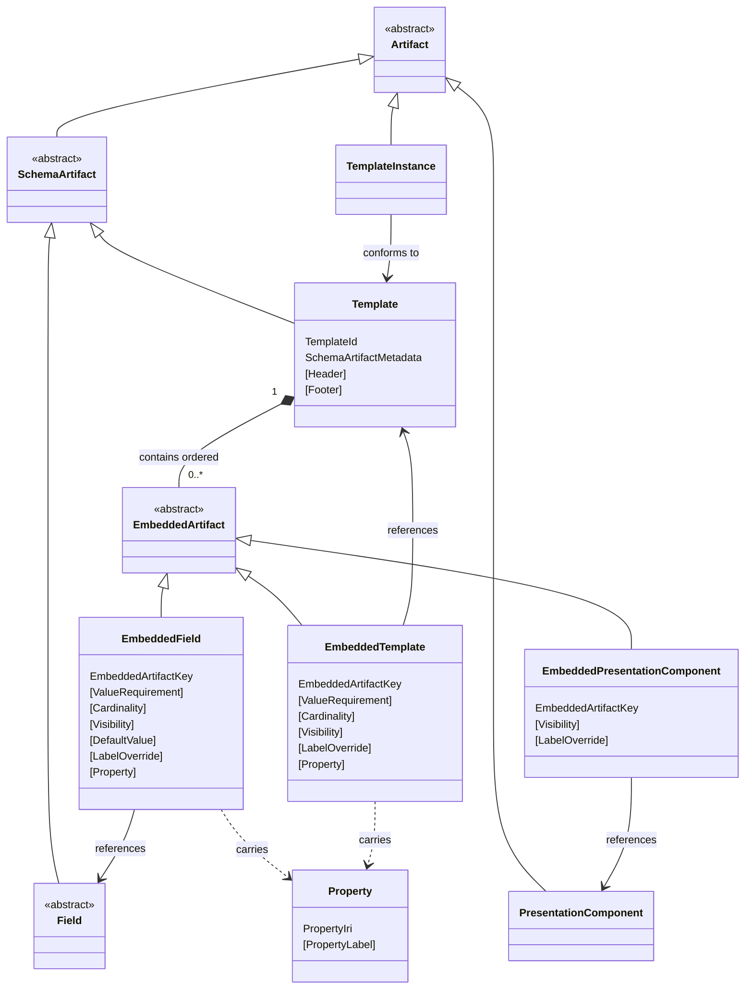

# Abstract Grammar

This section defines the abstract structure of the CEDAR Template Model using an EBNF-style grammar.

The grammar defines the abstract syntactic structure of the model. It specifies the kinds of constructs that exist and how they are composed, but it does not define a concrete textual or data serialization such as JSON, YAML, RDF, or a functional-style syntax.

Accordingly, a production in this grammar describes abstract structure rather than a directly parseable text form. In particular, a production such as `Template ::= template( ... )` does not mean:

- the literal token `template` must appear in a file
- parentheses must appear in a file
- whitespace must be used in a particular way in a file
- the production is itself a concrete serialization format

The following notation is used throughout this grammar:

```ebnf
::=    defined as
|      alternative production
X*     zero or more occurrences of X
X+     one or more occurrences of X
[X]    optional occurrence of X
(...)  groups the named components of an abstract constructor form
```

Whitespace separates symbols within a production.

Production names use `UpperCamelCase`. A production name denotes the abstract category being defined, such as `Template`, `Field`, or `DateFieldSpec`.

Abstract constructor forms use `lower_snake_case`. In this document, a constructor form is the schematic form used to show how an abstract construct is composed, such as `template(...)`, `field(...)`, or `date_field_spec(...)`. The difference between `UpperCamelCase` production names and `lower_snake_case` constructor forms is purely a visual distinction used to make it clear when the grammar is naming a category and when it is showing the abstract form of a construct belonging to that category.

For example, in the production

```ebnf
Template ::= template(
               TemplateId
               SchemaArtifactMetadata
               EmbeddedArtifact*
             )
```

`Template` is the production being defined, while `template(...)` denotes the abstract constructor form of that construct; in other words, it shows the components of a `Template` and how they are composed.

A conceptual overview of the model — describing the principal categories, their relationships, and the design rationale behind key decisions — is provided in [`spec/metamodel.md`](metamodel.md). The present document is the normative formal specification.

## Contents

- [Kernel Grammar](#kernel-grammar)
  - [Core Structure](#core-structure)
  - [Concrete Field Artifacts](#concrete-field-artifacts)
  - [Embedded Artifacts](#embedded-artifacts)
- [Artifact Identity](#artifact-identity)
- [Artifact Metadata](#artifact-metadata)
  - [Aggregate Structure](#aggregate-structure)
  - [Descriptive Metadata](#descriptive-metadata)
  - [Temporal Provenance](#temporal-provenance)
  - [Schema Versioning](#schema-versioning)
  - [Annotations](#annotations)
- [Scalar and Datatype Leaves](#scalar-and-datatype-leaves)
  - [Primitive String Types](#primitive-string-types)
  - [Core IRI and String Types](#core-iri-and-string-types)
  - [Numeric Datatype IRIs](#numeric-datatype-iris)
  - [Temporal Datatype IRIs](#temporal-datatype-iris)
- [Literals](#literals)
  - [Base Literals](#base-literals)
  - [Numeric Literals](#numeric-literals)
  - [Temporal Literals](#temporal-literals)
  - [Literal Value Semantics](#literal-value-semantics)
- [Values](#values)
  - [Scalar Values](#scalar-values)
  - [Temporal Values](#temporal-values)
  - [Controlled Term Value](#controlled-term-value)
  - [Choice Value](#choice-value)
  - [Link Value](#link-value)
  - [Contact Values](#contact-values)
  - [External Authority Values](#external-authority-values)
  - [Attribute Value](#attribute-value)
- [Embedded Artifact Properties](#embedded-artifact-properties)
  - [Embedded Artifact Key](#embedded-artifact-key)
  - [References](#references)
  - [Requirements](#requirements)
  - [Cardinality](#cardinality)
  - [Visibility](#visibility)
  - [Defaults](#defaults)
  - [Label Override](#label-override)
  - [Properties](#properties)
- [Field Specs](#field-specs)
  - [Temporal Field Specs](#temporal-field-specs)
  - [Controlled Term Sources](#controlled-term-sources)
  - [Rendering Hints](#rendering-hints)
- [Presentation Components](#presentation-components)
- [Field Spec And Value Correspondence](#field-spec-and-value-correspondence)
- [Instances](#instances)
- [Open Questions](#open-questions)

## Kernel Grammar

The kernel grammar defines the primary abstract categories of the model and the core schema-level structure that connects them. It introduces reusable schema artifacts, templates, and the embedding constructs through which templates assemble fields, nested templates, and presentation components. Subsequent sections refine the metadata, field-spec families, instance structures, and supporting constructs referenced here.

The diagram below gives an overview of the kernel. `Template` is the central container: it holds an ordered sequence of `EmbeddedArtifact` constructs, each of which contextualises a reusable artifact — a `Field`, a nested `Template`, or a `PresentationComponent` — within that specific template. A `TemplateInstance` records data conforming to a `Template`. Concrete `Field` variants and `FieldSpec` configurations are omitted for clarity.



### Core Structure

This subsection establishes the top-level taxonomy of the model and introduces its two principal concrete schema artifacts. `Artifact` is the broadest category, encompassing reusable schema artifacts, presentation components, and template instances. `Template` is defined here as the central container that organises embedded artifacts into a structured form. `Field` is introduced as an abstract category whose concrete variants are defined in the following subsection.

```ebnf
Artifact ::= SchemaArtifact
           | PresentationComponent
           | TemplateInstance

SchemaArtifact ::= Field
                 | Template
```

`Template` is a concrete schema artifact and the central container of the model. It assembles `EmbeddedArtifact` constructs into a structured form and defines the schema that `TemplateInstance` constructs conform to.

```ebnf
Template ::= template(
               TemplateId
               SchemaArtifactMetadata
               [Header]
               [Footer]
               EmbeddedArtifact*
             )

Header ::= header(
             string
           )

Footer ::= footer(
             string
           )
```

`Header` and `Footer` denote optional Unicode textual content displayed at the top and bottom of a rendered template respectively.

The following productions introduce the abstract field categories. `Field` remains an abstract category, while the intermediate categories group related concrete field artifacts for readability and shared semantics.

```ebnf
Field ::= TextField
        | NumericField
        | TemporalField
        | ControlledTermField
        | ChoiceField
        | LinkField
        | ContactField
        | ExternalAuthorityField
        | AttributeValueField

TemporalField ::= DateField
                | TimeField
                | DateTimeField

ChoiceField ::= SingleChoiceField
              | MultipleChoiceField

ContactField ::= EmailField
               | PhoneNumberField

ExternalAuthorityField ::= OrcidField
                         | RorField
                         | DoiField
                         | PubMedIdField
                         | RridField
                         | NihGrantIdField
```

### Concrete Field Artifacts

Each concrete `Field` variant carries exactly three components: a typed artifact identifier that permanently identifies the reusable field; `SchemaArtifactMetadata` providing the descriptive, provenance, versioning, and annotation metadata common to all schema artifacts; and a typed `FieldSpec` that specifies the value semantics and configuration for that field category. The identifier and `FieldSpec` are specific to each concrete variant; `SchemaArtifactMetadata` is uniform across all fields. The groupings below mirror the abstract `Field` hierarchy defined in Core Structure.

`TextField` and `NumericField` are the two simple scalar field specs. Each carries the most basic value semantics — free text and typed numeric values respectively.

```ebnf
TextField ::= text_field(
               TextFieldId
               SchemaArtifactMetadata
               TextFieldSpec
             )

NumericField ::= numeric_field(
                  NumericFieldId
                  SchemaArtifactMetadata
                  NumericFieldSpec
                )
```

The temporal field variants correspond to the `TemporalField` abstract category. Each is typed to a distinct temporal semantic — date, time of day, or combined date-time — and carries its own `FieldSpec` with precision and rendering options appropriate to that category.

```ebnf
DateField ::= date_field(
               DateFieldId
               SchemaArtifactMetadata
               DateFieldSpec
             )

TimeField ::= time_field(
               TimeFieldId
               SchemaArtifactMetadata
               TimeFieldSpec
             )

DateTimeField ::= date_time_field(
                   DateTimeFieldId
                   SchemaArtifactMetadata
                   DateTimeFieldSpec
                 )
```

`ControlledTermField` supports values drawn from declared ontology sources. `LinkField` carries a single IRI-valued hyperlink.

```ebnf
ControlledTermField ::= controlled_term_field(
                          ControlledTermFieldId
                          SchemaArtifactMetadata
                          ControlledTermFieldSpec
                        )

LinkField ::= link_field(
               LinkFieldId
               SchemaArtifactMetadata
               LinkFieldSpec
             )
```

`SingleChoiceField` and `MultipleChoiceField` correspond to the `ChoiceField` abstract category and are the two concrete choice field variants. They differ in whether they permit exactly one or multiple simultaneous selections from a declared set of options. The permitted options are declared in the corresponding `ChoiceFieldSpec` and are validated against at the instance level.

```ebnf
SingleChoiceField ::= single_choice_field(
                         SingleChoiceFieldId
                         SchemaArtifactMetadata
                         SingleChoiceFieldSpec
                       )

MultipleChoiceField ::= multiple_choice_field(
                           MultipleChoiceFieldId
                           SchemaArtifactMetadata
                           MultipleChoiceFieldSpec
                         )
```

The contact field variants correspond to the `ContactField` abstract category and represent human contact identifiers.

```ebnf
EmailField ::= email_field(
                EmailFieldId
                SchemaArtifactMetadata
                EmailFieldSpec
              )

PhoneNumberField ::= phone_number_field(
                      PhoneNumberFieldId
                      SchemaArtifactMetadata
                      PhoneNumberFieldSpec
                    )
```

The external authority field variants correspond to the `ExternalAuthorityField` abstract category. Each represents an identifier issued by a specific external authority system, as described in the [External Authority Values](#external-authority-values) section. Each external authority field is associated with format validation specific to its identifier scheme and supports integration with the corresponding resolution service for identifier lookup and verification.

```ebnf
OrcidField ::= orcid_field(
                OrcidFieldId
                SchemaArtifactMetadata
                OrcidFieldSpec
              )

RorField ::= ror_field(
              RorFieldId
              SchemaArtifactMetadata
              RorFieldSpec
            )

DoiField ::= doi_field(
              DoiFieldId
              SchemaArtifactMetadata
              DoiFieldSpec
            )

PubMedIdField ::= pub_med_id_field(
                    PubMedIdFieldId
                    SchemaArtifactMetadata
                    PubMedIdFieldSpec
                  )

RridField ::= rrid_field(
               RridFieldId
               SchemaArtifactMetadata
               RridFieldSpec
             )

NihGrantIdField ::= nih_grant_id_field(
                     NihGrantIdFieldId
                     SchemaArtifactMetadata
                     NihGrantIdFieldSpec
                   )
```

`AttributeValueField` supports open-ended name-value pair data whose attribute names are not fixed at schema definition time.

```ebnf
AttributeValueField ::= attribute_value_field(
                          AttributeValueFieldId
                          SchemaArtifactMetadata
                          AttributeValueFieldSpec
                        )
```

The concrete field artifacts defined above are reusable schema-level constructs. A reusable `Field` deliberately does not carry template-local keying, cardinality, visibility, or label override — those properties belong to the embedding context, not to the reusable artifact. To appear within a `Template`, each field must be included via an [Embedded Artifacts](#embedded-artifacts) construct, which adds that template-local context and governs how the field participates in that specific template.

### Embedded Artifacts

An `EmbeddedArtifact` contextualises a reusable artifact within a specific `Template`, adding template-local properties that govern how the artifact participates in that context. There are three forms: `EmbeddedField`, which embeds a data-bearing field; `EmbeddedTemplate`, which nests a template within the containing template; and `EmbeddedPresentationComponent`, which contributes presentational structure without producing instance data.

The sequence of `EmbeddedArtifact` constructs within a `Template` is significant. The order in which they appear determines the presentation order of embedded artifacts in a rendered template. Conforming implementations MUST preserve this order.

```ebnf
EmbeddedArtifact ::= EmbeddedField
                   | EmbeddedTemplate
                   | EmbeddedPresentationComponent

EmbeddedField ::= EmbeddedTextField
                | EmbeddedNumericField
                | EmbeddedDateField
                | EmbeddedTimeField
                | EmbeddedDateTimeField
                | EmbeddedControlledTermField
                | EmbeddedSingleChoiceField
                | EmbeddedMultipleChoiceField
                | EmbeddedLinkField
                | EmbeddedEmailField
                | EmbeddedPhoneNumberField
                | EmbeddedOrcidField
                | EmbeddedRorField
                | EmbeddedDoiField
                | EmbeddedPubMedIdField
                | EmbeddedRridField
                | EmbeddedNihGrantIdField
                | EmbeddedAttributeValueField
```

Every concrete `EmbeddedField` variant follows the same structural pattern. Each carries: an `EmbeddedArtifactKey` uniquely identifying the embedding site within the containing `Template`; a typed field reference identifying the reusable `Field` being embedded; an optional `ValueRequirement` specifying whether a value is required, recommended, or optional; an optional `Cardinality` bounding the permitted number of values; an optional `Visibility` controlling whether the field is shown in rendered interfaces; an optional typed `DefaultValue` providing an embedding-specific default; an optional `LabelOverride` allowing the template to override the field's label in this context; and an optional `Property` associating a semantic property IRI with the embedding site. The only variation across concrete `EmbeddedField` variants is the typed field reference and the typed default value, both of which match the value family of the referenced field.

```ebnf
EmbeddedTextField ::= embedded_text_field(
                        EmbeddedArtifactKey
                        TextFieldReference
                        [ValueRequirement]
                        [Cardinality]
                        [Visibility]
                        [TextDefaultValue]
                        [LabelOverride]
                        [Property]
                      )

EmbeddedNumericField ::= embedded_numeric_field(
                           EmbeddedArtifactKey
                           NumericFieldReference
                           [ValueRequirement]
                           [Cardinality]
                           [Visibility]
                           [NumericDefaultValue]
                           [LabelOverride]
                           [Property]
                         )

EmbeddedDateField ::= embedded_date_field(
                        EmbeddedArtifactKey
                        DateFieldReference
                        [ValueRequirement]
                        [Cardinality]
                        [Visibility]
                        [DateDefaultValue]
                        [LabelOverride]
                        [Property]
                      )

EmbeddedTimeField ::= embedded_time_field(
                        EmbeddedArtifactKey
                        TimeFieldReference
                        [ValueRequirement]
                        [Cardinality]
                        [Visibility]
                        [TimeDefaultValue]
                        [LabelOverride]
                        [Property]
                      )

EmbeddedDateTimeField ::= embedded_date_time_field(
                            EmbeddedArtifactKey
                            DateTimeFieldReference
                            [ValueRequirement]
                            [Cardinality]
                            [Visibility]
                            [DateTimeDefaultValue]
                            [LabelOverride]
                            [Property]
                          )

EmbeddedControlledTermField ::= embedded_controlled_term_field(
                                  EmbeddedArtifactKey
                                  ControlledTermFieldReference
                                  [ValueRequirement]
                                  [Cardinality]
                                  [Visibility]
                                  [ControlledTermDefaultValue]
                                  [LabelOverride]
                                  [Property]
                                )

EmbeddedSingleChoiceField ::= embedded_single_choice_field(
                                 EmbeddedArtifactKey
                                 SingleChoiceFieldReference
                                 [ValueRequirement]
                                 [Cardinality]
                                 [Visibility]
                                 [ChoiceDefaultValue]
                                 [LabelOverride]
                                 [Property]
                               )

EmbeddedMultipleChoiceField ::= embedded_multiple_choice_field(
                                   EmbeddedArtifactKey
                                   MultipleChoiceFieldReference
                                   [ValueRequirement]
                                   [Cardinality]
                                   [Visibility]
                                   [ChoiceDefaultValue]
                                   [LabelOverride]
                                   [Property]
                                 )

EmbeddedLinkField ::= embedded_link_field(
                        EmbeddedArtifactKey
                        LinkFieldReference
                        [ValueRequirement]
                        [Cardinality]
                        [Visibility]
                        [LinkDefaultValue]
                        [LabelOverride]
                        [Property]
                      )

EmbeddedEmailField ::= embedded_email_field(
                         EmbeddedArtifactKey
                         EmailFieldReference
                         [ValueRequirement]
                         [Cardinality]
                         [Visibility]
                         [EmailDefaultValue]
                         [LabelOverride]
                         [Property]
                       )

EmbeddedPhoneNumberField ::= embedded_phone_number_field(
                               EmbeddedArtifactKey
                               PhoneNumberFieldReference
                               [ValueRequirement]
                               [Cardinality]
                               [Visibility]
                               [PhoneNumberDefaultValue]
                               [LabelOverride]
                               [Property]
                             )

EmbeddedOrcidField ::= embedded_orcid_field(
                         EmbeddedArtifactKey
                         OrcidFieldReference
                         [ValueRequirement]
                         [Cardinality]
                         [Visibility]
                         [OrcidDefaultValue]
                         [LabelOverride]
                         [Property]
                       )

EmbeddedRorField ::= embedded_ror_field(
                       EmbeddedArtifactKey
                       RorFieldReference
                       [ValueRequirement]
                       [Cardinality]
                       [Visibility]
                       [RorDefaultValue]
                       [LabelOverride]
                       [Property]
                     )

EmbeddedDoiField ::= embedded_doi_field(
                       EmbeddedArtifactKey
                       DoiFieldReference
                       [ValueRequirement]
                       [Cardinality]
                       [Visibility]
                       [DoiDefaultValue]
                       [LabelOverride]
                       [Property]
                     )

EmbeddedPubMedIdField ::= embedded_pub_med_id_field(
                            EmbeddedArtifactKey
                            PubMedIdFieldReference
                            [ValueRequirement]
                            [Cardinality]
                            [Visibility]
                            [PubMedIdDefaultValue]
                            [LabelOverride]
                            [Property]
                          )

EmbeddedRridField ::= embedded_rrid_field(
                        EmbeddedArtifactKey
                        RridFieldReference
                        [ValueRequirement]
                        [Cardinality]
                        [Visibility]
                        [RridDefaultValue]
                        [LabelOverride]
                        [Property]
                      )

EmbeddedNihGrantIdField ::= embedded_nih_grant_id_field(
                               EmbeddedArtifactKey
                               NihGrantIdFieldReference
                               [ValueRequirement]
                               [Cardinality]
                               [Visibility]
                               [NihGrantIdDefaultValue]
                               [LabelOverride]
                               [Property]
                             )

EmbeddedAttributeValueField ::= embedded_attribute_value_field(
                                  EmbeddedArtifactKey
                                  AttributeValueFieldReference
                                  [ValueRequirement]
                                  [Cardinality]
                                  [Visibility]
                                  [LabelOverride]
                                  [Property]
                                )
```

`EmbeddedTemplate` and `EmbeddedPresentationComponent` follow a similar pattern to embedded fields but differ in what embedding properties they carry. `EmbeddedTemplate` supports cardinality to permit multiple nested instances of the referenced template, carries no typed default value, and carries an optional `Property` associating a semantic property IRI with the embedding site. `EmbeddedPresentationComponent` carries neither a value requirement, cardinality, default value, nor property, as it contributes no instance data and exists purely to contribute presentational structure.

```ebnf
EmbeddedTemplate ::= embedded_template(
                       EmbeddedArtifactKey
                       TemplateReference
                       [ValueRequirement]
                       [Cardinality]
                       [Visibility]
                       [LabelOverride]
                       [Property]
                     )

EmbeddedPresentationComponent ::= embedded_presentation_component(
                                    EmbeddedArtifactKey
                                    PresentationComponentReference
                                    [Visibility]
                                    [LabelOverride]
                                  )
```

## Artifact Identity

Artifact identity defines the typed identifiers by which artifacts and artifact references are denoted in the model. These identity constructs are distinct from descriptive metadata, provenance, versioning, and annotations.

Each field kind has its own typed identifier rather than sharing a single generic `FieldId`. This provides strong typing: a `TextFieldReference` can only refer to a `TextFieldId`, a `DateFieldReference` can only refer to a `DateFieldId`, and so on, making it structurally impossible to embed a field of the wrong type. `TemplateId`, `PresentationComponentId`, and `TemplateInstanceId` follow the same pattern for the same reason.

```ebnf
FieldId ::= TextFieldId
          | NumericFieldId
          | DateFieldId
          | TimeFieldId
          | DateTimeFieldId
          | ControlledTermFieldId
          | SingleChoiceFieldId
          | MultipleChoiceFieldId
          | LinkFieldId
          | EmailFieldId
          | PhoneNumberFieldId
          | OrcidFieldId
          | RorFieldId
          | DoiFieldId
          | PubMedIdFieldId
          | RridFieldId
          | NihGrantIdFieldId
          | AttributeValueFieldId

TextFieldId ::= text_field_id( Iri )

NumericFieldId ::= numeric_field_id( Iri )

DateFieldId ::= date_field_id( Iri )

TimeFieldId ::= time_field_id( Iri )

DateTimeFieldId ::= date_time_field_id( Iri )

ControlledTermFieldId ::= controlled_term_field_id( Iri )

SingleChoiceFieldId ::= single_choice_field_id( Iri )

MultipleChoiceFieldId ::= multiple_choice_field_id( Iri )

LinkFieldId ::= link_field_id( Iri )

EmailFieldId ::= email_field_id( Iri )

PhoneNumberFieldId ::= phone_number_field_id( Iri )

OrcidFieldId ::= orcid_field_id( Iri )

RorFieldId ::= ror_field_id( Iri )

DoiFieldId ::= doi_field_id( Iri )

PubMedIdFieldId ::= pub_med_id_field_id( Iri )

RridFieldId ::= rrid_field_id( Iri )

NihGrantIdFieldId ::= nih_grant_id_field_id( Iri )

AttributeValueFieldId ::= attribute_value_field_id( Iri )

TemplateId ::= template_id( Iri )

PresentationComponentId ::= presentation_component_id( Iri )

TemplateInstanceId ::= template_instance_id( Iri )
```

All artifact identifier productions are IRI-valued. See [`Iri`](#core-iri-and-string-types).

## Artifact Metadata

Artifact metadata defines descriptive information, provenance, versioning, and annotations. `ArtifactMetadata` provides the common metadata carried by all artifacts other than identity. `SchemaArtifactMetadata` extends that common structure with schema-versioning information used by reusable schema artifacts.

### Aggregate Structure

This subsection identifies how the metadata categories are grouped at the artifact level. `ArtifactMetadata` carries the metadata common to all artifacts other than identity, while `SchemaArtifactMetadata` adds versioning information for reusable schema artifacts.

```ebnf
SchemaArtifactMetadata ::= schema_artifact_metadata(
                             ArtifactMetadata
                             SchemaVersioning
                           )

ArtifactMetadata ::= artifact_metadata(
                       DescriptiveMetadata
                       TemporalProvenance
                       Annotation*
                     )
```

### Descriptive Metadata

`DescriptiveMetadata` identifies the human-oriented descriptive properties of an artifact. These properties support naming, explanatory text, and external or local identifiers used for cataloging. `Name` is the required user-supplied name of the artifact. `Description`, when present, is extended textual description explaining the artifact's purpose and content. `Identifier`, when present, is a user-specified external identifier intended for integration with institutional or external systems. `PreferredLabel`, when present, is the primary display label shown to end users — for fields, this is the question text presented in a rendered form. `AlternativeLabel`, when present, provides additional display labels for the artifact.

```ebnf
Name ::= name(
           string
         )

Description ::= description(
                  string
                )

Identifier ::= identifier(
                 string
               )

DescriptiveMetadata ::= descriptive_metadata(
                          Name
                          [Description]
                          [Identifier]
                          [PreferredLabel]
                          AlternativeLabel*
                        )
```

`Name`, `Description`, and `Identifier` carry arbitrary Unicode string values. `PreferredLabel` is defined in the [Controlled Term Value](#controlled-term-value) section; `AlternativeLabel` is defined in the [Label Override](#label-override) section.

> **Note:** Confirm with the CEDAR team that `PreferredLabel` and `AlternativeLabel` belong on `DescriptiveMetadata` for all artifact kinds rather than on a field-specific metadata structure. The v2.0.0 conceptual document (§4.1) describes these in the context of fields specifically; it is worth verifying whether templates, presentation components, and instances should carry them too.

### Temporal Provenance

`TemporalProvenance` identifies when an artifact was created and modified, and which agents were responsible for those actions.

```ebnf
TemporalProvenance ::= temporal_provenance(
                         CreatedOn
                         CreatedBy
                         ModifiedOn
                         ModifiedBy
                       )

CreatedOn ::= IsoDateTimeStamp

CreatedBy ::= Iri

ModifiedOn ::= IsoDateTimeStamp

ModifiedBy ::= Iri
```

`CreatedOn` and `ModifiedOn` MUST be ISO 8601 date-time timestamps.

`CreatedBy` and `ModifiedBy` denote IRIs identifying the responsible agents.

See [`IsoDateTimeStamp`](#core-iri-and-string-types) and [`Iri`](#core-iri-and-string-types).

### Schema Versioning

`SchemaVersioning` identifies version-related metadata specific to reusable schema artifacts. It captures artifact version, publication status, the version of the schema model used, and optional derivation links to earlier or source artifacts.

```ebnf
SchemaVersioning ::= schema_versioning(
                       Version
                       Status
                       ModelVersion
                       [PreviousVersion]
                       [DerivedFrom]
                     )
```

```ebnf
Version ::= version(
              SemanticVersion
            )

Status ::= DraftStatus
         | PublishedStatus

DraftStatus ::= draft_status()

PublishedStatus ::= published_status()

ModelVersion ::= model_version(
                   SemanticVersion
                 )

PreviousVersion ::= previous_version(
                      Iri
                    )

DerivedFrom ::= derived_from(
                  Iri
                )
```

`Version` and `ModelVersion` denote Semantic Versioning 2.0.0 version identifiers.

`Status` denotes the publication status of a reusable schema artifact and is restricted to `draft` or `published`.

`PreviousVersion` and `DerivedFrom` denote IRIs identifying related source or predecessor artifacts.

### Annotations

`Annotation` provides an extensible metadata mechanism for additional named metadata values that are not captured by the core descriptive, provenance, or versioning structures. `AnnotationName` identifies the annotated metadata property. `AnnotationValue` provides the associated metadata value. Annotation values may be either literals or IRIs. This supports linking to external resources such as DOIs and grant identifiers, as well as storing institutional metadata.

```ebnf
Annotation ::= annotation(
                 AnnotationName
                 AnnotationValue
               )

AnnotationName ::= annotation_name(
                     Iri
                   )

AnnotationValue ::= LiteralAnnotationValue
                  | IriAnnotationValue

LiteralAnnotationValue ::= literal_annotation_value(
                             Literal
                           )

IriAnnotationValue ::= iri_annotation_value(
                         Iri
                       )
```

See [`Iri`](#core-iri-and-string-types) and [`Literal`](#base-literals).

## Scalar and Datatype Leaves

The following productions define the primitive leaf types used throughout this grammar. They represent the atomic constructs from which all other productions are built: IRIs, typed string domains, lexical forms, numeric and temporal datatype IRIs, and textual metadata values.

### Primitive String Types

The following nonterminals are intentionally left abstract. They define the string-valued leaf types referenced by the productions in this section and are not themselves model-level constructs.

- `SemanticVersion` denotes a Semantic Versioning 2.0.0 lexical form and MUST conform to the Semantic Versioning 2.0.0 specification as defined at [semver.org](https://semver.org/).
- `IriString` denotes the lexical form of an IRI.
- `Bcp47Tag` denotes a well-formed BCP 47 language tag.
- `Iso8601DateTimeLexicalForm` denotes an ISO 8601 date-time lexical form.
- `AsciiIdentifier` denotes an identifier matching the pattern `[A-Za-z][A-Za-z0-9_-]*`: it begins with an ASCII letter followed by zero or more ASCII letters, digits, underscores, or hyphens.
- `IntegerLexicalForm` denotes a base-10 integer lexical form.

### Core IRI and String Types

This subsection defines the fundamental IRI, string, and numeric leaf types that appear throughout the grammar. `Iri` is the base construct for all IRI-valued positions. `DatatypeIri` and `TermIri` are specialised IRI forms used in literal typing and controlled-vocabulary references respectively. `LanguageTag` and `LexicalForm` support RDF literal construction. `IsoDateTimeStamp` carries ISO 8601 date-time values used in temporal provenance. `NonNegativeInteger` supports field-spec constraints.

```ebnf
Iri ::= iri(
          IriString
        )

DatatypeIri ::= datatype_iri(
                  Iri
                )

TermIri ::= term_iri(
              Iri
            )

LanguageTag ::= language_tag(
                  Bcp47Tag
                )

LexicalForm ::= lexical_form(
                  string
                )

IsoDateTimeStamp ::= iso_date_time_stamp(
                       Iso8601DateTimeLexicalForm
                     )

NonNegativeInteger ::= non_negative_integer(
                         IntegerLexicalForm
                       )
```

`Iri` denotes an Internationalized Resource Identifier. It corresponds to the `xsd:anyURI` datatype; implementations MAY represent it as a plain string provided it is a syntactically valid IRI.

`DatatypeIri` denotes an `Iri` that identifies an RDF datatype.

`TermIri` denotes an `Iri` that identifies a term in a controlled vocabulary or ontology. It is used in `ControlledTermValue` and `ControlledTermClass`.

`LanguageTag` denotes a well-formed BCP 47 language tag.

`LexicalForm` denotes a Unicode string and SHOULD be in Unicode Normalization Form C.

`IsoDateTimeStamp` denotes an ISO 8601 date-time lexical form.

`NonNegativeInteger` denotes an integer greater than or equal to zero.

### Numeric Datatype IRIs

`NumericDatatype` carries the XSD datatype IRI that identifies the numeric type of a `NumericLiteral`. `NumericDatatypeIri` enumerates the supported XSD numeric datatype IRIs. Each alternative is a nullary constructor; the corresponding XSD datatype IRI for each is given in the table below.

```ebnf
NumericDatatype ::= numeric_datatype(
                      NumericDatatypeIri
                    )

NumericDatatypeIri ::= XsdIntegerDatatypeIri
                     | XsdDecimalDatatypeIri
                     | XsdFloatDatatypeIri
                     | XsdDoubleDatatypeIri
                     | XsdLongDatatypeIri
                     | XsdIntDatatypeIri
                     | XsdShortDatatypeIri
                     | XsdByteDatatypeIri
                     | XsdNonNegativeIntegerDatatypeIri
                     | XsdPositiveIntegerDatatypeIri
                     | XsdNonPositiveIntegerDatatypeIri
                     | XsdNegativeIntegerDatatypeIri
                     | XsdUnsignedLongDatatypeIri
                     | XsdUnsignedIntDatatypeIri
                     | XsdUnsignedShortDatatypeIri
                     | XsdUnsignedByteDatatypeIri
```

| Production | XSD Datatype IRI |
|---|---|
| `XsdIntegerDatatypeIri` | `http://www.w3.org/2001/XMLSchema#integer` |
| `XsdDecimalDatatypeIri` | `http://www.w3.org/2001/XMLSchema#decimal` |
| `XsdFloatDatatypeIri` | `http://www.w3.org/2001/XMLSchema#float` |
| `XsdDoubleDatatypeIri` | `http://www.w3.org/2001/XMLSchema#double` |
| `XsdLongDatatypeIri` | `http://www.w3.org/2001/XMLSchema#long` |
| `XsdIntDatatypeIri` | `http://www.w3.org/2001/XMLSchema#int` |
| `XsdShortDatatypeIri` | `http://www.w3.org/2001/XMLSchema#short` |
| `XsdByteDatatypeIri` | `http://www.w3.org/2001/XMLSchema#byte` |
| `XsdNonNegativeIntegerDatatypeIri` | `http://www.w3.org/2001/XMLSchema#nonNegativeInteger` |
| `XsdPositiveIntegerDatatypeIri` | `http://www.w3.org/2001/XMLSchema#positiveInteger` |
| `XsdNonPositiveIntegerDatatypeIri` | `http://www.w3.org/2001/XMLSchema#nonPositiveInteger` |
| `XsdNegativeIntegerDatatypeIri` | `http://www.w3.org/2001/XMLSchema#negativeInteger` |
| `XsdUnsignedLongDatatypeIri` | `http://www.w3.org/2001/XMLSchema#unsignedLong` |
| `XsdUnsignedIntDatatypeIri` | `http://www.w3.org/2001/XMLSchema#unsignedInt` |
| `XsdUnsignedShortDatatypeIri` | `http://www.w3.org/2001/XMLSchema#unsignedShort` |
| `XsdUnsignedByteDatatypeIri` | `http://www.w3.org/2001/XMLSchema#unsignedByte` |

### Temporal Datatype IRIs

These productions define the XSD datatype IRIs used by temporal literal categories. Each temporal precision level has a dedicated abstract IRI type that resolves to a single XSD constructor. The corresponding XSD datatype IRI for each constructor is given in the table below.

```ebnf
YearDatatypeIri     ::= XsdGYearDatatypeIri
DateDatatypeIri     ::= XsdDateDatatypeIri
TimeDatatypeIri     ::= XsdTimeDatatypeIri
DateTimeDatatypeIri ::= XsdDateTimeDatatypeIri
```

| Production | XSD Datatype IRI |
|---|---|
| `XsdGYearDatatypeIri` | `http://www.w3.org/2001/XMLSchema#gYear` |
| `XsdDateDatatypeIri` | `http://www.w3.org/2001/XMLSchema#date` |
| `XsdTimeDatatypeIri` | `http://www.w3.org/2001/XMLSchema#time` |
| `XsdDateTimeDatatypeIri` | `http://www.w3.org/2001/XMLSchema#dateTime` |

`YearDatatypeIri`, `DateDatatypeIri`, `TimeDatatypeIri`, and `DateTimeDatatypeIri` denote the XML Schema datatype IRIs used by the corresponding temporal literal categories.

## Literals

Literals are the atomic data values used throughout the instance model. This specification follows the RDF literal model: every literal consists of a lexical form paired with either a datatype IRI or a language tag. Typed subclasses narrow the permitted datatype IRI to support strongly typed numeric and temporal values. The lexical form of any literal SHOULD be in Unicode Normalization Form C.

### Base Literals

The base literal types define the two concrete RDF literal forms together with their string specialisations. These are used in text-valued, general-purpose, and controlled-term positions throughout the model.

```ebnf
Literal ::= DatatypeIriLiteral
          | LangStringLiteral

DatatypeIriLiteral ::= datatype_iri_literal(
                         LexicalForm
                         DatatypeIri
                       )

LangStringLiteral ::= lang_string_literal(
                        LexicalForm
                        LanguageTag
                      )

StringLiteral ::= string_literal(
                    LexicalForm
                  )

TextLiteral ::= StringLiteral
              | LangStringLiteral
```

`Literal` is the base category for all RDF literals in this specification.

`DatatypeIriLiteral` consists of a lexical form and a datatype IRI.

`LangStringLiteral` consists of a lexical form and a language tag. Its implicit datatype IRI is `http://www.w3.org/1999/02/22-rdf-syntax-ns#langString`. Its language tag MUST be non-empty and well-formed according to BCP 47.

`StringLiteral` is a `DatatypeIriLiteral` whose datatype IRI is `http://www.w3.org/2001/XMLSchema#string`.

`TextLiteral` is the union of `StringLiteral` and `LangStringLiteral`. It is the class of literals permitted in `TextValue`, admitting both plain strings and language-tagged strings.

Concrete syntaxes MAY use simpler surface forms that omit an explicit datatype IRI for string literals or language-tagged strings. Such forms are syntactic sugar and do not change the abstract structure defined by this specification.

### Numeric Literals

`NumericLiteral` is the class of literals permitted in `NumericValue`. It pairs a lexical form with a numeric datatype IRI drawn from `NumericDatatypeIri` (see Numeric Datatype IRIs).

```ebnf
NumericLiteral ::= numeric_literal(
                     LexicalForm
                     NumericDatatypeIri
                   )
```

### Temporal Literals

A temporal literal is a typed literal that represents a date, a time of day, or a combined date-time value. Each production carries a `LexicalForm` and the fixed XSD datatype IRI for its precision level: `xsd:gYear`, `xsd:date`, `xsd:time`, or `xsd:dateTime`. `TemporalLiteral` is the abstract supertype; `DateLiteral`, `TimeLiteral`, and `DateTimeLiteral` correspond to the three temporal field specs. Within `DateLiteral`, the two alternatives preserve year-only and full-date precision explicitly rather than collapsing them into a single form.

```ebnf
TemporalLiteral ::= DateLiteral
                  | TimeLiteral
                  | DateTimeLiteral

DateLiteral ::= YearLiteral
              | FullDateLiteral

YearLiteral ::= year_literal(
                  LexicalForm
                  YearDatatypeIri
                )

FullDateLiteral ::= full_date_literal(
                      LexicalForm
                      DateDatatypeIri
                    )

TimeLiteral ::= time_literal(
                  LexicalForm
                  TimeDatatypeIri
                )

DateTimeLiteral ::= date_time_literal(
                      LexicalForm
                      DateTimeDatatypeIri
                    )
```

Each temporal literal carries a datatype IRI from the corresponding temporal datatype IRI category, and is used in the corresponding `Value` type:

| Literal | Datatype IRI category | Used in |
|---|---|---|
| `YearLiteral` | `YearDatatypeIri` | `YearValue` |
| `FullDateLiteral` | `DateDatatypeIri` | `FullDateValue` |
| `TimeLiteral` | `TimeDatatypeIri` | `TimeValue` |
| `DateTimeLiteral` | `DateTimeDatatypeIri` | `DateTimeValue` |

### Literal Value Semantics

The value associated with a `DatatypeIriLiteral` depends on whether its datatype IRI is recognised and whether its lexical form is in the lexical space of that datatype:

| Condition | Result |
|---|---|
| Datatype IRI recognised; lexical form in lexical space | Literal value is obtained by applying the lexical-to-value mapping of the datatype to the lexical form |
| Datatype IRI recognised; lexical form outside lexical space | Ill-typed literal: no valid literal value is determined |
| Datatype IRI not recognised | Literal value is not defined by this specification |

For a `LangStringLiteral`, the literal value is the pair consisting of lexical form and language tag, in that order.

An ill-typed literal is not syntactically ill-formed, but it does not determine a valid literal value and produces a semantic inconsistency. Implementations MUST accept ill-typed literals and MAY produce warnings when encountering them.

Two literals are term-equal if and only if their lexical forms and their datatype IRIs or language tags compare equal character by character.

## Values

This section defines the `Value` types that represent instance-level data. `Value` constructs appear in `FieldValue` instances and as typed default values in `EmbeddedArtifact` properties. The value types are defined here independently of the `FieldSpec` productions that constrain them; the normative mapping between each `FieldSpec` and its permitted `Value` form is given in the [Field Spec And Value Correspondence](#field-spec-and-value-correspondence) section.

```ebnf
Value ::= TextValue
        | NumericValue
        | DateValue
        | TimeValue
        | DateTimeValue
        | ControlledTermValue
        | ChoiceValue
        | LinkValue
        | EmailValue
        | PhoneNumberValue
        | ExternalAuthorityValue
        | AttributeValue
```

### Scalar Values

`TextValue` and `NumericValue` are the simplest value forms, each wrapping a single typed literal that corresponds directly to its field spec. `TextValue` accepts either a plain string or a language-tagged string via `TextLiteral`. `NumericValue` carries a typed numeric literal with an XML Schema numeric datatype IRI.

```ebnf
TextValue ::= text_value(
                TextLiteral
              )

NumericValue ::= numeric_value(
                   NumericLiteral
                 )
```

### Temporal Values

Temporal values represent date, time, and date-time data, corresponding directly to `DateFieldSpec`, `TimeFieldSpec`, and `DateTimeFieldSpec` respectively. `DateValue` is further refined into two precision variants — `YearValue` and `FullDateValue` — to preserve the intended granularity explicitly rather than collapsing all date forms into a single type.

```ebnf
DateValue ::= YearValue
            | FullDateValue

YearValue ::= year_value(
                YearLiteral
              )

FullDateValue ::= full_date_value(
                    FullDateLiteral
                  )

TimeValue ::= time_value(
                TimeLiteral
              )

DateTimeValue ::= date_time_value(
                    DateTimeLiteral
                  )
```

### Controlled Term Value

A controlled term value identifies a term drawn from an ontology, branch, class set, or value set declared in the corresponding `ControlledTermFieldSpec`. It carries a `TermIri` identifying the term and a mandatory human-readable `Label`. `Notation` and `PreferredLabel` carry optional terminology metadata from the source ontology, such as a symbolic code or the ontology's own preferred label for the term.

```ebnf
Label ::= label(
            string
          )

Notation ::= notation(
               string
             )

PreferredLabel ::= preferred_label(
                     string
                   )

ControlledTermValue ::= controlled_term_value(
                          TermIri
                          [Label]
                          [Notation]
                          [PreferredLabel]
                        )
```

### Choice Value

A choice value carries a selection from the options declared by a `ChoiceFieldSpec`. The form of the selection is determined by the kind of `ChoiceFieldSpec` the field carries: a field with a `LiteralSingleChoiceFieldSpec` or `LiteralMultipleChoiceFieldSpec` produces a `LiteralChoiceValue`, while a field with a `ControlledTermSingleChoiceFieldSpec` or `ControlledTermMultipleChoiceFieldSpec` produces a `ControlledTermChoiceValue`. A conforming instance value must correspond to one of the declared options of the referenced field's choice field spec.

```ebnf
ChoiceValue ::= LiteralChoiceValue
              | ControlledTermChoiceValue

LiteralChoiceValue ::= literal_choice_value(
                         Literal
                       )

ControlledTermChoiceValue ::= controlled_term_choice_value(
                                ControlledTermValue
                              )
```

### Link Value

A link value represents a hyperlink or URL-valued field. It carries an `Iri` identifying the linked resource and an optional `LinkLabel` providing a human-readable display label for the link.

```ebnf
LinkValue ::= link_value(
                Iri
                [LinkLabel]
              )

LinkLabel ::= link_label(
                string
              )
```

### Contact Values

Contact values represent human contact identifiers. `EmailValue` carries an email address as a plain string literal and `PhoneNumberValue` carries a telephone number as a plain string literal. Both use `StringLiteral` rather than a more specialised literal form; format validation is left to implementations.

```ebnf
EmailValue ::= email_value(
                 StringLiteral
               )

PhoneNumberValue ::= phone_number_value(
                       StringLiteral
                     )
```

### External Authority Values

External authority values represent identifiers issued by recognised external authority systems. Each concrete value type carries a typed IRI specialised for its authority together with an optional human-readable `Label`. The typed IRI signals the expected identifier scheme; format conformance for each authority may be enforced by profile-specific or implementation-specific validation rules.

```ebnf
ExternalAuthorityValue ::= OrcidValue
                         | RorValue
                         | DoiValue
                         | PubMedIdValue
                         | RridValue
                         | NihGrantIdValue

OrcidValue ::= orcid_value(
                 OrcidIri
                 [Label]
               )

RorValue ::= ror_value(
               RorIri
               [Label]
             )

DoiValue ::= doi_value(
               DoiIri
               [Label]
             )

PubMedIdValue ::= pub_med_id_value(
                    PubMedIri
                    [Label]
                  )

RridValue ::= rrid_value(
                RridIri
                [Label]
              )

NihGrantIdValue ::= nih_grant_id_value(
                      NihGrantIri
                      [Label]
                    )

OrcidIri    ::= orcid_iri( Iri )
RorIri      ::= ror_iri( Iri )
DoiIri      ::= doi_iri( Iri )
PubMedIri   ::= pub_med_iri( Iri )
RridIri     ::= rrid_iri( Iri )
NihGrantIri ::= nih_grant_iri( Iri )
```

| Typed IRI | Authority | IRI Pattern |
|---|---|---|
| `OrcidIri` | ORCID — identifies a researcher by ORCID iD | `https://orcid.org/\d{4}-\d{4}-\d{4}-\d{3}[\dX]` |
| `RorIri` | Research Organization Registry — identifies a research organisation by ROR ID | `https://ror.org/0[a-z0-9]{8}` |
| `DoiIri` | Digital Object Identifier — identifies a digital object by DOI | `https://doi.org/10\.\d{4,}/.+` |
| `PubMedIri` | PubMed — identifies a PubMed article | `https://pubmed.ncbi.nlm.nih.gov/\d+` |
| `RridIri` | Research Resource Identifier — identifies a research resource by RRID | `https://identifiers.org/RRID:[A-Z]+_\d+` |
| `NihGrantIri` | NIH — identifies an NIH-funded grant | unspecified |

The final character of an ORCID iD MAY be `X`, serving as an ISO 7064 Mod 11-2 check character.

### Attribute Value

An attribute value is a name-value pair used to represent arbitrary named properties whose names are not known at schema definition time. `AttributeName` carries the name of the attribute as a Unicode string. The value component is itself a `Value`, permitting attribute values to carry any value type including nested attribute values. Nesting depth is unbounded at the model level; concrete implementations MAY impose practical limits.

```ebnf
AttributeName ::= attribute_name(
                    string
                  )

AttributeValue ::= attribute_value(
                     AttributeName
                     Value
                   )
```

## Embedded Artifact Properties

Embedded artifact properties define the contextual information carried by an `EmbeddedArtifact` within a `Template`. These properties govern how a referenced reusable artifact is used in that template context, including key, reference, requirement, cardinality, visibility, defaults, and label override, and they are distinct from the intrinsic properties of the referenced reusable artifact itself.

### Embedded Artifact Key

An `EmbeddedArtifactKey` is the local identifier of an `EmbeddedArtifact` within a `Template`. It is the key by which an embedded field, embedded template, or embedded presentation component is distinguished from other embedded artifacts in the same template. This key is also the mechanism that connects template structure to instance structure: `FieldValue` and `NestedTemplateInstance` use `EmbeddedArtifactKey` to identify which embedded artifact in the template they correspond to.

```ebnf
EmbeddedArtifactKey ::= embedded_artifact_key(
                          KeyIdentifier
                        )

KeyIdentifier ::= key_identifier(
                    AsciiIdentifier
                  )
```

`EmbeddedArtifactKey` MUST match the pattern `[A-Za-z][A-Za-z0-9_-]*`: it MUST begin with an ASCII letter followed by zero or more ASCII letters, digits, underscores, or hyphens.

`EmbeddedArtifactKey` values are local to a `Template` and MUST be unique within that `Template`.

`EmbeddedArtifactKey` is distinct from artifact identifiers such as `FieldId` and `TemplateId`. It identifies the embedding site within a template rather than the reusable artifact being referenced. The same reusable `Field` may be embedded more than once in a `Template` under different keys, and each key independently identifies that embedding site in both the template structure and any corresponding `TemplateInstance`.

### References

These productions identify the reusable artifact that is being included in the template. Each reference type is a typed alias for the corresponding artifact identifier — for example, `TextFieldReference` is structurally identical to `TextFieldId`. The typed reference forms exist for the same strong-typing reason as the typed identifiers: a `TextFieldReference` can only appear in an `EmbeddedTextField`, making it structurally impossible to embed a field of the wrong kind. The distinction between a reference and an identifier is one of role: an identifier permanently names a reusable artifact, while a reference expresses the intention to embed that artifact in a specific template context.

```ebnf
FieldReference ::= TextFieldReference
                 | NumericFieldReference
                 | DateFieldReference
                 | TimeFieldReference
                 | DateTimeFieldReference
                 | ControlledTermFieldReference
                 | SingleChoiceFieldReference
                 | MultipleChoiceFieldReference
                 | LinkFieldReference
                 | EmailFieldReference
                 | PhoneNumberFieldReference
                 | OrcidFieldReference
                 | RorFieldReference
                 | DoiFieldReference
                 | PubMedIdFieldReference
                 | RridFieldReference
                 | NihGrantIdFieldReference
                 | AttributeValueFieldReference

TextFieldReference ::= TextFieldId

NumericFieldReference ::= NumericFieldId

DateFieldReference ::= DateFieldId

TimeFieldReference ::= TimeFieldId

DateTimeFieldReference ::= DateTimeFieldId

ControlledTermFieldReference ::= ControlledTermFieldId

SingleChoiceFieldReference ::= SingleChoiceFieldId

MultipleChoiceFieldReference ::= MultipleChoiceFieldId

LinkFieldReference ::= LinkFieldId

EmailFieldReference ::= EmailFieldId

PhoneNumberFieldReference ::= PhoneNumberFieldId

OrcidFieldReference ::= OrcidFieldId

RorFieldReference ::= RorFieldId

DoiFieldReference ::= DoiFieldId

PubMedIdFieldReference ::= PubMedIdFieldId

RridFieldReference ::= RridFieldId

NihGrantIdFieldReference ::= NihGrantIdFieldId

AttributeValueFieldReference ::= AttributeValueFieldId

TemplateReference ::= TemplateId

PresentationComponentReference ::= PresentationComponentId
```

### Requirements

`ValueRequirement` identifies whether a value is required, recommended, or optional in the embedding context. `Required` means that a value must be supplied for conformance. `Recommended` and `Optional` are identical for conformance purposes: absence of a value MUST NOT cause conformance failure in either case. The distinction is one of authoring guidance only: implementations SHOULD encourage entry for `Recommended` fields and MAY issue warnings when such fields are left empty.

```ebnf
ValueRequirement ::= Required
                   | Recommended
                   | Optional
```

When `ValueRequirement` is absent from an `EmbeddedArtifact`, the default is `Optional`.

### Cardinality

`Cardinality` identifies the permitted number of occurrences for the embedded artifact in the embedding context.

```ebnf
Cardinality ::= cardinality(
                  MinCardinality
                  [MaxCardinality]
                )

MinCardinality ::= min_cardinality(
                     NonNegativeInteger
                   )

MaxCardinality ::= max_cardinality(
                     CardinalityUpperBound
                   )

CardinalityUpperBound ::= NonNegativeInteger
                        | UnboundedCardinality

UnboundedCardinality ::= unbounded_cardinality()
```

When `Cardinality` is absent from an `EmbeddedArtifact`, the implied default is `min_cardinality(1)` with `max_cardinality(1)`: the embedded artifact MUST appear exactly once.

`ValueRequirement` and `Cardinality` are orthogonal. `ValueRequirement` governs whether the user is obligated to supply any values at all. `Cardinality` governs the permitted count of values if any are supplied. A field may therefore be `Optional` — meaning the user is not required to fill it in — while carrying a `min_cardinality` greater than one, meaning that if values are supplied, at least that many must be present. For example, a primer pair field might be `Optional` but carry `min_cardinality(2)`, because a primer pair is only interpretable when both the forward and reverse primers are specified together.

### Visibility

`Visibility` determines whether the embedded artifact is shown in rendered interfaces. It is modeled as an embedding property rather than as a rendering hint because it applies to any kind of embedded artifact, not only to fields.

```ebnf
Visibility ::= Visible
             | Hidden
```

When `Visibility` is absent from an `EmbeddedArtifact`, the default is `Visible`.

### Defaults

A `DefaultValue` specifies the value to be pre-populated for an embedded artifact when no explicit value has been supplied by the user. Each concrete `DefaultValue` variant wraps the `Value` type of its corresponding field family, ensuring that a default is always structurally compatible with the values the field accepts. The concrete variants are grouped by field family, mirroring the groupings in the Values and Concrete Field Artifacts sections.

`TextDefaultValue` occupies a special position: it may appear both on `TextFieldSpec` as a reusable field-level default, and on `EmbeddedTextField` as an embedding-specific override. All other default value types appear only at the embedding level. When both a field-level and an embedding-specific text default are present, the embedding-specific one takes precedence as it is more specific to the template context.

```ebnf
DefaultValue ::= TextDefaultValue
               | NumericDefaultValue
               | DateDefaultValue
               | TimeDefaultValue
               | DateTimeDefaultValue
               | ControlledTermDefaultValue
               | ChoiceDefaultValue
               | LinkDefaultValue
               | EmailDefaultValue
               | PhoneNumberDefaultValue
               | OrcidDefaultValue
               | RorDefaultValue
               | DoiDefaultValue
               | PubMedIdDefaultValue
               | RridDefaultValue
               | NihGrantIdDefaultValue

TextDefaultValue ::= text_default_value(
                       TextValue
                     )

NumericDefaultValue ::= numeric_default_value(
                          NumericValue
                        )

DateDefaultValue ::= date_default_value(
                       DateValue
                     )

TimeDefaultValue ::= time_default_value(
                       TimeValue
                     )

DateTimeDefaultValue ::= date_time_default_value(
                           DateTimeValue
                         )

ControlledTermDefaultValue ::= controlled_term_default_value(
                                 ControlledTermValue
                               )

ChoiceDefaultValue ::= choice_default_value(
                         ChoiceValue+
                       )

LinkDefaultValue ::= link_default_value(
                       LinkValue
                     )

EmailDefaultValue ::= email_default_value(
                        EmailValue
                      )

PhoneNumberDefaultValue ::= phone_number_default_value(
                              PhoneNumberValue
                            )

OrcidDefaultValue ::= orcid_default_value(
                        OrcidValue
                      )

RorDefaultValue ::= ror_default_value(
                      RorValue
                    )

DoiDefaultValue ::= doi_default_value(
                      DoiValue
                    )

PubMedIdDefaultValue ::= pub_med_id_default_value(
                           PubMedIdValue
                         )

RridDefaultValue ::= rrid_default_value(
                       RridValue
                     )

NihGrantIdDefaultValue ::= nih_grant_id_default_value(
                             NihGrantIdValue
                           )
```

### Label Override

`LabelOverride` provides template-specific labeling for an embedded artifact. This allows a template to override the default label of the referenced reusable artifact in that embedding context.

```ebnf
AlternativeLabel ::= alternative_label(
                       string
                     )

LabelOverride ::= label_override(
                    Label
                    AlternativeLabel*
                  )
```

### Properties

A `Property` associates a semantic property IRI with an `EmbeddedField` or `EmbeddedTemplate` within a specific `Template`. The property IRI identifies the RDF property that the embedded artifact's value represents in that template context. The optional `PropertyLabel` provides a human-readable label for the property.

`Property` is an embedding-level construct. It is distinct from the intrinsic metadata of the referenced `Field` or `Template` artifact. The same reusable artifact may be embedded in different templates under different property IRIs.

```ebnf
Property ::= property(
               PropertyIri
               [PropertyLabel]
             )

PropertyIri   ::= property_iri( Iri )
PropertyLabel ::= property_label( string )
```

## Field Specs

A `FieldSpec` is the semantic configuration block carried by a concrete `Field` artifact. It specifies what kind of value the field accepts, any constraints on that value, and any compatible rendering hints for presentation. Each concrete `Field` variant carries exactly one `FieldSpec` that matches its kind: a `TextField` carries a `TextFieldSpec`, a `DateField` carries a `DateFieldSpec`, and so on. The correspondence between each `FieldSpec` and its permitted `Value` form is given in the [Field Spec And Value Correspondence](#field-spec-and-value-correspondence) section.

One might ask why `FieldSpec` exists as a separate construct rather than folding its content directly into the concrete `Field` artifact. The answer is separation of concerns: the concrete field artifact — `TextField`, `DateField`, and so on — answers the question "what kind of reusable field is this?" and carries the artifact's identity, descriptive metadata, provenance, and versioning. The `FieldSpec` answers the separate question "what are the value rules and rendering-compatible properties for this kind of field?" Keeping these concerns distinct means that artifact identity and lifecycle metadata remain uniform across all field kinds, while value semantics and field-specific configuration vary per family through `FieldSpec`. It also preserves a clean, uniform pattern: every concrete field artifact carries exactly one identifier, one `SchemaArtifactMetadata`, and one `FieldSpec`.

`FieldSpec` productions are grouped here by field family, mirroring the abstract `Field` hierarchy in the Kernel Grammar. Temporal field specs, which carry additional precision and rendering configuration, are detailed in the [Temporal Field Specs](#temporal-field-specs) subsection. Controlled term source declarations, which specify the ontological authorities from which controlled-term values may be drawn, are covered in the [Controlled Term Sources](#controlled-term-sources) subsection. Rendering hints for all field families are defined in the [Rendering Hints](#rendering-hints) subsection, with the exception of temporal rendering hints which are defined alongside their field specs.

```ebnf
FieldSpec ::= TextFieldSpec
            | NumericFieldSpec
            | TemporalFieldSpec
            | ControlledTermFieldSpec
            | ChoiceFieldSpec
            | LinkFieldSpec
            | ContactFieldSpec
            | ExternalAuthorityFieldSpec
            | AttributeValueFieldSpec

TextFieldSpec ::= text_field_spec(
                    [TextDefaultValue]
                    [MinLength]
                    [MaxLength]
                    [ValidationRegex]
                    [TextRenderingHint]
                  )

NumericFieldSpec ::= numeric_field_spec(
                       NumericDatatype
                       [Unit]
                       [NumericPrecision]
                       [NumericMinValue]
                       [NumericMaxValue]
                       [NumericRenderingHint]
                     )

Unit ::= unit(
           Iri
           [Label]
         )

MinLength ::= min_length(
                NonNegativeInteger
              )

MaxLength ::= max_length(
                NonNegativeInteger
              )

ValidationRegex ::= validation_regex(
                      string
                    )

NumericPrecision ::= numeric_precision(
                       NonNegativeInteger
                     )

NumericMinValue ::= numeric_min_value(
                      NumericValue
                    )

NumericMaxValue ::= numeric_max_value(
                      NumericValue
                    )

TemporalFieldSpec ::= DateFieldSpec
                    | TimeFieldSpec
                    | DateTimeFieldSpec

ControlledTermFieldSpec ::= controlled_term_field_spec(
                              ControlledTermSource+
                            )

ChoiceFieldSpec ::= SingleChoiceFieldSpec
                  | MultipleChoiceFieldSpec

SingleChoiceFieldSpec ::= LiteralSingleChoiceFieldSpec
                        | ControlledTermSingleChoiceFieldSpec

MultipleChoiceFieldSpec ::= LiteralMultipleChoiceFieldSpec
                          | ControlledTermMultipleChoiceFieldSpec

LiteralSingleChoiceFieldSpec ::= literal_single_choice_field_spec(
                                   LiteralChoiceOption+
                                   [SingleChoiceRenderingHint]
                                 )

ControlledTermSingleChoiceFieldSpec ::= controlled_term_single_choice_field_spec(
                                          ControlledTermChoiceOption+
                                          [SingleChoiceRenderingHint]
                                        )

LiteralMultipleChoiceFieldSpec ::= literal_multiple_choice_field_spec(
                                     LiteralChoiceOption+
                                     [MultipleChoiceRenderingHint]
                                   )

ControlledTermMultipleChoiceFieldSpec ::= controlled_term_multiple_choice_field_spec(
                                            ControlledTermChoiceOption+
                                            [MultipleChoiceRenderingHint]
                                          )

LiteralChoiceOption ::= literal_choice_option(
                          Literal
                          [DefaultOption]
                        )

ControlledTermChoiceOption ::= controlled_term_choice_option(
                                 ControlledTermValue
                                 [DefaultOption]
                               )

DefaultOption ::= default_option()

LinkFieldSpec ::= link_field_spec()

ContactFieldSpec ::= EmailFieldSpec
                   | PhoneNumberFieldSpec

EmailFieldSpec ::= email_field_spec()

PhoneNumberFieldSpec ::= phone_number_field_spec()

ExternalAuthorityFieldSpec ::= OrcidFieldSpec
                             | RorFieldSpec
                             | DoiFieldSpec
                             | PubMedIdFieldSpec
                             | RridFieldSpec
                             | NihGrantIdFieldSpec

OrcidFieldSpec ::= orcid_field_spec()

RorFieldSpec ::= ror_field_spec()

DoiFieldSpec ::= doi_field_spec()

PubMedIdFieldSpec ::= pub_med_id_field_spec()

RridFieldSpec ::= rrid_field_spec()

NihGrantIdFieldSpec ::= nih_grant_id_field_spec()

AttributeValueFieldSpec ::= attribute_value_field_spec()
```

`Unit` denotes an identified measurement or quantity unit optionally paired with a human-readable label.

The current placement of `Unit` on `NumericFieldSpec` is a pragmatic compromise. A later revision may introduce a distinct `QuantityFieldSpec` to model numeric values with fixed units more explicitly.

`NumericMinValue` and `NumericMaxValue` specify inclusive lower and upper bounds on the numeric values that a field accepts. Both are expressed as `NumericValue` constructs so that the datatype of the bound matches the datatype of the field values it constrains.

`ChoiceFieldSpec` is refined along two independent dimensions: cardinality and value kind. The cardinality dimension distinguishes `SingleChoiceFieldSpec` — which permits exactly one selection — from `MultipleChoiceFieldSpec` — which permits one or more simultaneous selections. The value kind dimension distinguishes `LiteralSingleChoiceFieldSpec` and `LiteralMultipleChoiceFieldSpec`, whose options are plain string or typed literals, from `ControlledTermSingleChoiceFieldSpec` and `ControlledTermMultipleChoiceFieldSpec`, whose options are ontology-backed controlled terms carrying an IRI and a human-readable label. All options within a single choice field spec must be of the same kind: a literal choice field spec carries only `LiteralChoiceOption` entries, and a controlled term choice field spec carries only `ControlledTermChoiceOption` entries. This uniformity means that the value kind of a choice field is declared structurally rather than inferred by inspecting individual options.

`LiteralChoiceOption` and `ControlledTermChoiceOption` each carry an optional `DefaultOption`. When `DefaultOption` is present, the option is pre-selected when a new instance is created. This is a field-level default baked into the option definition itself; an embedding-level `ChoiceDefaultValue` on the corresponding `EmbeddedField` takes precedence when both are present.

`ControlledTermSource` is defined in [Controlled Term Sources](#controlled-term-sources).

### Temporal Field Specs

`TemporalFieldSpec` denotes temporal-valued fields and is refined into strongly typed date, time, and date-time forms. This section groups the temporal field-spec productions together with their compatible rendering hints and value-type constraints.

```ebnf
DateFieldSpec ::= date_field_spec(
                    DateValueType
                    [DateRenderingHint]
                  )

DateValueType ::= YearValueType
                | FullDateValueType

YearValueType ::= year_value_type()

FullDateValueType ::= full_date_value_type()
```

```ebnf
TimeFieldSpec ::= time_field_spec(
                    [TimePrecision]
                    [TimezoneRequirement]
                    [TimeRenderingHint]
                  )

TimePrecision ::= HourMinutePrecision
                | HourMinuteSecondPrecision
                | HourMinuteSecondFractionPrecision

HourMinutePrecision ::= hour_minute_precision()

HourMinuteSecondPrecision ::= hour_minute_second_precision()

HourMinuteSecondFractionPrecision ::= hour_minute_second_fraction_precision()

TimezoneRequirement ::= TimezoneRequired
                      | TimezoneNotRequired

TimezoneRequired ::= timezone_required()

TimezoneNotRequired ::= timezone_not_required()
```

`TimePrecision` identifies the finest time precision permitted by a `TimeFieldSpec`.

`HourMinutePrecision`, `HourMinuteSecondPrecision`, and `HourMinuteSecondFractionPrecision` identify time values constrained respectively to hour-and-minute precision, second precision, and fractional-second precision.

`TimezoneRequirement` identifies whether timezone information is required by the field spec.

The declared `TimePrecision` determines the required lexical form of conforming `TimeValue` constructs. Finer components than the declared precision MUST be omitted entirely; zeroing them is not equivalent to omitting them. Specifically:

- `HourMinutePrecision`: `TimeLiteral` MUST carry only hour and minute components (`HH:MM`).
- `HourMinuteSecondPrecision`: `TimeLiteral` MUST carry hour, minute, and second components (`HH:MM:SS`), with no fractional seconds.
- `HourMinuteSecondFractionPrecision`: `TimeLiteral` MAY carry a fractional seconds component.

When `TimePrecision` is absent from a `TimeFieldSpec`, no precision constraint applies and any well-formed `TimeLiteral` is conforming.

The same strict-truncation rule applies to `DateTimeValueType` for `DateTimeValue` constructs:

- `DateHourMinuteValueType`: the time component of `DateTimeLiteral` MUST carry only hour and minute (`YYYY-MM-DDTHH:MM`).
- `DateHourMinuteSecondValueType`: the time component MUST carry hour, minute, and second (`YYYY-MM-DDTHH:MM:SS`), with no fractional seconds.
- `DateHourMinuteSecondFractionValueType`: the time component MAY carry a fractional seconds component.

```ebnf
DateTimeFieldSpec ::= date_time_field_spec(
                        DateTimeValueType
                        [TimezoneRequirement]
                        [DateTimeRenderingHint]
                      )

DateTimeValueType ::= DateHourMinuteValueType
                    | DateHourMinuteSecondValueType
                    | DateHourMinuteSecondFractionValueType

DateHourMinuteValueType ::= date_hour_minute_value_type()

DateHourMinuteSecondValueType ::= date_hour_minute_second_value_type()

DateHourMinuteSecondFractionValueType ::= date_hour_minute_second_fraction_value_type()
```

`DateTimeValueType` identifies the finest permitted date-time precision.

`DateHourMinuteValueType`, `DateHourMinuteSecondValueType`, and `DateHourMinuteSecondFractionValueType` identify date-time values constrained respectively to minute precision, second precision, and fractional-second precision.

```ebnf
DateRenderingHint ::= date_rendering_hint(
                        DateRenderingWidget
                        [DateFormat]
                      )

DateRenderingWidget ::= DatePickerRenderingWidget

DatePickerRenderingWidget ::= date_picker_rendering_widget()

DateFormat ::= date_format(
                 DateComponentOrder
               )

DateComponentOrder ::= DayMonthYearOrder
                     | MonthDayYearOrder
                     | YearMonthDayOrder

DayMonthYearOrder ::= day_month_year_order()

MonthDayYearOrder ::= month_day_year_order()

YearMonthDayOrder ::= year_month_day_order()

TimeRenderingHint ::= time_rendering_hint(
                        TimeRenderingWidget
                        [TimeFormat]
                      )

TimeRenderingWidget ::= TimePickerRenderingWidget

TimePickerRenderingWidget ::= time_picker_rendering_widget()

DateTimeRenderingHint ::= date_time_rendering_hint(
                            DateTimeRenderingWidget
                            [TimeFormat]
                          )

DateTimeRenderingWidget ::= DateTimePickerRenderingWidget

DateTimePickerRenderingWidget ::= date_time_picker_rendering_widget()

TimeFormat ::= TwelveHourTimeFormat
             | TwentyFourHourTimeFormat

TwelveHourTimeFormat ::= twelve_hour_time_format()

TwentyFourHourTimeFormat ::= twenty_four_hour_time_format()
```

`DateFormat` identifies the ordering used to display or acquire date components.

`DateComponentOrder` identifies whether a date is rendered or acquired in day-month-year, month-day-year, or year-month-day order.

### Controlled Term Sources

Controlled term sources define the ontological authorities from which controlled-term values may be drawn. A `ControlledTermFieldSpec` requires one or more `ControlledTermSource` entries. Each source specifies either an entire ontology, a branch of an ontology rooted at a given term, a set of individual ontology classes, or an external value set. `TermIri` is defined in the Scalar and Datatype Leaves section.

```ebnf
ControlledTermSource ::= OntologySource
                       | BranchSource
                       | ClassSource
                       | ValueSetSource

OntologySource ::= ontology_source(
                     OntologyReference
                   )

OntologyReference ::= ontology_reference(
                        OntologyIri
                        [OntologyDisplayHint]
                      )

OntologyDisplayHint ::= ontology_display_hint(
                          OntologyDisplayHintContent
                        )

OntologyDisplayHintContent ::= OntologyAcronym
                             | OntologyName
                             | OntologyAcronym OntologyName

BranchSource ::= branch_source(
                   OntologyReference
                   RootTermIri
                   RootTermLabel
                   [MaxTraversalDepth]
                 )

ClassSource ::= class_source(
                  ControlledTermClass+
                )

ControlledTermClass ::= controlled_term_class(
                          TermIri
                          Label
                          OntologyReference
                        )

ValueSetSource ::= value_set_source(
                     ValueSetIdentifier
                     [ValueSetName]
                     [ValueSetIri]
                   )
```

```ebnf
OntologyAcronym ::= ontology_acronym(
                      string
                    )

OntologyName ::= ontology_name(
                   string
                 )

OntologyIri ::= ontology_iri(
                  Iri
                )

RootTermIri ::= root_term_iri(
                  Iri
                )

RootTermLabel ::= root_term_label(
                    string
                  )

MaxTraversalDepth ::= max_traversal_depth(
                        NonNegativeInteger
                      )

ValueSetIdentifier ::= value_set_identifier(
                         string
                       )

ValueSetName ::= value_set_name(
                   string
                 )

ValueSetIri ::= value_set_iri(
                  Iri
                )
```

`OntologyIri`, `RootTermIri`, and `ValueSetIri` denote IRIs used in controlled-term source specifications.

`OntologyAcronym`, `OntologyName`, `RootTermLabel`, `ValueSetIdentifier`, and `ValueSetName` denote textual controlled-term source metadata.

`MaxTraversalDepth` denotes a non-negative traversal-depth limit for branch-based controlled-term sources.

### Rendering Hints

A `RenderingHint` is an optional presentational instruction carried by a `FieldSpec` that tells a rendering implementation how to display the field. Rendering hints are strictly presentational: they do not affect the meaning, structure, or validation of field values. Each rendering hint is typed to a specific `FieldSpec` family, so only compatible hint-and-field-spec combinations are expressible. For example, a `TextRenderingHint` may only appear on a `TextFieldSpec`, and a `SingleChoiceRenderingHint` may only appear on a `SingleChoiceFieldSpec`. Note that temporal rendering hints (`DateRenderingHint`, `TimeRenderingHint`, and `DateTimeRenderingHint`) are defined alongside their respective field specs in the [Temporal Field Specs](#temporal-field-specs) subsection.

```ebnf
RenderingHint ::= TextRenderingHint
                | SingleChoiceRenderingHint
                | MultipleChoiceRenderingHint
                | NumericRenderingHint
                | DateRenderingHint
                | TimeRenderingHint
                | DateTimeRenderingHint

TextRenderingHint ::= SingleLineTextRenderingHint
                    | MultiLineTextRenderingHint

SingleLineTextRenderingHint ::= single_line_text_rendering_hint()

MultiLineTextRenderingHint ::= multi_line_text_rendering_hint()

SingleChoiceRenderingHint ::= RadioRenderingHint
                            | SingleSelectDropdownRenderingHint

RadioRenderingHint ::= radio_rendering_hint()

SingleSelectDropdownRenderingHint ::= single_select_dropdown_rendering_hint()

MultipleChoiceRenderingHint ::= CheckboxRenderingHint
                              | MultiSelectDropdownRenderingHint

CheckboxRenderingHint ::= checkbox_rendering_hint()

MultiSelectDropdownRenderingHint ::= multi_select_dropdown_rendering_hint()

NumericRenderingHint ::= NumericInputRenderingHint

NumericInputRenderingHint ::= numeric_input_rendering_hint()
```

This specification draws a strict distinction between semantic structure and presentation. Semantic distinctions MUST be modeled in `FieldSpec` when they affect the meaning, cardinality, or value structure of a field. This includes distinctions such as single-choice versus multiple-choice, date versus time versus date-time, and permitted temporal precision. Purely presentational distinctions MUST NOT be modeled as separate field specs. Instead, distinctions such as single-line versus multi-line text entry, date component ordering, and 12-hour versus 24-hour time display MUST be expressed only through compatible typed rendering hints.

Accordingly, `TextFieldSpec` is a single semantic field spec whose single-line and multi-line display forms are represented by `TextRenderingHint`.

A `TextFieldSpec` MAY additionally define a default text value, minimum length, maximum length, and validating regular expression.

Similarly, `ChoiceFieldSpec` distinguishes `SingleChoiceFieldSpec` from `MultipleChoiceFieldSpec` semantically, and further distinguishes literal-valued from controlled-term-valued options, while the rendering hint determines whether the UI uses radio buttons, checkboxes, or dropdown presentation. Typed rendering hints make incompatible combinations structurally invalid.

Temporal semantics are also split structurally: `DateFieldSpec`, `TimeFieldSpec`, and `DateTimeFieldSpec` are distinct semantic field specs, and each carries only the rendering hints and temporal options that are meaningful for that temporal category.

The current rendering vocabulary is explicit but deliberately small: numeric fields use `NumericInputRenderingHint`, date fields use `DatePickerRenderingWidget`, time fields use `TimePickerRenderingWidget`, and date-time fields use `DateTimePickerRenderingWidget`.

## Presentation Components

A `PresentationComponent` is a reusable artifact that contributes presentation or instructional structure to a rendered template without introducing data-bearing content. It is distinct from `SchemaArtifact`: where `Template` and `Field` define the structure and semantics of instance data, `PresentationComponent` exists purely to guide, organise, or annotate the rendered form — for example by embedding rich text instructions, illustrative images, video content, or structural breaks between sections.

`PresentationComponent` carries its own identity, metadata, and provenance as an `Artifact`, making it independently reusable across multiple templates. It appears within a template only through `EmbeddedPresentationComponent`, which contributes no `InstanceValue` and is therefore invisible to the instance model. A conforming `TemplateInstance` MUST NOT contain an `InstanceValue` for an `EmbeddedPresentationComponent`.

The following concrete variants are defined:

```ebnf
PresentationComponent ::= RichTextComponent
                        | ImageComponent
                        | YoutubeVideoComponent
                        | SectionBreakComponent
                        | PageBreakComponent

RichTextComponent ::= rich_text_component(
                        PresentationComponentId
                        ArtifactMetadata
                        HtmlContent
                      )

ImageComponent ::= image_component(
                     PresentationComponentId
                     ArtifactMetadata
                     ImageSource
                   )

YoutubeVideoComponent ::= you_tube_video_component(
                            PresentationComponentId
                            ArtifactMetadata
                            YoutubeVideoSource
                          )

SectionBreakComponent ::= section_break_component(
                            PresentationComponentId
                            ArtifactMetadata
                          )

PageBreakComponent ::= page_break_component(
                         PresentationComponentId
                         ArtifactMetadata
                       )
```

```ebnf
HtmlContent ::= html_content(
                  string
                )
```

`HtmlContent` denotes an HTML fragment represented as a Unicode string and used by a `RichTextComponent`.

The permitted HTML feature set and any sanitization requirements are outside the scope of this abstract specification and SHOULD be defined by concrete serialization specifications that build on this model.

```ebnf
ImageSource ::= image_source(
                  Iri
                )

YoutubeVideoSource ::= you_tube_video_source(
                         Iri
                       )
```

`ImageSource` and `YoutubeVideoSource` denote IRIs identifying the image or video resource used by the corresponding presentation component.

## Field Spec And Value Correspondence

The `FieldSpec` carried by a `Field` determines the `Value` form that MUST appear in any `FieldValue` corresponding to an embedding of that field. This is a normative constraint: a `FieldValue` that carries a `Value` of the wrong form for the referenced field's `FieldSpec` is non-conforming.

The correspondence is applied through the `EmbeddedArtifactKey` chain. A `FieldValue` in a `TemplateInstance` carries an `EmbeddedArtifactKey` that identifies an `EmbeddedField` in the referenced `Template`. That `EmbeddedField` references a reusable `Field`, which carries a `FieldSpec`. It is that `FieldSpec` that determines the permitted `Value` form for the `FieldValue`. The correspondence therefore spans the full path from instance value through embedding context to reusable field definition.

The table below gives the complete correspondence. The Field Family column identifies the abstract category in the `Field` hierarchy to which the concrete field belongs; families group field kinds that share related value semantics. Where a field is a direct subclass of `Field` with no intermediate abstract category, this column is left blank.

| Field Family | `FieldSpec` | `Value` |
|---|---|---|
| | `TextFieldSpec` | `TextValue` |
| | `NumericFieldSpec` | `NumericValue` |
| `TemporalField` | `DateFieldSpec` | `DateValue` |
| `TemporalField` | `TimeFieldSpec` | `TimeValue` |
| `TemporalField` | `DateTimeFieldSpec` | `DateTimeValue` |
| | `ControlledTermFieldSpec` | `ControlledTermValue` |
| `ChoiceField` | `LiteralSingleChoiceFieldSpec` | `LiteralChoiceValue` |
| `ChoiceField` | `LiteralMultipleChoiceFieldSpec` | `LiteralChoiceValue` |
| `ChoiceField` | `ControlledTermSingleChoiceFieldSpec` | `ControlledTermChoiceValue` |
| `ChoiceField` | `ControlledTermMultipleChoiceFieldSpec` | `ControlledTermChoiceValue` |
| | `LinkFieldSpec` | `LinkValue` |
| `ContactField` | `EmailFieldSpec` | `EmailValue` |
| `ContactField` | `PhoneNumberFieldSpec` | `PhoneNumberValue` |
| `ExternalAuthorityField` | `OrcidFieldSpec` | `OrcidValue` |
| `ExternalAuthorityField` | `RorFieldSpec` | `RorValue` |
| `ExternalAuthorityField` | `DoiFieldSpec` | `DoiValue` |
| `ExternalAuthorityField` | `PubMedIdFieldSpec` | `PubMedIdValue` |
| `ExternalAuthorityField` | `RridFieldSpec` | `RridValue` |
| `ExternalAuthorityField` | `NihGrantIdFieldSpec` | `NihGrantIdValue` |
| | `AttributeValueFieldSpec` | `AttributeValue` |

The four concrete choice field specs map to two value kinds. `LiteralSingleChoiceFieldSpec` and `LiteralMultipleChoiceFieldSpec` both require `LiteralChoiceValue` in instances; `ControlledTermSingleChoiceFieldSpec` and `ControlledTermMultipleChoiceFieldSpec` both require `ControlledTermChoiceValue`. The cardinality distinction — single versus multiple — is not visible in the value type itself but in the count of values permitted per `FieldValue`: a `SingleChoiceFieldSpec` permits exactly one `ChoiceValue`, while a `MultipleChoiceFieldSpec` permits one or more. This cardinality constraint is enforced at validation rather than through distinct value types.

## Instances

A `TemplateInstance` is an `Artifact` that records data conforming to a specific `Template`. Instance productions are defined here separately from schema and presentation productions so that the schema model and the instance model can be read independently.

Because `TemplateInstance` is a full `Artifact`, it carries `ArtifactMetadata` — a `TemplateInstanceId`, descriptive metadata, and temporal provenance. This means instances are independently identifiable, catalogable artifacts in their own right rather than anonymous data records. They can be referenced, versioned, and tracked just as templates and fields can.

A `TemplateInstance` contains zero or more `InstanceValue` constructs, each keyed by an `EmbeddedArtifactKey` identifying the corresponding embedded artifact in the referenced template. There are two forms: `FieldValue`, which carries one or more typed values for an `EmbeddedField`, and `NestedTemplateInstance`, which carries a nested collection of `InstanceValue` constructs for an `EmbeddedTemplate`. `EmbeddedPresentationComponent` constructs produce no `InstanceValue` and are absent from the instance model entirely.

```ebnf
TemplateInstance ::= template_instance(
                       TemplateInstanceId
                       ArtifactMetadata
                       TemplateReference
                       InstanceValue*
                     )

InstanceValue ::= FieldValue
                | NestedTemplateInstance

FieldValue ::= field_value(
                 EmbeddedArtifactKey
                 Value+
               )

NestedTemplateInstance ::= nested_template_instance(
                             EmbeddedArtifactKey
                             InstanceValue*
                           )
```

`TemplateReference` is the persistent schema link that ties a `TemplateInstance` to the `Template` it was created from. It is the basis for all validation and interpretation of instance content: the `EmbeddedArtifactKey` values in `FieldValue` and `NestedTemplateInstance` constructs are only meaningful in relation to the embedded artifacts of that specific template.

Each `FieldValue`'s `EmbeddedArtifactKey` MUST identify an `EmbeddedField` in the referenced `Template`. Each `NestedTemplateInstance`'s `EmbeddedArtifactKey` MUST identify an `EmbeddedTemplate`. An `EmbeddedArtifactKey` that identifies an `EmbeddedPresentationComponent` MUST NOT appear as the key of any `InstanceValue`. The full instance alignment constraints are specified in `spec/validation.md`.

To make the abstract structure concrete, consider a `Template` containing two `EmbeddedTextField` constructs keyed `title` and `description`, and one `EmbeddedTemplate` keyed `study_arm` with a maximum cardinality of three. A conforming `TemplateInstance` for that template would contain two `FieldValue` constructs — one keyed `title` carrying a `TextValue`, one keyed `description` carrying a `TextValue` — and between one and three `NestedTemplateInstance` constructs each keyed `study_arm`, where each `NestedTemplateInstance` contains its own `InstanceValue` constructs corresponding to the embedded artifacts of the nested template.

For multi-valued `EmbeddedField`, all values for a single field occurrence are collected within a single `FieldValue` using `Value*`. For multi-valued `EmbeddedTemplate`, multiplicity is represented by multiple `NestedTemplateInstance` constructs sharing the same `EmbeddedArtifactKey` within the containing `TemplateInstance`. This asymmetry reflects the structural difference between scalar repetition (multiple values for one field) and structural repetition (multiple complete nested instances for one embedded template). In both cases the number of values or instances MUST satisfy the [Cardinality](#cardinality) constraints defined by the corresponding `EmbeddedField` or `EmbeddedTemplate`; see `spec/validation.md` for the normative multiplicity rules. `NestedTemplateInstance` is the recursive construct that supports arbitrarily deep nested template structure: because a `NestedTemplateInstance` itself contains `InstanceValue*`, and `InstanceValue` may contain further `NestedTemplateInstance` constructs, template nesting can be as deep as the schema requires.

Instance conformance may be enforced at data-entry time, preventing submission of a non-conforming instance, or retrospectively, by validating existing instances against their referenced template. Both modes apply the same conformance rules; the distinction is an implementation concern rather than a model-level distinction.

Absence of a value for an optional field is represented by omitting the `FieldValue` entirely rather than including an empty one; hence `FieldValue` requires `Value+`. Note that concrete serializations and authoring tools may have their own conventions for representing absence — for example, a JSON serialization may choose to omit a key entirely or include it with a null value — but such distinctions are a concern of the serialization layer and do not affect the abstract model defined here.

## Open Questions

- Should embedded artifacts always refer to reusable artifacts by explicit reference construct, or does the CEDAR model require some embeddings to support inline artifact definition?
- Should `PresentationComponent` remain a direct subclass of `Artifact`, or should a later revision introduce an intermediate superclass for reusable non-schema artifacts? This would make the distinction between reusable schema artifacts such as `Template` and `Field` and reusable non-schema artifacts such as rich text, images, videos, and section breaks more explicit in the hierarchy.
- Should a later revision introduce a distinct `QuantityFieldSpec` rather than attaching optional `Unit` information directly to `NumericFieldSpec`? The current model permits fixed units on numeric fields as a pragmatic compromise, but a dedicated quantity field spec may provide a cleaner semantic distinction for numeric values that are intrinsically unit-bearing.
