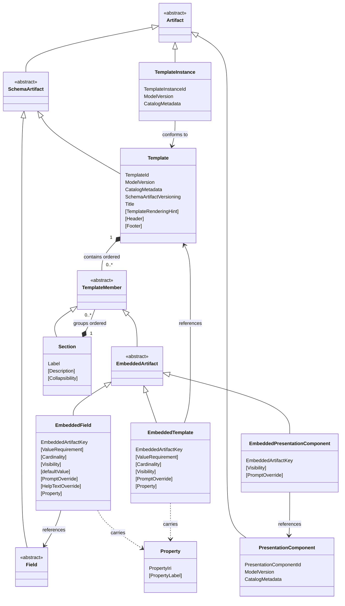

# Abstract Grammar

> **Read this in the rendered book, not on GitHub.** The published version at <https://metadatacenter.github.io/cedar-structural-spec/grammar.html> renders the EBNF cross-references and the interactive kernel-overview class diagram. Viewing this file directly on github.com shows the markdown source — production-anchor links (`#prod-Template`, etc.) and the mermaid `click` directives don't resolve there.

This section defines the abstract structure of the CEDAR Template Model using an EBNF-style grammar.

The grammar defines the abstract syntactic structure of the model. It specifies the kinds of constructs that exist and how they are composed, but it does not define a concrete textual or data serialization such as JSON, YAML, RDF, or a functional-style syntax.

Accordingly, a production in this grammar describes abstract structure rather than a directly parseable text form. In particular, a production such as `Template ::= template( ... )` does not mean:

- the literal token `template` must appear in a file
- parentheses must appear in a file
- whitespace must be used in a particular way in a file
- the production is itself a concrete serialization format

The following notation is used throughout this grammar:

```ebnf
::=    defined as
|      alternative production
X*     zero or more occurrences of X
X+     one or more occurrences of X
[X]    optional occurrence of X
(...)  groups the named components of an abstract constructor form
```

Whitespace separates symbols within a production.

Production names use `UpperCamelCase`. A production name denotes the abstract category being defined, such as `Template`, `Field`, or `DateFieldSpec`.

Abstract constructor forms use `lower_snake_case`. In this document, a constructor form is the schematic form used to show how an abstract construct is composed, such as `template(...)`, `field(...)`, or `date_field_spec(...)`. The difference between `UpperCamelCase` production names and `lower_snake_case` constructor forms is purely a visual distinction used to make it clear when the grammar is naming a category and when it is showing the abstract form of a construct belonging to that category.

For example, in the production

```ebnf
Template ::= template(
               TemplateId
               CatalogMetadata
               SchemaArtifactVersioning
               Title
               [TemplateRenderingHint]
               TemplateMember*
             )
```

`Template` is the production being defined, while `template(...)` denotes the abstract constructor form of that construct; in other words, it shows the components of a `Template` and how they are composed.

A conceptual overview of the model — describing the principal categories, their relationships, and the design rationale behind key decisions — is provided in [`spec/metamodel.md`](metamodel.md). The present document is the normative formal specification.

## Contents

- [Kernel Grammar](#kernel-grammar)
  - [Core Structure](#core-structure)
    - [Template](#template)
    - [Field](#field)
  - [Embedded Artifacts](#embedded-artifacts)
    - [EmbeddedField](#embeddedfield)
    - [EmbeddedTemplate](#embeddedtemplate)
    - [EmbeddedPresentationComponent](#embeddedpresentationcomponent)
- [Concrete Field Artifacts](#concrete-field-artifacts)
- [Concrete Embedded Fields](#concrete-embedded-fields)
- [Artifact Identity](#artifact-identity)
- [Artifact Metadata](#artifact-metadata)
  - [Aggregate Structure](#aggregate-structure)
  - [Descriptive Metadata](#descriptive-metadata)
  - [Lifecycle Metadata](#lifecycle-metadata)
  - [Schema Versioning](#schema-versioning)
  - [Annotations](#annotations)
- [Scalar and Datatype Leaves](#scalar-and-datatype-leaves)
  - [Primitive String Types](#primitive-string-types)
  - [Core IRI and String Types](#core-iri-and-string-types)
  - [Numeric Datatype Kind](#numeric-datatype-kind)
- [Values](#values)
  - [Scalar Values](#scalar-values)
  - [Temporal Values](#temporal-values)
  - [Controlled Term Value](#controlled-term-value)
  - [Enum Value](#enum-value)
  - [Link Value](#link-value)
  - [Contact Values](#contact-values)
  - [External Authority Values](#external-authority-values)
  - [Language Value](#language-value)
  - [Attribute Value](#attribute-value)
- [Embedded Artifact Properties](#embedded-artifact-properties)
  - [Embedded Artifact Key](#embedded-artifact-key)
  - [References](#references)
  - [Requirements](#requirements)
  - [Cardinality](#cardinality)
  - [Visibility](#visibility)
  - [Defaults](#defaults)
  - [Prompt Override](#prompt-override)
  - [Properties](#properties)
- [Field Specs](#field-specs)
  - [Temporal Field Specs](#temporal-field-specs)
  - [Controlled Term Sources](#controlled-term-sources)
  - [Rendering Hints](#rendering-hints)
- [Presentation Components](#presentation-components)
- [Field Spec And Value Correspondence](#field-spec-and-value-correspondence)
- [Instances](#instances)
- [Open Questions](#open-questions)

## Kernel Grammar

The kernel grammar defines the primary abstract categories of the model and the core schema-level structure that connects them. It introduces reusable schema artifacts, templates, and the embedding constructs through which templates assemble fields, nested templates, and presentation components. Subsequent sections refine the metadata, field-spec families, instance structures, and supporting constructs referenced here.

The diagram below gives an overview of the kernel. [`Template`](#prod-Template) is the central container: it holds an ordered sequence of [`TemplateMember`](#prod-TemplateMember) constructs. A `TemplateMember` is either an [`EmbeddedArtifact`](#prod-EmbeddedArtifact), which contextualises a reusable artifact — a [`Field`](#prod-Field), a nested [`Template`](#prod-Template), or a [`PresentationComponent`](#prod-PresentationComponent) — within that specific template, or a [`Section`](#prod-Section), which groups members under a heading. The three concrete embedded constructs are [`EmbeddedField`](#prod-EmbeddedField), [`EmbeddedTemplate`](#prod-EmbeddedTemplate), and [`EmbeddedPresentationComponent`](#prod-EmbeddedPresentationComponent); a `Section` recursively contains further `TemplateMember` constructs. A [`TemplateInstance`](#prod-TemplateInstance) records data conforming to a [`Template`](#prod-Template). Concrete `Field` variants and `FieldSpec` configurations are omitted from the diagram for clarity; they are defined in [Concrete Field Artifacts](#concrete-field-artifacts) and [Field Specs](#field-specs).

The diagram is interactive: each named class in the rendered book links to the corresponding EBNF production below.



### Core Structure

This subsection establishes the top-level taxonomy of the model and introduces its two principal concrete schema artifacts. [`Artifact`](#prod-Artifact) is the broadest category, encompassing reusable schema artifacts, presentation components, and template instances. [`Template`](#prod-Template) is defined here as the central container that organises embedded artifacts into a structured form. [`Field`](#prod-Field) is introduced as an abstract category whose concrete variants are defined in [Concrete Field Artifacts](#concrete-field-artifacts).

```ebnf
Artifact ::= SchemaArtifact
           | PresentationComponent
           | TemplateInstance

SchemaArtifact ::= Field
                 | Template
```

#### Template

[`Template`](#prod-Template) is a concrete schema artifact and the central container of the model. It assembles [`TemplateMember`](#prod-TemplateMember) constructs — [`EmbeddedArtifact`](#prod-EmbeddedArtifact) embeddings and [`Section`](#prod-Section) groupings — into a structured form and defines the schema that [`TemplateInstance`](#prod-TemplateInstance) constructs conform to.

```ebnf
Template ::= template(
               TemplateId
               ModelVersion
               CatalogMetadata
               SchemaArtifactVersioning
               Title
               [TemplateRenderingHint]
               [Header]
               [Footer]
               EmbeddedArtifact*
             )

Title ::= title(
            MultilingualString
          )

Label ::= label(
            MultilingualString
          )

Prompt ::= prompt(
             MultilingualString
           )

AlternativePrompt ::= alternative_prompt(
                        PromptKey
                        MultilingualString
                      )

PromptKey ::= prompt_key(
                AsciiIdentifier
              )

Header ::= header(
             MultilingualString
           )

Footer ::= footer(
             MultilingualString
           )

TemplateRenderingHint ::= template_rendering_hint(
                            [HelpDisplayMode]
                          )

HelpDisplayMode ::= "inline" | "tooltip" | "both" | "none"
```

`Header` and `Footer` denote optional human-readable textual content displayed at the top and bottom of a rendered template respectively. Each is a [`MultilingualString`](#multilingual-strings) carrying one or more language-tagged localizations of the same conceptual text.

`TemplateRenderingHint` carries form-level UX configuration. Distinct from the per-field-spec [`RenderingHint`](#rendering-hints) family, which configures how a single field is rendered, `TemplateRenderingHint` configures behaviour that applies to the form as a whole. Currently the only slot is `HelpDisplayMode`; future revisions may add further form-level UX switches, each with its own cascade rule for embedded templates.

`HelpDisplayMode` selects how field [`HelpText`](#field-artifacts) — and any per-embedding [`HelpTextOverride`](#help-text-override) — is presented at form-render time:

- `"inline"` — `HelpText` renders as visible text adjacent to the field, typically beneath the input.
- `"tooltip"` — `HelpText` renders as a hover/focus tooltip, triggered by a `?` icon or similar affordance.
- `"both"` — both presentations are emitted. Useful for accessibility contexts where redundancy is preferred.
- `"none"` — the field's `HelpText` is not displayed at form-render time. The content remains part of the model (visible to alternative renderers, to the RDF projection, and to catalog displays) but the form-rendering layer suppresses it.

When `HelpDisplayMode` is absent — either because the `Template` carries no `TemplateRenderingHint`, or because the hint omits the slot — the default behaviour is `"inline"`.

The cascade rule for nested templates is a rendering-time concern, not a structural validation constraint, and is normatively stated in [`presentation.md`](presentation.md): when a `Template` is embedded inside another `Template`, the inner template's `HelpDisplayMode` is ignored for help-text rendering; the enclosing template's setting applies to every field within the rendered form, including fields contributed by nested templates. The inner template's own `HelpDisplayMode` applies only when the template is rendered standalone.

#### Field

The following productions introduce the abstract field categories. [`Field`](#prod-Field) remains an abstract category, while the intermediate categories group related concrete field artifacts for readability and shared semantics. Concrete `Field` variants are defined in [Concrete Field Artifacts](#concrete-field-artifacts) below.

```ebnf
Field ::= TextField
        | NumericField
        | BooleanField
        | TemporalField
        | ControlledTermField
        | EnumField
        | LinkField
        | ContactField
        | ExternalAuthorityField
        | LanguageField
        | AttributeValueField

NumericField ::= IntegerNumberField
               | RealNumberField

TemporalField ::= DateField
                | TimeField
                | DateTimeField

EnumField ::= SingleValuedEnumField
            | MultiValuedEnumField

ContactField ::= EmailField
               | PhoneNumberField

ExternalAuthorityField ::= OrcidField
                         | RorField
                         | DoiField
                         | PubMedIdField
                         | RridField
                         | NihGrantIdField
```

### Template Members

A [`Template`](#prod-Template) holds an ordered sequence of [`TemplateMember`](#prod-TemplateMember) constructs. A `TemplateMember` is either an [`EmbeddedArtifact`](#prod-EmbeddedArtifact) — a reusable artifact contextualised within the template — or a [`Section`](#prod-Section), which groups members under a heading without itself contributing instance data.

```ebnf
TemplateMember ::= EmbeddedArtifact
                 | Section
```

The sequence of `TemplateMember` constructs within a `Template` (and within a `Section`) is significant. The order in which they appear determines the presentation order in a rendered template. Conforming implementations MUST preserve this order.

### Embedded Artifacts

An [`EmbeddedArtifact`](#prod-EmbeddedArtifact) contextualises a reusable artifact within a specific [`Template`](#prod-Template), adding template-local properties that govern how the artifact participates in that context. There are three forms: [`EmbeddedField`](#prod-EmbeddedField), which embeds a data-bearing field; [`EmbeddedTemplate`](#prod-EmbeddedTemplate), which nests a template within the containing template; and [`EmbeddedPresentationComponent`](#prod-EmbeddedPresentationComponent), which contributes presentational structure without producing instance data.

```ebnf
EmbeddedArtifact ::= EmbeddedField
                   | EmbeddedTemplate
                   | EmbeddedPresentationComponent
```

#### EmbeddedField

[`EmbeddedField`](#prod-EmbeddedField) is the abstract category for embeddings of reusable `Field` artifacts. Its concrete variants are one-to-one with the concrete `Field` variants — `EmbeddedTextField` embeds a `TextField`, `EmbeddedDateField` embeds a `DateField`, and so on for all twenty-one field families. The concrete variants are defined in [Concrete Embedded Fields](#concrete-embedded-fields) below.

```ebnf
EmbeddedField ::= EmbeddedTextField
                | EmbeddedIntegerNumberField
                | EmbeddedRealNumberField
                | EmbeddedBooleanField
                | EmbeddedDateField
                | EmbeddedTimeField
                | EmbeddedDateTimeField
                | EmbeddedControlledTermField
                | EmbeddedSingleValuedEnumField
                | EmbeddedMultiValuedEnumField
                | EmbeddedLinkField
                | EmbeddedEmailField
                | EmbeddedPhoneNumberField
                | EmbeddedOrcidField
                | EmbeddedRorField
                | EmbeddedDoiField
                | EmbeddedPubMedIdField
                | EmbeddedRridField
                | EmbeddedNihGrantIdField
                | EmbeddedLanguageField
                | EmbeddedAttributeValueField
```

#### EmbeddedTemplate

[`EmbeddedTemplate`](#prod-EmbeddedTemplate) follows a similar pattern to the embedded-field family but differs in what embedding properties it carries. It supports cardinality to permit multiple nested instances of the referenced template, carries no typed default value (templates are not single-valued in the way scalar fields are), and carries an optional [`Property`](#prod-Property) associating a semantic property IRI with the embedding site.

```ebnf
EmbeddedTemplate ::= embedded_template(
                       EmbeddedArtifactKey
                       TemplateId
                       [ValueRequirement]
                       [Cardinality]
                       [Visibility]
                       [PromptOverride]
                       [Property]
                     )
```

#### EmbeddedPresentationComponent

[`EmbeddedPresentationComponent`](#prod-EmbeddedPresentationComponent) carries neither a value requirement, cardinality, default value, prompt override, nor property, as it contributes no instance data and exists purely to contribute presentational structure. The only embedding-level property it carries is [`Visibility`](#prod-Visibility).

```ebnf
EmbeddedPresentationComponent ::= embedded_presentation_component(
                                    EmbeddedArtifactKey
                                    PresentationComponentId
                                    [Visibility]
                                  )
```

### Sections

A [`Section`](#prod-Section) groups [`TemplateMember`](#prod-TemplateMember) constructs under a heading. Sectioning is *semantic* organisation, not presentation: the decision that a field belongs with one group of members rather than another is an authoring decision about the form's meaning, and it survives across renderers, exports, and downstream transformations. (Presentational *layout* — columns, rows, responsive arrangement — is a separate concern, not modelled by `Section`.)

```ebnf
Section ::= section(
              Label
              [Description]
              [Collapsibility]
              TemplateMember*
            )

Collapsibility ::= "none" | "startsExpanded" | "startsCollapsed"
```

A `Section` carries a required [`Label`](#prod-Label) heading, an optional [`Description`](#prod-Description) for short prose shown beneath the heading, an optional `Collapsibility`, and its own ordered sequence of `TemplateMember` constructs. Because a `Section`'s body is again `TemplateMember*`, sections nest: a section may contain embedded artifacts, further sections, or both. The body MAY be empty. The grammar imposes no nesting-depth limit; renderers MAY impose sensible limits.

`Collapsibility` declares how a section behaves with respect to expand/collapse — author intent about the form's information hierarchy, which a non-interactive renderer (PDF, paper form, linear screen-reader traversal) MAY ignore:

- `"none"` (the default when the slot is absent) — the section is not collapsible; no toggle is exposed and the section is always shown open.
- `"startsExpanded"` — the section is collapsible and starts expanded.
- `"startsCollapsed"` — the section is collapsible and starts collapsed (the "advanced settings" / "supplementary information" pattern).

A `Section` does **not** carry an [`EmbeddedArtifactKey`](#embedded-artifact-key). Sections are not referenced from `TemplateInstance` constructs, from override mechanisms, or from anywhere else in the model, so a key would be unused. (If a future feature requires referencing sections — conditional logic, deep linking — a key slot can be added then as a scoped change.)

Sections carry no instance data and are **transparent** to instance matching. A `TemplateInstance` records values keyed only by `EmbeddedArtifactKey`, with no record of section membership; re-sectioning a template — moving an embedded artifact from one section to another — therefore does not migrate any instance data. To match instance values against the template, an implementation walks the member tree, recursing through `Section` bodies, and collects every `EmbeddedArtifact` into a flat map keyed by `EmbeddedArtifactKey`. For this to be unambiguous, `EmbeddedArtifactKey` values MUST be unique across the entire member tree of a `Template`, not merely among sibling members (see [Validation](validation.md)).

## Concrete Field Artifacts

Each concrete `Field` variant carries six components: a typed artifact identifier that permanently identifies the reusable field; a `ModelVersion` identifying the version of the CEDAR structural model the artifact conforms to; `CatalogMetadata` providing the descriptive, lifecycle, and annotation metadata used in catalog and registry contexts; `SchemaArtifactVersioning` providing the version, status, and lineage information common to all schema artifacts; a typed `FieldSpec` that specifies the value semantics and configuration for that field category; and a `Prompt` that carries the rendered question text shown to users at data-entry time. The identifier, `FieldSpec`, and `Prompt` are specific to each concrete variant; `ModelVersion`, `CatalogMetadata`, and `SchemaArtifactVersioning` are uniform across all fields. Each concrete `Field` MAY additionally carry an optional `HelpText`, an optional repeated `AlternativePrompt*` slot carrying a field-owner-curated set of alternative question wordings (see [Alternative Prompts](#alternative-prompts)), and two optional advisory slots, `RecommendedKey` and `RecommendedProperty`. The groupings below mirror the abstract `Field` hierarchy defined in Core Structure.

`TextField`, `BooleanField`, and the two numeric field families (`IntegerNumberField` and `RealNumberField`) are the simple scalar field specs. Each carries the most basic value semantics — free text, `true` / `false`, exact integer values, and real-valued numbers respectively.

```ebnf
TextField ::= text_field(
               TextFieldId
               ModelVersion
               CatalogMetadata
               SchemaArtifactVersioning
               TextFieldSpec
               Prompt
               [HelpText]
               AlternativePrompt*
               [RecommendedKey]
               [RecommendedProperty]
             )

BooleanField ::= boolean_field(
                  BooleanFieldId
                  ModelVersion
                  CatalogMetadata
                  SchemaArtifactVersioning
                  BooleanFieldSpec
                  Prompt
                  [HelpText]
                  AlternativePrompt*
                  [RecommendedKey]
                  [RecommendedProperty]
                )
```

The numeric field variants correspond to the `NumericField` abstract category. They share the broader concept of numeric content but split semantically: `IntegerNumberField` carries arbitrary-precision integer values (no fractional part); `RealNumberField` carries real-valued numbers (decimal arbitrary precision, or IEEE 754 single- or double-precision floating point). The split is principled: integer arithmetic is exact and closed under the usual operations, whereas real-valued arithmetic carries approximation concerns. See [Field Specs](#field-specs) for the per-family configuration.

```ebnf
IntegerNumberField ::= integer_number_field(
                         IntegerNumberFieldId
                         ModelVersion
                         CatalogMetadata
                         SchemaArtifactVersioning
                         IntegerNumberFieldSpec
                         Prompt
                         [HelpText]
                         AlternativePrompt*
                         [RecommendedKey]
                         [RecommendedProperty]
                       )

RealNumberField ::= real_number_field(
                      RealNumberFieldId
                      ModelVersion
                      CatalogMetadata
                      SchemaArtifactVersioning
                      RealNumberFieldSpec
                      Prompt
                      [HelpText]
                      AlternativePrompt*
                      [RecommendedKey]
                      [RecommendedProperty]
                    )
```

The temporal field variants correspond to the `TemporalField` abstract category. Each is typed to a distinct temporal semantic — date, time of day, or combined date-time — and carries its own `FieldSpec` with precision and rendering options appropriate to that category.

```ebnf
DateField ::= date_field(
               DateFieldId
               ModelVersion
               CatalogMetadata
               SchemaArtifactVersioning
               DateFieldSpec
               Prompt
               [HelpText]
               AlternativePrompt*
               [RecommendedKey]
               [RecommendedProperty]
             )

TimeField ::= time_field(
               TimeFieldId
               ModelVersion
               CatalogMetadata
               SchemaArtifactVersioning
               TimeFieldSpec
               Prompt
               [HelpText]
               AlternativePrompt*
               [RecommendedKey]
               [RecommendedProperty]
             )

DateTimeField ::= date_time_field(
                   DateTimeFieldId
                   ModelVersion
                   CatalogMetadata
                   SchemaArtifactVersioning
                   DateTimeFieldSpec
                   Prompt
                   [HelpText]
                   AlternativePrompt*
                   [RecommendedKey]
                   [RecommendedProperty]
                 )
```

`ControlledTermField` supports values drawn from declared ontology sources. `LinkField` carries a single IRI-valued hyperlink.

```ebnf
ControlledTermField ::= controlled_term_field(
                          ControlledTermFieldId
                          ModelVersion
                          CatalogMetadata
                          SchemaArtifactVersioning
                          ControlledTermFieldSpec
                          Prompt
                          [HelpText]
                          AlternativePrompt*
                          [RecommendedKey]
                          [RecommendedProperty]
                        )

LinkField ::= link_field(
               LinkFieldId
               ModelVersion
               CatalogMetadata
               SchemaArtifactVersioning
               LinkFieldSpec
               Prompt
               [HelpText]
               AlternativePrompt*
               [RecommendedKey]
               [RecommendedProperty]
             )
```

`SingleValuedEnumField` and `MultiValuedEnumField` correspond to the `EnumField` abstract category and are the two concrete enum field variants. They differ in whether they permit exactly one or multiple simultaneous selections from a declared set of permissible values. The permitted values are declared in the corresponding `EnumFieldSpec` and are validated against at the instance level.

```ebnf
SingleValuedEnumField ::= single_valued_enum_field(
                            SingleValuedEnumFieldId
                            ModelVersion
                            CatalogMetadata
                            SchemaArtifactVersioning
                            SingleValuedEnumFieldSpec
                            Prompt
                            [HelpText]
                            AlternativePrompt*
                            [RecommendedKey]
                            [RecommendedProperty]
                          )

MultiValuedEnumField ::= multi_valued_enum_field(
                           MultiValuedEnumFieldId
                           ModelVersion
                           CatalogMetadata
                           SchemaArtifactVersioning
                           MultiValuedEnumFieldSpec
                           Prompt
                           [HelpText]
                           AlternativePrompt*
                           [RecommendedKey]
                           [RecommendedProperty]
                         )
```

The contact field variants correspond to the `ContactField` abstract category and represent human contact identifiers.

```ebnf
EmailField ::= email_field(
                EmailFieldId
                ModelVersion
                CatalogMetadata
                SchemaArtifactVersioning
                EmailFieldSpec
                Prompt
                [HelpText]
                AlternativePrompt*
                [RecommendedKey]
                [RecommendedProperty]
              )

PhoneNumberField ::= phone_number_field(
                      PhoneNumberFieldId
                      ModelVersion
                      CatalogMetadata
                      SchemaArtifactVersioning
                      PhoneNumberFieldSpec
                      Prompt
                      [HelpText]
                      AlternativePrompt*
                      [RecommendedKey]
                      [RecommendedProperty]
                    )
```

The external authority field variants correspond to the `ExternalAuthorityField` abstract category. Each represents an identifier issued by a specific external authority system, as described in the [External Authority Values](#external-authority-values) section. Each external authority field is associated with format validation specific to its identifier scheme and supports integration with the corresponding resolution service for identifier lookup and verification.

```ebnf
OrcidField ::= orcid_field(
                OrcidFieldId
                ModelVersion
                CatalogMetadata
                SchemaArtifactVersioning
                OrcidFieldSpec
                Prompt
                [HelpText]
                AlternativePrompt*
                [RecommendedKey]
                [RecommendedProperty]
              )

RorField ::= ror_field(
              RorFieldId
              ModelVersion
              CatalogMetadata
              SchemaArtifactVersioning
              RorFieldSpec
              Prompt
              [HelpText]
              AlternativePrompt*
              [RecommendedKey]
              [RecommendedProperty]
            )

DoiField ::= doi_field(
              DoiFieldId
              ModelVersion
              CatalogMetadata
              SchemaArtifactVersioning
              DoiFieldSpec
              Prompt
              [HelpText]
              AlternativePrompt*
              [RecommendedKey]
              [RecommendedProperty]
            )

PubMedIdField ::= pub_med_id_field(
                    PubMedIdFieldId
                    ModelVersion
                    CatalogMetadata
                    SchemaArtifactVersioning
                    PubMedIdFieldSpec
                    Prompt
                    [HelpText]
                    AlternativePrompt*
                    [RecommendedKey]
                    [RecommendedProperty]
                  )

RridField ::= rrid_field(
               RridFieldId
               ModelVersion
               CatalogMetadata
               SchemaArtifactVersioning
               RridFieldSpec
               Prompt
               [HelpText]
               AlternativePrompt*
               [RecommendedKey]
               [RecommendedProperty]
             )

NihGrantIdField ::= nih_grant_id_field(
                     NihGrantIdFieldId
                     ModelVersion
                     CatalogMetadata
                     SchemaArtifactVersioning
                     NihGrantIdFieldSpec
                     Prompt
                     [HelpText]
                     AlternativePrompt*
                     [RecommendedKey]
                     [RecommendedProperty]
                   )
```

`LanguageField` carries a natural-language designation as data — for example, the primary language of a document, a person's spoken language, or a community's language. Its value is a canonical BCP 47 language tag. Display-name rendering and authoring-time autocomplete are typically performed against the IANA Language Subtag Registry; the structural spec does not redistribute or version-lock the registry. The normative requirement on a `LanguageValue` is that the carried tag MUST be a well-formed BCP 47 language tag.

`LanguageField` is distinct from the `LanguageTag` carried by `TextValue.lang` and `LangString.lang`. Those slots are *metadata about a text value* — what language a piece of text is in. `LanguageValue` is *a language as data itself* — what language is being recorded as the answer to a form question. The two carry the same lexical type but play different semantic roles, and a template may use both.

```ebnf
LanguageField ::= language_field(
                    LanguageFieldId
                    ModelVersion
                    CatalogMetadata
                    SchemaArtifactVersioning
                    LanguageFieldSpec
                    Prompt
                    [HelpText]
                    AlternativePrompt*
                    [RecommendedKey]
                    [RecommendedProperty]
                  )
```

`AttributeValueField` supports open-ended name-value pair data whose attribute names are not fixed at schema definition time.

```ebnf
AttributeValueField ::= attribute_value_field(
                          AttributeValueFieldId
                          ModelVersion
                          CatalogMetadata
                          SchemaArtifactVersioning
                          AttributeValueFieldSpec
                          Prompt
                          [HelpText]
                          AlternativePrompt*
                          [RecommendedKey]
                          [RecommendedProperty]
                        )
```

The concrete field artifacts defined above are reusable schema-level constructs. A reusable `Field` deliberately does not carry template-local keying, cardinality, visibility, or prompt override — those properties belong to the embedding context, not to the reusable artifact. To appear within a `Template`, each field must be included via an [Embedded Artifacts](#embedded-artifacts) construct, which adds that template-local context and governs how the field participates in that specific template.

Each concrete `Field` artifact MAY carry an optional `HelpText` slot. `HelpText` is authored guidance about what the field is asking for and how to answer — text typically rendered alongside the field at form-render time as inline help, as a hover tooltip, or both, controlled by the enclosing `Template`'s [`HelpDisplayMode`](#template-rendering-hint). `HelpText` is distinct from [`Description`](#descriptive-metadata): `Description` is the artifact-catalog explanation seen when browsing the field registry; `HelpText` is the form-author-facing guidance seen at data-entry time. The two roles often share text but serve different audiences.

```ebnf
HelpText ::= help_text( MultilingualString )
```

`HelpText` carries a [`MultilingualString`](#multilingual-strings) value: localized authored guidance that may be presented in one or more natural languages. The enclosing `Template`'s `HelpDisplayMode` selects the presentation; absence of `HelpDisplayMode` defaults to `"inline"` rendering. The `"none"` arm suppresses rendering but preserves the content in the model (visible to alternative renderers, RDF projection, and catalog displays).

A per-embedding override is also defined: an `EmbeddedField` MAY carry an optional `HelpTextOverride` that replaces the field's canonical `HelpText` at that embedding site only, mirroring the existing `PromptOverride` precedent. See [Embedded Artifacts](#embedded-artifacts) for the embedding-site shape.

Each concrete `Field` artifact MAY also carry an optional `RecommendedKey` slot. `RecommendedKey` is a non-binding suggestion the field's owner offers to template authors for the [`EmbeddedArtifactKey`](#embedded-artifact-key) of an embedding that references this field. Its purpose is to propagate a convention across the templates that embed the same field, so that downstream consumers (analytics, exports, joins) see a consistent instance-side identifier where possible.

```ebnf
RecommendedKey ::= recommended_key( EmbeddedArtifactKey )
```

`RecommendedKey` is **advisory only**. It does not constrain `EmbeddedField.EmbeddedArtifactKey` at validation time: an embedding referencing a field that carries `RecommendedKey` MAY use the recommended key as its own `EmbeddedArtifactKey`, or MAY pick a different key. Authoring tools MAY pre-fill the embedding's key with the field's recommendation, and MAY surface deviations from it as warnings; the spec requires neither. The authoritative key for instance data is always the one carried by the `EmbeddedField`, never the field's recommendation.

The carried `EmbeddedArtifactKey` is subject to the same lexical rules as any other `EmbeddedArtifactKey` (see [Embedded Artifact Key](#embedded-artifact-key)), so a `RecommendedKey` is always a syntactically valid candidate for direct adoption by an embedding.

Each concrete `Field` artifact MAY also carry an optional `RecommendedProperty` slot. `RecommendedProperty` is a non-binding suggestion the field's owner offers to template authors for the [`Property`](#prod-Property) of an embedding that references this field. Its purpose is to propagate a semantic-predicate convention across the templates that embed the same field, so that RDF projections of nominally-equivalent data points use a consistent predicate where possible.

```ebnf
RecommendedProperty ::= recommended_property( Property )
```

`RecommendedProperty` is **advisory only**. It does not constrain `EmbeddedField.Property` at validation time: an embedding referencing a field that carries `RecommendedProperty` MAY use the recommended `Property` as its own, MAY pick a different one, or MAY omit `Property` entirely. Authoring tools MAY pre-fill the embedding's `Property` from the field's recommendation, and MAY surface deviations from it as warnings; the spec requires neither. The authoritative `Property` for an embedding's RDF projection is always the one carried by the `EmbeddedField`, never the field's recommendation.

The carried `Property` is subject to the same well-formedness rules as any other `Property` (a syntactically valid `PropertyIri`, an optional `PropertyLabel`; see [Properties](#properties)), so a `RecommendedProperty` is always a valid candidate for direct adoption by an embedding.

## Concrete Embedded Fields

Every concrete `EmbeddedField` variant follows the same structural pattern. Each carries: an `EmbeddedArtifactKey` uniquely identifying the embedding site within the containing `Template`; a typed field reference identifying the reusable `Field` being embedded; an optional `ValueRequirement` specifying whether a value is required, recommended, or optional; an optional `Cardinality` bounding the permitted number of values; an optional `Visibility` controlling whether the field is shown in rendered interfaces; an optional `defaultValue` providing an embedding-specific default whose type is the family-specific `Value` type (e.g. `TextValue` for `EmbeddedTextField`, `DateValue` for `EmbeddedDateField`); an optional `PromptOverride` allowing the template to override the field's prompt at this embedding site; an optional `Property` associating a semantic property IRI with the embedding site; and an optional `PromptKey` selecting one of the referenced field's curated `AlternativePrompt` entries (see [Alternative Prompts](#alternative-prompts)). The only variation across concrete `EmbeddedField` variants is the typed field reference and the typed default value, both of which match the value family of the referenced field.

`EmbeddedBooleanField` and `EmbeddedSingleValuedEnumField` are the two exceptions to this pattern: each omits the `[Cardinality]` slot. A boolean field is inherently single-valued — its `ValueRequirement` slot already distinguishes the meaningful states (required, recommended, optional). A `SingleValuedEnumField` is similarly single-valued by construction; multi-valued enum embedding is expressed only through `EmbeddedMultiValuedEnumField`. `EmbeddedMultiValuedEnumField` further differs in that its embedding-level default is a sequence (`EnumValue*`) rather than a single optional value, parallel to how multi-valued enum instance values appear as a sequence in `FieldValue`.

```ebnf
EmbeddedTextField ::= embedded_text_field(
                        EmbeddedArtifactKey
                        TextFieldId
                        [ValueRequirement]
                        [Cardinality]
                        [Visibility]
                        [TextValue]
                        [PromptOverride]
                        [HelpTextOverride]
                        [Property]
                        [PromptKey]
                      )

EmbeddedIntegerNumberField ::= embedded_integer_number_field(
                                 EmbeddedArtifactKey
                                 IntegerNumberFieldId
                                 [ValueRequirement]
                                 [Cardinality]
                                 [Visibility]
                                 [IntegerNumberValue]
                                 [PromptOverride]
                                 [HelpTextOverride]
                                 [Property]
                                 [PromptKey]
                               )

EmbeddedRealNumberField ::= embedded_real_number_field(
                              EmbeddedArtifactKey
                              RealNumberFieldId
                              [ValueRequirement]
                              [Cardinality]
                              [Visibility]
                              [RealNumberValue]
                              [PromptOverride]
                              [HelpTextOverride]
                              [Property]
                              [PromptKey]
                            )

EmbeddedBooleanField ::= embedded_boolean_field(
                           EmbeddedArtifactKey
                           BooleanFieldId
                           [ValueRequirement]
                           [Visibility]
                           [BooleanValue]
                           [PromptOverride]
                           [HelpTextOverride]
                           [Property]
                           [PromptKey]
                         )

EmbeddedDateField ::= embedded_date_field(
                        EmbeddedArtifactKey
                        DateFieldId
                        [ValueRequirement]
                        [Cardinality]
                        [Visibility]
                        [DateValue]
                        [PromptOverride]
                        [HelpTextOverride]
                        [Property]
                        [PromptKey]
                      )

EmbeddedTimeField ::= embedded_time_field(
                        EmbeddedArtifactKey
                        TimeFieldId
                        [ValueRequirement]
                        [Cardinality]
                        [Visibility]
                        [TimeValue]
                        [PromptOverride]
                        [HelpTextOverride]
                        [Property]
                        [PromptKey]
                      )

EmbeddedDateTimeField ::= embedded_date_time_field(
                            EmbeddedArtifactKey
                            DateTimeFieldId
                            [ValueRequirement]
                            [Cardinality]
                            [Visibility]
                            [DateTimeValue]
                            [PromptOverride]
                            [HelpTextOverride]
                            [Property]
                            [PromptKey]
                          )

EmbeddedControlledTermField ::= embedded_controlled_term_field(
                                  EmbeddedArtifactKey
                                  ControlledTermFieldId
                                  [ValueRequirement]
                                  [Cardinality]
                                  [Visibility]
                                  [ControlledTermValue]
                                  [PromptOverride]
                                  [HelpTextOverride]
                                  [Property]
                                  [PromptKey]
                                )

EmbeddedSingleValuedEnumField ::= embedded_single_valued_enum_field(
                                    EmbeddedArtifactKey
                                    SingleValuedEnumFieldId
                                    [ValueRequirement]
                                    [Visibility]
                                    [EnumValue]
                                    [PromptOverride]
                                    [HelpTextOverride]
                                    [Property]
                                    [PromptKey]
                                  )

EmbeddedMultiValuedEnumField ::= embedded_multi_valued_enum_field(
                                   EmbeddedArtifactKey
                                   MultiValuedEnumFieldId
                                   [ValueRequirement]
                                   [Cardinality]
                                   [Visibility]
                                   EnumValue*
                                   [PromptOverride]
                                   [HelpTextOverride]
                                   [Property]
                                   [PromptKey]
                                 )

EmbeddedLinkField ::= embedded_link_field(
                        EmbeddedArtifactKey
                        LinkFieldId
                        [ValueRequirement]
                        [Cardinality]
                        [Visibility]
                        [LinkValue]
                        [PromptOverride]
                        [HelpTextOverride]
                        [Property]
                        [PromptKey]
                      )

EmbeddedEmailField ::= embedded_email_field(
                         EmbeddedArtifactKey
                         EmailFieldId
                         [ValueRequirement]
                         [Cardinality]
                         [Visibility]
                         [EmailValue]
                         [PromptOverride]
                         [HelpTextOverride]
                         [Property]
                         [PromptKey]
                       )

EmbeddedPhoneNumberField ::= embedded_phone_number_field(
                               EmbeddedArtifactKey
                               PhoneNumberFieldId
                               [ValueRequirement]
                               [Cardinality]
                               [Visibility]
                               [PhoneNumberValue]
                               [PromptOverride]
                               [HelpTextOverride]
                               [Property]
                               [PromptKey]
                             )

EmbeddedOrcidField ::= embedded_orcid_field(
                         EmbeddedArtifactKey
                         OrcidFieldId
                         [ValueRequirement]
                         [Cardinality]
                         [Visibility]
                         [OrcidValue]
                         [PromptOverride]
                         [HelpTextOverride]
                         [Property]
                         [PromptKey]
                       )

EmbeddedRorField ::= embedded_ror_field(
                       EmbeddedArtifactKey
                       RorFieldId
                       [ValueRequirement]
                       [Cardinality]
                       [Visibility]
                       [RorValue]
                       [PromptOverride]
                       [HelpTextOverride]
                       [Property]
                       [PromptKey]
                     )

EmbeddedDoiField ::= embedded_doi_field(
                       EmbeddedArtifactKey
                       DoiFieldId
                       [ValueRequirement]
                       [Cardinality]
                       [Visibility]
                       [DoiValue]
                       [PromptOverride]
                       [HelpTextOverride]
                       [Property]
                       [PromptKey]
                     )

EmbeddedPubMedIdField ::= embedded_pub_med_id_field(
                            EmbeddedArtifactKey
                            PubMedIdFieldId
                            [ValueRequirement]
                            [Cardinality]
                            [Visibility]
                            [PubMedIdValue]
                            [PromptOverride]
                            [HelpTextOverride]
                            [Property]
                            [PromptKey]
                          )

EmbeddedRridField ::= embedded_rrid_field(
                        EmbeddedArtifactKey
                        RridFieldId
                        [ValueRequirement]
                        [Cardinality]
                        [Visibility]
                        [RridValue]
                        [PromptOverride]
                        [HelpTextOverride]
                        [Property]
                        [PromptKey]
                      )

EmbeddedNihGrantIdField ::= embedded_nih_grant_id_field(
                               EmbeddedArtifactKey
                               NihGrantIdFieldId
                               [ValueRequirement]
                               [Cardinality]
                               [Visibility]
                               [NihGrantIdValue]
                               [PromptOverride]
                               [HelpTextOverride]
                               [Property]
                               [PromptKey]
                             )

EmbeddedLanguageField ::= embedded_language_field(
                            EmbeddedArtifactKey
                            LanguageFieldId
                            [ValueRequirement]
                            [Cardinality]
                            [Visibility]
                            [LanguageValue]
                            [PromptOverride]
                            [HelpTextOverride]
                            [Property]
                            [PromptKey]
                          )

EmbeddedAttributeValueField ::= embedded_attribute_value_field(
                                  EmbeddedArtifactKey
                                  AttributeValueFieldId
                                  [ValueRequirement]
                                  [Cardinality]
                                  [Visibility]
                                  [PromptOverride]
                                  [HelpTextOverride]
                                  [Property]
                                  [PromptKey]
                                )
```

## Artifact Identity

Artifact identity defines the typed identifiers by which artifacts and artifact references are denoted in the model. These identity constructs are distinct from descriptive metadata, lifecycle metadata, versioning, and annotations.

Each field kind has its own typed identifier rather than sharing a single generic `FieldId`. This provides strong typing: an `EmbeddedTextField` can only carry a `TextFieldId` at its `artifactRef` slot, an `EmbeddedDateField` can only carry a `DateFieldId`, and so on, making it structurally impossible to embed a field of the wrong type. `TemplateId`, `PresentationComponentId`, and `TemplateInstanceId` follow the same pattern for the same reason.

Identifiers serve two roles: at the **definition site** of a reusable artifact (e.g. `Field.id`, `Template.id`) they permanently name the artifact; at the **embedding site** (e.g. `EmbeddedField.artifactRef`, `EmbeddedTemplate.artifactRef`) they reference the artifact being embedded. The same typed identifier production is used at both positions; the role distinction is conveyed by the surrounding production's component name.

```ebnf
FieldId ::= TextFieldId
          | IntegerNumberFieldId
          | RealNumberFieldId
          | BooleanFieldId
          | DateFieldId
          | TimeFieldId
          | DateTimeFieldId
          | ControlledTermFieldId
          | SingleValuedEnumFieldId
          | MultiValuedEnumFieldId
          | LinkFieldId
          | EmailFieldId
          | PhoneNumberFieldId
          | OrcidFieldId
          | RorFieldId
          | DoiFieldId
          | PubMedIdFieldId
          | RridFieldId
          | NihGrantIdFieldId
          | LanguageFieldId
          | AttributeValueFieldId

TextFieldId ::= text_field_id( Iri )

IntegerNumberFieldId ::= integer_number_field_id( Iri )

RealNumberFieldId ::= real_number_field_id( Iri )

BooleanFieldId ::= boolean_field_id( Iri )

DateFieldId ::= date_field_id( Iri )

TimeFieldId ::= time_field_id( Iri )

DateTimeFieldId ::= date_time_field_id( Iri )

ControlledTermFieldId ::= controlled_term_field_id( Iri )

SingleValuedEnumFieldId ::= single_valued_enum_field_id( Iri )

MultiValuedEnumFieldId ::= multi_valued_enum_field_id( Iri )

LinkFieldId ::= link_field_id( Iri )

EmailFieldId ::= email_field_id( Iri )

PhoneNumberFieldId ::= phone_number_field_id( Iri )

OrcidFieldId ::= orcid_field_id( Iri )

RorFieldId ::= ror_field_id( Iri )

DoiFieldId ::= doi_field_id( Iri )

PubMedIdFieldId ::= pub_med_id_field_id( Iri )

RridFieldId ::= rrid_field_id( Iri )

NihGrantIdFieldId ::= nih_grant_id_field_id( Iri )

LanguageFieldId ::= language_field_id( Iri )

AttributeValueFieldId ::= attribute_value_field_id( Iri )

TemplateId ::= template_id( Iri )

PresentationComponentId ::= presentation_component_id( Iri )

TemplateInstanceId ::= template_instance_id( Iri )
```

All artifact identifier productions are IRI-valued. See [`Iri`](#core-iri-and-string-types).

Concrete serializations need not preserve the per-family identifier distinctions drawn here. In the JSON wire encoding, every artifact identifier — whether a per-family `FieldId` variant such as `TextFieldId` or `SingleValuedEnumFieldId`, or one of the non-field identifiers `TemplateId`, `PresentationComponentId`, and `TemplateInstanceId` — is encoded as a bare IRI string with no per-family discriminator. The field family of a `FieldId` reference is recovered from the `kind` of the enclosing `Field` or `EmbeddedField`. See [`wire-grammar.md`](wire-grammar.md) §5 and [`serialization.md`](serialization.md).

## Artifact Metadata

Artifact metadata defines descriptive information, lifecycle information, versioning, and annotations. `CatalogMetadata` is uniform across every artifact kind and provides the common catalog-oriented metadata carried by all artifacts other than identity: descriptive properties (preferred catalog label, description, identifier, alternative labels), lifecycle metadata, and annotations. Schema artifacts (`Field`, `Template`) additionally carry `SchemaArtifactVersioning` as a separate top-level slot recording version, status, and lineage.

### Aggregate Structure

This subsection identifies how the metadata categories are grouped at the artifact level. `CatalogMetadata` carries the catalog-oriented properties of an artifact — descriptive properties (preferred catalog label, description, identifier, alternative labels), lifecycle metadata, and annotations — directly as members. It is uniform across every artifact kind: `Field`, `Template`, `PresentationComponent`, and `TemplateInstance` all carry the same `CatalogMetadata` shape.

The schema artifacts (`Field` and `Template`) additionally carry [`SchemaArtifactVersioning`](#versioning) as a separate top-level slot on the artifact itself; non-schema artifacts (`PresentationComponent`, `TemplateInstance`) do not carry versioning.

`CatalogMetadata` is distinct from an artifact's **rendered display name**. A `Field` carries a top-level `Prompt` slot (the rendered question text); a `Template` carries a top-level `Title` slot (the rendered form title); a `TemplateInstance` MAY carry an optional `Label` (a user-supplied instance name); a `PresentationComponent` carries no rendered display name at all. These rendered slots are defined on the per-artifact productions in [Field Artifacts](#field-artifacts), [Core Structure](#core-structure), [Instances](#instances), and [Presentation Components](#presentation-components) respectively.

```ebnf
CatalogMetadata ::= catalog_metadata(
                      [PreferredLabel]
                      [Description]
                      [Identifier]
                      AlternativeLabel*
                      LifecycleMetadata
                      Annotation*
                    )
```

### Descriptive Metadata

The descriptive metadata of an artifact comprises a set of human-oriented properties carried directly by `CatalogMetadata`. These properties support naming, explanatory text, and external or local identifiers used for cataloging. `PreferredLabel`, when present, is the artifact's preferred display name in catalog and registry contexts (e.g., browsing the field registry or listing templates) — distinct from the artifact's *rendered* display name, which lives in a top-level slot on the artifact itself (`Field.prompt`, `Template.title`, `TemplateInstance.label`). Authors typically populate `PreferredLabel` with the same text as the rendered slot; the two are separate so they MAY differ when needed (for example, a field whose registry name is `"Comment field (v1.2)"` may render in forms as just `"Comment"`). `Description`, when present, is an extended textual explanation of the artifact's purpose and content, intended for catalog display. `Identifier`, when present, is a user-specified external identifier intended for integration with institutional or external systems. `AlternativeLabel`, when present, provides additional display labels for the artifact (synonyms, abbreviations, legacy labels carried forward from prior versions of the model).

```ebnf
Description ::= description(
                  MultilingualString
                )

Identifier ::= identifier(
                 string
               )

AlternativeLabel ::= alternative_label(
                       MultilingualString
                     )
```

`Description` carries a [`MultilingualString`](#multilingual-strings) value: human-readable text that may be presented in one or more natural languages. `Identifier` carries an arbitrary Unicode string value: it is a technical user-supplied key intended for integration with external systems and is not a human-display label, so it is not multilingual. `PreferredLabel` is defined in the [Controlled Term Value](#controlled-term-value) section. `AlternativeLabel` is a [`MultilingualString`](#multilingual-strings): each entry is itself a localization set for one alternative phrasing of the artifact's catalog-discovery label.

### Lifecycle Metadata

`LifecycleMetadata` identifies when an artifact was created and modified, and which agents were responsible for those actions.

```ebnf
LifecycleMetadata ::= lifecycle_metadata(
                        CreatedOn
                        CreatedBy
                        ModifiedOn
                        ModifiedBy
                      )

CreatedOn ::= IsoDateTimeStamp

CreatedBy ::= Iri

ModifiedOn ::= IsoDateTimeStamp

ModifiedBy ::= Iri
```

`CreatedOn` and `ModifiedOn` MUST be ISO 8601 date-time timestamps.

`CreatedBy` and `ModifiedBy` denote IRIs identifying the responsible agents.

See [`IsoDateTimeStamp`](#core-iri-and-string-types) and [`Iri`](#core-iri-and-string-types).

### Schema Versioning

`SchemaArtifactVersioning` identifies version-related metadata specific to reusable schema artifacts. It captures artifact version, publication status, and optional derivation links to earlier or source artifacts.

```ebnf
SchemaArtifactVersioning ::= schema_artifact_versioning(
                       Version
                       Status
                       [PreviousVersion]
                       [DerivedFrom]
                     )
```

```ebnf
Version ::= version(
              SemanticVersion
            )

Status ::= "draft" | "published"

ModelVersion ::= model_version(
                   SemanticVersion
                 )

PreviousVersion ::= previous_version(
                      Iri
                    )

DerivedFrom ::= derived_from(
                  Iri
                )
```

`Version` denotes a Semantic Versioning 2.0.0 version identifier.

`Status` denotes the publication status of a reusable schema artifact and is restricted to `draft` or `published`.

`PreviousVersion` and `DerivedFrom` denote IRIs identifying related source or predecessor artifacts.

The combined meaning of these fields and their interaction with artifact identity is specified in [Versioning Model](#versioning-model) below.

#### Versioning Model

The CEDAR versioning model rests on one guiding rule: **identity is per-version**. Every version of a `Field` or `Template` is itself a distinct `Artifact` with its own IRI. There is no separate "version-independent" identifier for the conceptual artifact; what holds successive versions together is the `PreviousVersion` link from each artifact to the one it replaces.

**Identity and immutability.** Every reusable schema artifact (every `Field` and every `Template`) is identified by a single `SchemaArtifactId` (a `FieldId` or `TemplateId`). That IRI denotes one specific version: distinct versions of "the same" artifact are distinct artifacts in the model, each with its own IRI. A `published` artifact MUST be treated as immutable — once `Status` is `"published"`, the content addressed by its IRI MUST NOT change. A `draft` artifact MAY be edited in place while its `Status` remains `"draft"`. The transition from `draft` to `published` is one-way: an artifact whose `Status` is `"published"` MUST NOT transition back to `"draft"`.

**Creating a new version.** To produce a revised version of a published artifact, mint a new IRI, allocate a new artifact at that IRI with `Status` set to `"draft"`, and set `PreviousVersion` to the IRI of the artifact being revised. Editing happens on the new draft; once the new artifact is itself published, it joins the version chain and becomes immutable in turn. The published predecessor is unaffected by the existence of its successor: it remains addressable at its own IRI and continues to be a valid target for `TemplateInstance` references.

**Version chains.** Successive versions of an artifact form a *version chain*: a sequence of distinct artifacts, each with its own IRI, linked by `PreviousVersion`. Artifact `B` is the immediate successor of artifact `A` when `B.previousVersion = A.id`. The first artifact in a chain MUST omit `PreviousVersion`. Every subsequent artifact in the chain MUST set `PreviousVersion` to the IRI of its immediate predecessor. A chain is therefore a singly-linked list of IRIs, traversable backwards from any version to the original.

**The role of `Version`.** `Version` carries a Semantic Versioning identifier as advisory metadata describing this artifact's place in its chain (e.g. `1.0.0` → `1.1.0` for a backwards-compatible change, `1.0.0` → `2.0.0` for a breaking change). The pairing of IRI and `PreviousVersion` is what *authoritatively* establishes the chain; `Version` is descriptive and is not load-bearing for chain identity. Successive artifacts in a chain SHOULD carry monotonically increasing `SemanticVersion` values, but this specification does not impose a structural constraint to that effect.

**Derivation versus succession.** `DerivedFrom` and `PreviousVersion` are distinct relationships and answer different questions. `PreviousVersion` records *succession within a single version chain*: the successor is intended to replace its predecessor as the same conceptual artifact evolves. `DerivedFrom` records *non-version lineage*: the new artifact is a fork or adaptation — it was authored by copying or modifying an existing artifact, but it is not the next version of that artifact. A fork begins its own independent version chain. Typical uses of `DerivedFrom` include adopting a community-published template into an institutional namespace or spawning a specialised variant of an existing field. An artifact MAY carry both `PreviousVersion` and `DerivedFrom` simultaneously: the artifact succeeds another within its own chain *and* was originally derived from a separate source artifact. The two relationships are independent. `PreviousVersion` and `DerivedFrom`, when both present, MUST NOT carry the same IRI value — succession and derivation are mutually exclusive at any single point.

**Summary of normative rules.**

1. Every version of a `Field` or `Template` MUST have a distinct IRI.
2. A `published` artifact MUST NOT change at its IRI.
3. A `published` artifact MUST NOT transition back to `draft`.
4. The first artifact in a version chain MUST omit `PreviousVersion`. Every other artifact in the chain MUST set `PreviousVersion` to the IRI of its immediate predecessor in that chain.
5. When both `PreviousVersion` and `DerivedFrom` are present on the same artifact, they MUST NOT carry the same IRI.

### Annotations

`Annotation` provides an extensible metadata mechanism for additional named metadata values that are not captured by the core descriptive, lifecycle, or versioning structures. The first `Iri` identifies the annotation property — the predicate IRI under which the annotation is asserted. The `AnnotationValue` is the associated metadata value, currently a string-bearing scalar or an IRI. This supports linking to external resources such as DOIs and grant identifiers, as well as storing institutional metadata.

```ebnf
Annotation ::= annotation(
                 Iri
                 AnnotationValue
               )

AnnotationValue ::= AnnotationStringValue
                  | AnnotationIriValue

AnnotationStringValue ::= annotation_string_value(
                            LexicalForm
                            [LanguageTag]
                          )

AnnotationIriValue ::= annotation_iri_value(
                         Iri
                       )
```

`AnnotationValue` is a discriminated union over named annotation-value productions. The two currently defined variants represent text-valued and IRI-valued annotations: `AnnotationStringValue` carries a lexical form with an optional language tag; `AnnotationIriValue` carries an IRI denoting a resource. `AnnotationStringValue` does not carry an explicit datatype; lexically-typed annotations are not modelled at this position, since annotation metadata is by convention either text or IRI-valued.

The variant family is open to extension. A future revision MAY introduce additional `AnnotationXxxValue` productions (for example, integer- or real-number-valued annotations) without breaking the existing variants.

## Scalar and Datatype Leaves

The following productions define the primitive leaf types used throughout this grammar. They represent the atomic constructs from which all other productions are built: IRIs, typed string domains, lexical forms, multilingual textual metadata, numeric and temporal datatype IRIs, and textual metadata values.

### Primitive String Types

The following nonterminals are the string-valued leaf types
referenced by the productions in this section. Each is pinned to a
specific external specification or regular expression so that
implementations can validate inputs unambiguously.

- **`SemanticVersion`** — a Semantic Versioning 2.0.0 string. MUST
  conform to the Semantic Versioning 2.0.0 specification at
  [semver.org](https://semver.org/), specifically the regular
  expression in the SemVer FAQ
  ([https://semver.org/#is-there-a-suggested-regular-expression-regex-to-check-a-semver-string](https://semver.org/#is-there-a-suggested-regular-expression-regex-to-check-a-semver-string)).
  Examples: `1.0.0`, `2.0.0-alpha.1`, `1.0.0+build.7`.
- **`IriString`** — the lexical form of an IRI as defined by
  [RFC 3987](https://www.rfc-editor.org/rfc/rfc3987) §2.2 (the `IRI`
  production). The IRI MUST be absolute (carry a scheme); relative
  IRIs are not permitted at any wire-form position. Implementations
  SHOULD use the RFC 3987 `IRI` ABNF; a permissive practical regex
  is `^[A-Za-z][A-Za-z0-9+.\-]*:[^\s<>"]+$` but this is not
  sufficient for full conformance.
- **`Bcp47Tag`** — a well-formed BCP 47 language tag per
  [RFC 5646](https://www.rfc-editor.org/rfc/rfc5646), specifically the
  `Language-Tag` production. Implementations SHOULD validate against
  the IANA Language Subtag Registry; a syntactic-only check
  (well-formedness without registry lookup) is acceptable as a
  baseline. Examples: `en`, `en-US`, `zh-Hant-TW`, `de-CH-1901`.
- **`Iso8601DateTimeLexicalForm`** — an ISO 8601 *combined date-and-time*
  string in the **extended** format with full date and full time, with
  or without a UTC offset. The accepted shapes are:
  - `YYYY-MM-DDTHH:MM:SS` (no offset)
  - `YYYY-MM-DDTHH:MM:SS.sss` (fractional seconds, 1–9 digits)
  - `YYYY-MM-DDTHH:MM:SSZ` (UTC)
  - `YYYY-MM-DDTHH:MM:SS±HH:MM` (offset)
  - the same shapes with `.sss` fractional seconds combined with the
    timezone form.

  This corresponds to the XSD `dateTime` lexical form
  ([XSD 1.1 §3.3.7](https://www.w3.org/TR/xmlschema11-2/#dateTime)).
  Examples: `2026-05-08T14:30:00Z`, `2026-05-08T14:30:00.123-07:00`.
- **`AsciiIdentifier`** — a string matching the regular expression
  `^[A-Za-z][A-Za-z0-9_-]*$`: an ASCII letter followed by zero or
  more ASCII letters, digits, underscores, or hyphens. Length is
  unbounded. Examples: `topic`, `field-1`, `Member_42`.
- **`IntegerLexicalForm`** — a base-10 signed integer literal
  matching the regular expression `^-?(0|[1-9][0-9]*)$`: an optional
  leading minus sign followed by either `0` or a non-zero digit and
  zero or more digits. Leading zeros and a leading `+` are not
  permitted. Magnitude is unbounded. The using context may further
  restrict the sign — `NonNegativeInteger` rejects values with a
  leading minus sign; signed bounds productions accept it.

### Core IRI and String Types

This subsection defines the fundamental IRI, string, and numeric leaf types that appear throughout the grammar. `Iri` is the base construct for all IRI-valued positions. `TermIri` is a specialised IRI form for controlled-vocabulary references. `LanguageTag` and `LexicalForm` are leaf string types used by `Value` constructs that carry localized or lexically-typed content. `IsoDateTimeStamp` carries ISO 8601 date-time values used in lifecycle metadata. `NonNegativeInteger` supports field-spec constraints.

```ebnf
Iri ::= iri(
          IriString
        )

TermIri ::= term_iri(
              Iri
            )

LanguageTag ::= language_tag(
                  Bcp47Tag
                )

LexicalForm ::= lexical_form(
                  string
                )

IsoDateTimeStamp ::= iso_date_time_stamp(
                       Iso8601DateTimeLexicalForm
                     )

NonNegativeInteger ::= non_negative_integer(
                         IntegerLexicalForm
                       )
```

`Iri` denotes an Internationalized Resource Identifier. It corresponds to the `xsd:anyURI` datatype; implementations MAY represent it as a plain string provided it is a syntactically valid IRI.

`TermIri` denotes an `Iri` that identifies a term in a controlled vocabulary or ontology. It is used in `ControlledTermValue`, `ControlledTermClass`, and `Meaning`.

`LanguageTag` denotes a well-formed BCP 47 language tag.

`LexicalForm` denotes a Unicode string and SHOULD be in Unicode Normalization Form C.

`IsoDateTimeStamp` denotes an ISO 8601 date-time lexical form.

`NonNegativeInteger` denotes an integer greater than or equal to zero.

### Multilingual Strings

`LangString` and `MultilingualString` are the constructs used at every grammar position that carries human-display text. They distinguish localizations of one conceptual string from technical Unicode-string keys (which remain plain `string`-valued; see [`Identifier`](#descriptive-metadata) and the controlled-term-source identifiers in [Controlled Term Sources](#controlled-term-sources)).

```ebnf
LangString ::= lang_string(
                 string
                 Bcp47Tag
               )

MultilingualString ::= multilingual_string(
                         LangString+
                       )
```

`LangString` pairs a textual value with a BCP 47 language tag identifying its natural language.

`MultilingualString` denotes a non-empty set of `LangString` entries representing localizations of one conceptual string. The entries' language tags MUST be unique within a `MultilingualString` (case-folded comparison): the construct represents a set of localizations, not a list of phrasings within a single language.

The `'und'` (undetermined) BCP 47 subtag MAY be used to denote a `LangString` whose natural language is unspecified. Implementations MAY use `'und'` as the default tag when constructing a `MultilingualString` from a bare string with no language information.

`MultilingualString` differs from a single language-tagged scalar value (such as `TextValue` with a `LanguageTag`) in that it carries an unweighted localization *set* — multiple language tags coexist for the same conceptual string at metadata positions such as `Template.header` or `CatalogMetadata.preferredLabel`.

### Numeric Datatype Kind

`IntegerNumberValue` is fixed to a single integer category; its datatype is implicit and is not a configurable component of the production. `RealNumberValue` carries an explicit `RealNumberDatatypeKind` chosen from three alternatives — `decimal`, `float`, or `double`. The kind names are CEDAR-native enum values; their corresponding XSD datatype IRIs are defined externally to the abstract grammar by [`rdf-projection.md`](rdf-projection.md).

```ebnf
RealNumberDatatypeKind ::= "decimal" | "float" | "double"
```

`decimal` denotes exact arbitrary-precision decimal numbers. `float` and `double` denote IEEE 754 single- and double-precision floating-point numbers respectively.

This specification narrows the supported numeric kinds to four (one integer kind plus the three real-number kinds). Earlier drafts admitted the full XSD numeric hierarchy (16 datatypes including `long`, `short`, `byte`, the signed/unsigned bounded subtypes, and the sign-constrained subtypes such as `nonNegativeInteger`); those are not part of the conforming set. Sign and range constraints are expressed via `IntegerNumberMinValue` / `IntegerNumberMaxValue` (or the real-valued equivalents). Bit-precision distinctions are not modelled at the type level; `decimal` covers exact arbitrary precision when needed, and `float` / `double` cover IEEE 754 single- and double-precision when storage precision matters.

## Values

This section defines the `Value` types that represent instance-level data. `Value` constructs appear in `FieldValue` instances and as typed default values in `EmbeddedArtifact` properties. The value types are defined here independently of the `FieldSpec` productions that constrain them; the normative mapping between each `FieldSpec` and its permitted `Value` form is given in the [Field Spec And Value Correspondence](#field-spec-and-value-correspondence) section.

```ebnf
Value ::= TextValue
        | NumericValue
        | BooleanValue
        | DateValue
        | TimeValue
        | DateTimeValue
        | ControlledTermValue
        | EnumValue
        | LinkValue
        | EmailValue
        | PhoneNumberValue
        | ExternalAuthorityValue
        | LanguageValue
        | AttributeValue

NumericValue ::= IntegerNumberValue
               | RealNumberValue
```

### Scalar Values

`TextValue`, `BooleanValue`, and the two numeric value forms (`IntegerNumberValue` and `RealNumberValue`) are the simplest value types. Each carries the family-specific content directly: a lexical form for the string-bearing variants, a boolean payload for `BooleanValue`. `TextValue` carries an optional `LanguageTag`; when present, the value is a language-tagged string, when absent, a plain string. `IntegerNumberValue` carries a base-10 integer lexical form; its category is implicit and not carried as a component. `RealNumberValue` carries a base-10 real-valued lexical form paired with an explicit `RealNumberDatatypeKind` (`decimal`, `float`, or `double`).

```ebnf
TextValue ::= text_value(
                LexicalForm
                [LanguageTag]
              )

IntegerNumberValue ::= integer_number_value(
                         LexicalForm
                       )

RealNumberValue ::= real_number_value(
                      LexicalForm
                      RealNumberDatatypeKind
                    )

BooleanValue ::= boolean_value(
                   boolean
                 )
```

`IntegerNumberValue`'s lexical form MUST be a base-10 integer literal (per the `IntegerLexicalForm` primitive in §Primitive String Types). `RealNumberValue`'s lexical form is a base-10 real-valued literal whose admissible form depends on the carried datatype: `decimal` admits an arbitrary-precision decimal lexical form; `float` and `double` admit IEEE 754-style lexical forms (including special values such as `INF`, `-INF`, and `NaN`).

`NumericValue` is the abstract category admitting `IntegerNumberValue` and `RealNumberValue`; the two are distinct concrete value types and a `FieldValue` carrying numeric content discriminates between them by `kind`.

The lexical form of any string-bearing value SHOULD be in Unicode Normalization Form C.

A `Value` whose lexical form lies outside the lexical space of its declared datatype is **ill-typed**: it is not syntactically ill-formed but does not determine a valid value. Implementations MUST accept ill-typed values and MAY produce warnings when encountering them. The corresponding RDF projection (see [rdf-projection.md](rdf-projection.md)) preserves the ill-typed lexical form.

### Temporal Values

Temporal values represent date, time, and date-time data, corresponding directly to `DateFieldSpec`, `TimeFieldSpec`, and `DateTimeFieldSpec` respectively. `DateValue` is further refined into three precision variants — `YearValue`, `YearMonthValue`, and `FullDateValue`. Each temporal `Value` variant carries a `LexicalForm` directly; the temporal category is fixed by the variant's `kind`. `FullDateValue` carries an ISO 8601 calendar-date lexical form; `TimeValue` carries an ISO 8601 time-of-day lexical form; `DateTimeValue` carries an ISO 8601 combined date-time lexical form. `YearValue` and `YearMonthValue` carry plain strings matching the patterns `YYYY` and `YYYY-MM` respectively. The RDF projection of these values is defined separately in [`rdf-projection.md`](rdf-projection.md).

```ebnf
DateValue ::= YearValue
            | YearMonthValue
            | FullDateValue

YearValue ::= year_value(
                LexicalForm    (* matches YYYY, e.g. "2024" *)
              )

YearMonthValue ::= year_month_value(
                     LexicalForm    (* matches YYYY-MM, e.g. "2024-06" *)
                   )

FullDateValue ::= full_date_value(
                    LexicalForm
                  )

TimeValue ::= time_value(
                LexicalForm
              )

DateTimeValue ::= date_time_value(
                    LexicalForm
                  )
```

### Controlled Term Value

A controlled term value identifies a term drawn from an ontology, branch, class set, or value set declared in the corresponding `ControlledTermFieldSpec`. It carries a `TermIri` identifying the term, together with an optional human-readable `Label` and optional `Notation` and `PreferredLabel` terminology metadata from the source ontology. `Label` is the display label intended for end-user presentation; `Notation` is a symbolic code (typically a SKOS notation) bound to the term; `PreferredLabel` is the ontology's own preferred label for the term, distinct from the display `Label` that may have been customized for the surrounding context.

A `ControlledTermValue` MAY omit `Label`: a consumer that has access to the source ontology can resolve the term's display label from the `TermIri`. Producers SHOULD include `Label` when it is known at the point of value construction so that downstream consumers without ontology access can render the value.

```ebnf
Label ::= label(
            MultilingualString
          )

Notation ::= notation(
               string
             )

PreferredLabel ::= preferred_label(
                     MultilingualString
                   )

ControlledTermValue ::= controlled_term_value(
                          TermIri
                          [Label]
                          [Notation]
                          [PreferredLabel]
                        )
```

`Label` and `PreferredLabel` are [`MultilingualString`](#multilingual-strings) values: each carries one or more language-tagged localizations of the term's display label. `Notation` is a plain Unicode string: it is a technical symbolic code (typically a SKOS notation) rather than human-display text, and is therefore not multilingual.

### Enum Value

An enum value carries a selection from the permissible values declared by an `EnumFieldSpec`. Every enum value is identified by a `Token` — a non-empty Unicode string that serves as the canonical key of one of the enum spec's `PermissibleValue` entries. A conforming instance value MUST equal the `Token` of one of the referenced spec's permissible values.

```ebnf
EnumValue ::= enum_value(
                Token
              )
```

`Token` is the leaf type used as the canonical key of an enum selection. It is defined in the [Field Specs](#field-specs) section alongside the related leaf productions (`PermissibleValue`, `Meaning`) used by `EnumFieldSpec`.

### Link Value

A link value represents a hyperlink or URL-valued field. It carries an `Iri` identifying the linked resource and an optional `Label` providing a human-readable display label for the link.

```ebnf
LinkValue ::= link_value(
                Iri
                [Label]
              )
```

`Label` is the same `MultilingualString`-valued production used by [`ControlledTermValue`](#controlled-term-value), [`PermissibleValue`](#field-specs), and the external-authority value types: a label is treated uniformly as a localizable display string. A hyperlink's display text MAY therefore carry one or more language-tagged localizations.

### Contact Values

Contact values represent human contact identifiers. `EmailValue` carries an email address as a plain `LexicalForm`; `PhoneNumberValue` carries a telephone number as a plain `LexicalForm`. Format validation is left to implementations.

```ebnf
EmailValue ::= email_value(
                 LexicalForm
               )

PhoneNumberValue ::= phone_number_value(
                       LexicalForm
                     )
```

### External Authority Values

External authority values represent identifiers issued by recognised external authority systems. Each concrete value type carries a typed IRI specialised for its authority together with an optional human-readable `Label`. The typed IRI signals the expected identifier scheme; format conformance for each authority may be enforced by profile-specific or implementation-specific validation rules.

```ebnf
ExternalAuthorityValue ::= OrcidValue
                         | RorValue
                         | DoiValue
                         | PubMedIdValue
                         | RridValue
                         | NihGrantIdValue

OrcidValue ::= orcid_value(
                 OrcidIri
                 [Label]
               )

RorValue ::= ror_value(
               RorIri
               [Label]
             )

DoiValue ::= doi_value(
               DoiIri
               [Label]
             )

PubMedIdValue ::= pub_med_id_value(
                    PubMedIri
                    [Label]
                  )

RridValue ::= rrid_value(
                RridIri
                [Label]
              )

NihGrantIdValue ::= nih_grant_id_value(
                      NihGrantIri
                      [Label]
                    )

OrcidIri    ::= orcid_iri( Iri )
RorIri      ::= ror_iri( Iri )
DoiIri      ::= doi_iri( Iri )
PubMedIri   ::= pub_med_iri( Iri )
RridIri     ::= rrid_iri( Iri )
NihGrantIri ::= nih_grant_iri( Iri )
```

| Typed IRI | Authority | IRI Pattern |
|---|---|---|
| `OrcidIri` | ORCID — identifies a researcher by ORCID iD | `https://orcid.org/\d{4}-\d{4}-\d{4}-\d{3}[\dX]` |
| `RorIri` | Research Organization Registry — identifies a research organisation by ROR ID | `https://ror.org/0[a-z0-9]{8}` |
| `DoiIri` | Digital Object Identifier — identifies a digital object by DOI | `https://doi.org/10\.\d{4,}/.+` |
| `PubMedIri` | PubMed — identifies a PubMed article | `https://pubmed.ncbi.nlm.nih.gov/\d+` |
| `RridIri` | Research Resource Identifier — identifies a research resource by RRID | `https://identifiers.org/RRID:[A-Z]+_\d+` |
| `NihGrantIri` | NIH — identifies an NIH-funded grant | unspecified |

The final character of an ORCID iD MAY be `X`, serving as an ISO 7064 Mod 11-2 check character.

### Language Value

A `LanguageValue` carries a single canonical BCP 47 language tag. The tag is the sole carried fact: no denormalized display label is stored alongside it. Conforming implementations are expected to render display names (and to drive authoring-time autocomplete) by consulting the IANA Language Subtag Registry; the structural spec does not redistribute or version-lock the registry. The normative requirement is that the carried tag MUST be a well-formed BCP 47 language tag.

```ebnf
LanguageValue ::= language_value(
                    LanguageTag
                  )
```

The lexical type `LanguageTag` is the same production used by `TextValue.lang` and `LangString.lang`; the role distinction is semantic, not lexical. See [`LanguageField`](#concrete-field-artifacts) for the contrast between language-as-metadata-about-text and language-as-data.

### Attribute Value

An attribute value is a name-value pair used to represent arbitrary named properties whose names are not known at schema definition time. `AttributeName` carries the name of the attribute as a Unicode string. The value component is itself a `Value`, permitting attribute values to carry any value type including nested attribute values. Nesting depth is unbounded at the model level; concrete implementations MAY impose practical limits.

```ebnf
AttributeName ::= attribute_name(
                    string
                  )

AttributeValue ::= attribute_value(
                     AttributeName
                     Value
                   )
```

## Embedded Artifact Properties

Embedded artifact properties define the contextual information carried by an `EmbeddedArtifact` within a `Template`. These properties govern how a referenced reusable artifact is used in that template context, including key, reference, requirement, cardinality, visibility, defaults, and prompt override, and they are distinct from the intrinsic properties of the referenced reusable artifact itself.

### Embedded Artifact Key

An `EmbeddedArtifactKey` is the local identifier of an `EmbeddedArtifact` within a `Template`. It is the key by which an embedded field, embedded template, or embedded presentation component is distinguished from other embedded artifacts in the same template. This key is also the mechanism that connects template structure to instance structure: `FieldValue` and `NestedTemplateInstance` use `EmbeddedArtifactKey` to identify which embedded artifact in the template they correspond to.

```ebnf
EmbeddedArtifactKey ::= embedded_artifact_key(
                          AsciiIdentifier
                        )
```

`EmbeddedArtifactKey` MUST match the pattern `[A-Za-z][A-Za-z0-9_-]*`: it MUST begin with an ASCII letter followed by zero or more ASCII letters, digits, underscores, or hyphens.

`EmbeddedArtifactKey` values are local to a `Template` and MUST be unique within that `Template`.

`EmbeddedArtifactKey` is distinct from artifact identifiers such as `FieldId` and `TemplateId`. It identifies the embedding site within a template rather than the reusable artifact being referenced. The same reusable `Field` may be embedded more than once in a `Template` under different keys, and each key independently identifies that embedding site in both the template structure and any corresponding `TemplateInstance`.

The restriction to the `AsciiIdentifier` lexical form is deliberate: it lets the key serve directly as an identifier in the contexts that consume template data. Because a key is a syntactically valid identifier, a tool projecting a template into code may use it verbatim as a programming-language variable or field name, and a tabular export may use it verbatim as a column name in the header row of a CSV — in both cases without escaping, quoting, or remapping. These are illustrative uses, not requirements; the spec constrains only the lexical form of the key, not how downstream tools consume it.

### Requirements

`ValueRequirement` identifies whether a value is required, recommended, or optional in the embedding context. `Required` means that a value must be supplied for conformance. `Recommended` and `Optional` are identical for conformance purposes: absence of a value MUST NOT cause conformance failure in either case. The distinction is one of authoring guidance only: implementations SHOULD encourage entry for `Recommended` fields and MAY issue warnings when such fields are left empty.

```ebnf
ValueRequirement ::= "required" | "recommended" | "optional"
```

When `ValueRequirement` is absent from an `EmbeddedArtifact`, the default is `"optional"`.

### Cardinality

`Cardinality` identifies the permitted number of occurrences for the embedded artifact in the embedding context.

```ebnf
Cardinality ::= cardinality(
                  MinCardinality
                  [MaxCardinality]
                )

MinCardinality ::= min_cardinality(
                     NonNegativeInteger
                   )

MaxCardinality ::= max_cardinality(
                     NonNegativeInteger
                   )
```

When `MaxCardinality` is absent from a present `Cardinality`, the cardinality is unbounded above: any number of occurrences greater than or equal to the specified `MinCardinality` is permitted. Unboundedness is therefore expressed by omission of `MaxCardinality` rather than by a distinct construct.

When `Cardinality` is absent from an `EmbeddedArtifact`, the implied default is `min_cardinality(1)` with `max_cardinality(1)`: the embedded artifact MUST appear exactly once.

`ValueRequirement` and `Cardinality` are orthogonal. `ValueRequirement` governs whether the user is obligated to supply any values at all. `Cardinality` governs the permitted count of values if any are supplied. A field may therefore be `Optional` — meaning the user is not required to fill it in — while carrying a `min_cardinality` greater than one, meaning that if values are supplied, at least that many must be present. For example, a primer pair field might be `Optional` but carry `min_cardinality(2)`, because a primer pair is only interpretable when both the forward and reverse primers are specified together.

### Visibility

`Visibility` determines whether the embedded artifact is shown in rendered interfaces. It is modeled as an embedding property rather than as a rendering hint because it applies to any kind of embedded artifact, not only to fields.

```ebnf
Visibility ::= "visible" | "hidden"
```

When `Visibility` is absent from an `EmbeddedArtifact`, the default is `"visible"`.

### Defaults

A *default value* is a value used to pre-populate a field at instance-creation time when no explicit value has yet been supplied by the user. Defaults exist at two layers:

- A **field-level default** lives on the reusable `Field`'s `FieldSpec`. It is set when the field is authored and is shared by every Template that embeds the field.
- An **embedding-level default** lives on the `EmbeddedXxxField` inside a Template. It overrides the field-level default for embeddings within that one Template.

Every concrete field family carries an optional default at both layers, with one exception: `AttributeValueField` carries no default at either layer (an `AttributeValue` instance is a per-instance pairing of an attribute name and a value, and a default is not meaningful).

The two default-value types match: at each layer the slot is typed with the family-specific `Value` type. The per-family typing is:

| Family | Field-level slot (on `XxxFieldSpec`) | Embedding-level slot (on `EmbeddedXxxField`) |
|---|---|---|
| Text | `[TextValue]` | `[TextValue]` |
| IntegerNumber | `[IntegerNumberValue]` | `[IntegerNumberValue]` |
| RealNumber | `[RealNumberValue]` | `[RealNumberValue]` |
| Boolean | `[BooleanValue]` | `[BooleanValue]` |
| Date | `[DateValue]` | `[DateValue]` (polymorphic: `YearValue \| YearMonthValue \| FullDateValue`) |
| Time | `[TimeValue]` | `[TimeValue]` |
| DateTime | `[DateTimeValue]` | `[DateTimeValue]` |
| ControlledTerm | `[ControlledTermValue]` | `[ControlledTermValue]` |
| SingleValuedEnum | `[EnumValue]` | `[EnumValue]` |
| MultiValuedEnum | `[EnumValue*]` (zero or more) | `[EnumValue*]` (zero or more) |
| Link | `[LinkValue]` | `[LinkValue]` |
| Email | `[EmailValue]` | `[EmailValue]` |
| PhoneNumber | `[PhoneNumberValue]` | `[PhoneNumberValue]` |
| Orcid | `[OrcidValue]` | `[OrcidValue]` |
| Ror | `[RorValue]` | `[RorValue]` |
| Doi | `[DoiValue]` | `[DoiValue]` |
| PubMedId | `[PubMedIdValue]` | `[PubMedIdValue]` |
| Rrid | `[RridValue]` | `[RridValue]` |
| NihGrantId | `[NihGrantIdValue]` | `[NihGrantIdValue]` |
| Language | `[LanguageValue]` | `[LanguageValue]` |
| AttributeValue | (no default) | (no default) |

The shape is uniform across layers: every default at every layer is the family's `Value` type. For the enum families this means the field-level default is an `EnumValue` (or sequence of `EnumValue`) — the same kind-tagged object form that appears at the embedding level. The `Token` carried inside each default `EnumValue` MUST equal the `Token` of one of the spec's `PermissibleValue+` entries; for `MultiValuedEnumFieldSpec` the sequence MUST NOT contain duplicate tokens.

**Precedence and absence semantics.** Both layers are independent and optional. The four cases:

| Field-level | Embedding-level | Effective default |
|---|---|---|
| absent | absent | none — the field has no default |
| present | absent | the field-level default |
| absent | present | the embedding-level default |
| present | present | the embedding-level default (it overrides the field-level default) |

There is no mechanism for an embedding to *unset* a field-level default. An embedding that wishes to override a field-level default with no default at all is not expressible in this version of the model.

**Defaults are UI/UX initialisation only.** A default value's sole role is to seed an instance's value at creation time, so that a user-facing form can pre-fill the corresponding input. Defaults do not appear in the wire form of `TemplateInstance` artifacts and do not affect the [RDF projection](rdf-projection.md). When an instance is created and the user accepts the default without modification, the resulting `FieldValue` carries the default value as if the user had typed it in by hand; from the instance's perspective the default and a user-supplied identical value are indistinguishable. When an instance is created and the user does not supply a value (and the field is not required), the corresponding `FieldValue` is omitted entirely — the default does not appear by virtue of having existed.

### Prompt Override

`PromptOverride` provides a template-specific rendered question text for an embedded artifact. When present, it replaces the referenced reusable `Field`'s `Prompt` at that embedding site only.

```ebnf
PromptOverride ::= prompt_override(
                     Prompt
                   )
```

`PromptOverride` is a single-component wrapper around a `Prompt`: it carries the same kind of localized rendered text as `Field.Prompt`, scoped to one embedding. The precedence rule is straightforward: at an embedding site, the renderer displays the embedding's `PromptOverride` if present, otherwise the referenced `Field`'s `Prompt`. The override is *replace*, not *merge*: localizations present in the field's `Prompt` but absent from the embedding's `PromptOverride` do not fall back.

`PromptOverride` is the *escape hatch*: free-form, unconstrained rendered text supplied by the template author when no sanctioned wording fits. It is distinct from the embedding's [`PromptKey`](#alternative-prompts) slot, which is the *governance path*: a keyed selection from the closed set of wordings the field's owner curated as `AlternativePrompt` entries. The two slots express contradictory intents — overriding with one's own wording versus selecting a sanctioned one — and an embedding MUST NOT carry both (see [Validation](validation.md)).

### Help Text Override

`HelpTextOverride` provides template-specific authored guidance for an embedded field. When present, it replaces the field's canonical [`HelpText`](#field-artifacts) for that embedding context only. The reusable `Field`'s `HelpText` remains the canonical content for all other embedding contexts (and for the field rendered standalone).

```ebnf
HelpTextOverride ::= help_text_override( MultilingualString )
```

`HelpTextOverride` is a [`MultilingualString`](#multilingual-strings): it carries the same kind of authored guidance as `HelpText`, but scoped to a single embedding site. The override's presentation — inline, tooltip, both, or none — is selected by the enclosing `Template`'s `HelpDisplayMode` exactly as for the underlying `HelpText`.

The precedence rule is straightforward: at an embedding site, the renderer displays the embedding's `HelpTextOverride` if present, otherwise the referenced `Field`'s `HelpText`, otherwise nothing. The override is *replace*, not *merge*: localizations present in the field's `HelpText` but absent from the embedding's `HelpTextOverride` do not fall back.

### Properties

A `Property` associates a semantic property IRI with an `EmbeddedField` or `EmbeddedTemplate` within a specific `Template`. The property IRI identifies the RDF property that the embedded artifact's value represents in that template context. The optional `PropertyLabel` provides a human-readable label for the property.

`Property` is an embedding-level construct. It is distinct from the intrinsic metadata of the referenced `Field` or `Template` artifact. The same reusable artifact may be embedded in different templates under different property IRIs.

```ebnf
Property ::= property(
               PropertyIri
               [PropertyLabel]
             )

PropertyIri   ::= property_iri( Iri )
PropertyLabel ::= property_label( MultilingualString )
```

`PropertyLabel` is a [`MultilingualString`](#multilingual-strings) carrying one or more language-tagged localizations of the property's human-readable label.

### Alternative Prompts

A `Field`'s `Prompt` carries its single preferred question wording. `AlternativePrompt` lets the field's owner curate a closed set of *additional* sanctioned wordings, each addressable by a stable key, so that templates embedding the field select from that set rather than inventing their own. This supports curated-vocabulary governance — the motivating case is NIH/CADSR Common Data Elements (CDEs), where a field carries the CDE's preferred wording plus its other sanctioned alternatives — but the mechanism is general: any field owner may offer style variants (formal vs. casual, long vs. short) and constrain template authors to the offered set.

```ebnf
AlternativePrompt ::= alternative_prompt(
                        PromptKey
                        MultilingualString
                      )

PromptKey ::= prompt_key(
                AsciiIdentifier
              )
```

Each concrete `Field` variant carries an optional repeated `AlternativePrompt*` slot. Each `AlternativePrompt` pairs a stable `PromptKey` with a [`MultilingualString`](#multilingual-strings) wording. The production name parallels the `Label` / `AlternativeLabel*` distinction in [`CatalogMetadata`](#descriptive-metadata): just as `AlternativeLabel*` curates alternatives to the catalog-discovery label, `AlternativePrompt*` curates alternatives to the rendered `Prompt`. The two roles are kept as distinct productions rather than reusing `Prompt` with a second shape, so the single-component preferred wording and the two-component keyed alternative remain visibly separate.

`PromptKey` is a stable, opaque local identifier — an [`AsciiIdentifier`](#prod-AsciiIdentifier) the field owner chooses. It is given its own production rather than reusing `EmbeddedArtifactKey` or `Token` so the role stays separable in the vocabulary, following the same reasoning as `RecommendedKey` and `RecommendedProperty`.

The semantic union — `{ Field.Prompt } ∪ { each AlternativePrompt's MultilingualString }` — is the complete set of wordings a conforming embedding may render. Each concrete `EmbeddedField` variant carries an optional `PromptKey` slot referencing one of the referenced field's `AlternativePrompt` keys. There are three render-time states:

- `PromptKey` absent → render the referenced field's `Prompt` (the preferred wording).
- `PromptKey` present and equal to one of the referenced field's `AlternativePrompt.PromptKey` values → render that alternative's `MultilingualString`.
- `PromptKey` present and matching none → validation error (see [Validation](validation.md)).

The model does not reserve a `PromptKey` (such as `"preferred"`) for selecting `Field.Prompt`; an embedding selects the preferred wording simply by omitting the slot.

#### Identification by key, not by content

The embedding references an alternative by its `PromptKey`, never by the literal wording. This mirrors two existing decisions in the model: every embedding is identified within its template by an [`EmbeddedArtifactKey`](#embedded-artifact-key) rather than by content, and an `EnumValue` references a [`PermissibleValue`](#prod-PermissibleValue) by its `Token` rather than by its `Label`. The rationale is robustness under composition: templates outlive the fields they reference, and keys decouple identity from content. A content-match design (selecting by the full `MultilingualString` tuple) would be more self-describing on the wire, but every wording edit — fixing a typo, adjusting punctuation, adding a localization — would silently break the embeddings that selected it. Keys are stable across all such edits.

#### How alternative prompts relate to other text-bearing surfaces

The model carries several rendered-text surfaces in this neighbourhood. The distinguishing axis is *who controls the wording* and *whether the set is open or closed*:

| Slot (abstract) | Wire-form key | Role | Controlled by |
|---|---|---|---|
| `Field.Prompt` | `prompt` | Rendered question text — the preferred wording shown when an embedding does not select otherwise | Field author |
| `CatalogMetadata.AlternativeLabel*` | `altLabels` | Synonyms for catalog discovery and search | Field author |
| `EmbeddedField.[PromptOverride]` | `promptOverride` | Free-form override of the rendered wording at the embedding site — the *escape hatch* | Template author |
| `Field.AlternativePrompt*` | `altPrompts` | Curated alternative question wordings, keyed by `PromptKey`; the closed set the field owner sanctioned | Field author |
| `EmbeddedField.[PromptKey]` | `promptKey` | Keyed selection of one `AlternativePrompt` — the *governance path* | Template author |

`PromptOverride` and `PromptKey` are the two mutually exclusive ways an embedding may change the rendered wording: the former invents a wording outside the curated set, the latter selects one within it. An embedding MUST NOT carry both (see [Validation](validation.md)).

## Field Specs

A `FieldSpec` is the semantic configuration block carried by a concrete `Field` artifact. It specifies what kind of value the field accepts, any constraints on that value, and any compatible rendering hints for presentation. Each concrete `Field` variant carries exactly one `FieldSpec` that matches its kind: a `TextField` carries a `TextFieldSpec`, a `DateField` carries a `DateFieldSpec`, and so on. The correspondence between each `FieldSpec` and its permitted `Value` form is given in the [Field Spec And Value Correspondence](#field-spec-and-value-correspondence) section.

One might ask why `FieldSpec` exists as a separate construct rather than folding its content directly into the concrete `Field` artifact. The answer is separation of concerns: the concrete field artifact — `TextField`, `DateField`, and so on — answers the question "what kind of reusable field is this?" and carries the artifact's identity, catalog metadata, versioning, and the rendered question-text prompt. The `FieldSpec` answers the separate question "what are the value rules and rendering-compatible properties for this kind of field?" Keeping these concerns distinct means that artifact identity, catalog metadata, and lifecycle/versioning information remain uniform across all field kinds, while value semantics and field-specific configuration vary per family through `FieldSpec`.

`FieldSpec` productions are grouped here by field family, mirroring the abstract `Field` hierarchy in the Kernel Grammar. Temporal field specs, which carry additional precision and rendering configuration, are detailed in the [Temporal Field Specs](#temporal-field-specs) subsection. Controlled term source declarations, which specify the ontological authorities from which controlled-term values may be drawn, are covered in the [Controlled Term Sources](#controlled-term-sources) subsection. Rendering hints for all field families are defined in the [Rendering Hints](#rendering-hints) subsection, with the exception of temporal rendering hints which are defined alongside their field specs.

```ebnf
FieldSpec ::= TextFieldSpec
            | NumericFieldSpec
            | BooleanFieldSpec
            | TemporalFieldSpec
            | ControlledTermFieldSpec
            | EnumFieldSpec
            | LinkFieldSpec
            | ContactFieldSpec
            | ExternalAuthorityFieldSpec
            | LanguageFieldSpec
            | AttributeValueFieldSpec

NumericFieldSpec ::= IntegerNumberFieldSpec
                   | RealNumberFieldSpec

TextFieldSpec ::= text_field_spec(
                    [TextValue]
                    [MinLength]
                    [MaxLength]
                    [ValidationRegex]
                    [LangTagRequirement]
                    [TextRenderingHint]
                    TextValue*  // examples
                  )

LangTagRequirement ::= "langTagRequired"
                     | "langTagOptional"
                     | "langTagForbidden"

IntegerNumberFieldSpec ::= integer_number_field_spec(
                             [IntegerNumberValue]
                             [Unit]
                             [IntegerNumberMinValue]
                             [IntegerNumberMaxValue]
                             [NumericRenderingHint]
                             IntegerNumberValue*  // examples
                           )

RealNumberFieldSpec ::= real_number_field_spec(
                          RealNumberDatatypeKind
                          [RealNumberValue]
                          [Unit]
                          [RealNumberMinValue]
                          [RealNumberMaxValue]
                          [NumericRenderingHint]
                          RealNumberValue*  // examples
                        )

Unit ::= unit(
           Iri
           [Label]
         )

MinLength ::= min_length(
                NonNegativeInteger
              )

MaxLength ::= max_length(
                NonNegativeInteger
              )

ValidationRegex ::= validation_regex(
                      string
                    )

IntegerNumberMinValue ::= integer_number_min_value(
                            IntegerNumberValue
                          )

IntegerNumberMaxValue ::= integer_number_max_value(
                            IntegerNumberValue
                          )

RealNumberMinValue ::= real_number_min_value(
                         RealNumberValue
                       )

RealNumberMaxValue ::= real_number_max_value(
                         RealNumberValue
                       )

BooleanFieldSpec ::= boolean_field_spec(
                       [BooleanValue]
                       [BooleanRenderingHint]
                       BooleanValue*  // examples
                     )

TemporalFieldSpec ::= DateFieldSpec
                    | TimeFieldSpec
                    | DateTimeFieldSpec

ControlledTermFieldSpec ::= controlled_term_field_spec(
                              [ControlledTermValue]
                              ControlledTermSource+
                              [ControlledTermRenderingHint]
                              ControlledTermValue*  // examples
                            )

EnumFieldSpec ::= SingleValuedEnumFieldSpec
                | MultiValuedEnumFieldSpec

SingleValuedEnumFieldSpec ::= single_valued_enum_field_spec(
                                PermissibleValue+
                                [EnumValue]
                                [SingleValuedEnumRenderingHint]
                                EnumValue*  // examples
                              )

MultiValuedEnumFieldSpec ::= multi_valued_enum_field_spec(
                               PermissibleValue+
                               EnumValue*  // defaultValue
                               [MultiValuedEnumRenderingHint]
                               EnumValue*  // examples
                             )

PermissibleValue ::= permissible_value(
                       Token
                       [Label]
                       [Description]
                       Meaning*
                     )

Token ::= token(
            string
          )

Meaning ::= meaning(
              TermIri
              [Label]
            )

LinkFieldSpec ::= link_field_spec(
                    [LinkValue]
                    [LinkRenderingHint]
                    LinkValue*  // examples
                  )

ContactFieldSpec ::= EmailFieldSpec
                   | PhoneNumberFieldSpec

EmailFieldSpec ::= email_field_spec(
                     [EmailValue]
                     [EmailRenderingHint]
                     EmailValue*  // examples
                   )

PhoneNumberFieldSpec ::= phone_number_field_spec(
                           [PhoneNumberValue]
                           [PhoneNumberRenderingHint]
                           PhoneNumberValue*  // examples
                         )

ExternalAuthorityFieldSpec ::= OrcidFieldSpec
                             | RorFieldSpec
                             | DoiFieldSpec
                             | PubMedIdFieldSpec
                             | RridFieldSpec
                             | NihGrantIdFieldSpec

OrcidFieldSpec ::= orcid_field_spec(
                     [OrcidValue]
                     [OrcidRenderingHint]
                     OrcidValue*  // examples
                   )

RorFieldSpec ::= ror_field_spec(
                   [RorValue]
                   [RorRenderingHint]
                   RorValue*  // examples
                 )

DoiFieldSpec ::= doi_field_spec(
                   [DoiValue]
                   [DoiRenderingHint]
                   DoiValue*  // examples
                 )

PubMedIdFieldSpec ::= pub_med_id_field_spec(
                        [PubMedIdValue]
                        [PubMedIdRenderingHint]
                        PubMedIdValue*  // examples
                      )

RridFieldSpec ::= rrid_field_spec(
                    [RridValue]
                    [RridRenderingHint]
                    RridValue*  // examples
                  )

NihGrantIdFieldSpec ::= nih_grant_id_field_spec(
                          [NihGrantIdValue]
                          [NihGrantIdRenderingHint]
                          NihGrantIdValue*  // examples
                        )

LanguageFieldSpec ::= language_field_spec(
                        [LanguageValue]
                        [PermittedLanguages]
                        [LanguageRenderingHint]
                        LanguageValue*  // examples
                      )

PermittedLanguages ::= permitted_languages(
                         LanguageTag+
                       )

LanguageRenderingHint ::= "autocomplete"
                        | "dropdown"
                        | "radio"

AttributeValueFieldSpec ::= attribute_value_field_spec()
```

`Unit` denotes an identified measurement or quantity unit optionally paired with a human-readable label.

The current placement of `Unit` on `IntegerNumberFieldSpec` and `RealNumberFieldSpec` is a pragmatic compromise. A later revision may introduce a distinct `QuantityFieldSpec` to model numeric values with fixed units more explicitly.

`IntegerNumberMinValue` and `IntegerNumberMaxValue` specify inclusive lower and upper bounds on the integer values that an `IntegerNumberField` accepts. Both are expressed as `IntegerNumberValue` constructs. `RealNumberMinValue` and `RealNumberMaxValue` are the analogous bounds on `RealNumberField` and carry `RealNumberValue` constructs whose `RealNumberDatatypeKind` matches the field's declared datatype.

A `RealNumberFieldSpec` MAY use the family-shared `NumericRenderingHint`; if it carries a non-zero `decimalPlaces` rendering hint, the hint applies to display rounding only and does not constrain the lexical form of submitted values. `IntegerNumberFieldSpec` MAY also use `NumericRenderingHint`; a `decimalPlaces` value other than `0` on an integer field is harmless (display only) and SHOULD be omitted when not meaningful.

`EnumFieldSpec` is refined along a single dimension: cardinality. `SingleValuedEnumFieldSpec` permits exactly one selection; `MultiValuedEnumFieldSpec` permits zero or more simultaneous selections (subject to the embedding's `Cardinality`). The two specs share a common option model: every permissible value is a `PermissibleValue` carrying a canonical `Token` key together with optional human-readable `Label` and `Description` localizations and zero or more `Meaning` entries that bind the token to ontology terms. The `Token` strings of a spec's permissible values MUST be unique within that spec; the spec's `PermissibleValue+` is the closed set of values an instance may carry.

The two enum specs each carry a field-level default per the [Defaults](#defaults) section: `SingleValuedEnumFieldSpec` an optional `[EnumValue]`, `MultiValuedEnumFieldSpec` a (possibly empty) `EnumValue*`. The `Token` carried inside each default `EnumValue` MUST equal the `Token` of one of the spec's `PermissibleValue+` entries; for `MultiValuedEnumFieldSpec` the sequence MUST NOT contain duplicate tokens.

A `Meaning` carried by a `PermissibleValue` binds the token to a term IRI in an external vocabulary or ontology. A permissible value MAY carry zero, one, or several `Meaning` entries. Each `Meaning` MAY additionally carry an optional `Label` recording the bound term's human-readable label (in the same way `ControlledTermValue.Label` caches the term's label inline) so that consumers without ontology access can render the bound term's display name. The `Meaning.Label` is the label of the bound *term*, distinct from the surrounding `PermissibleValue.Label` which is the display label of the permissible value itself. When the RDF projection is applied (see [`rdf-projection.md`](rdf-projection.md)), an `EnumValue` whose token matches a `PermissibleValue` carrying one or more `Meaning` entries projects as the corresponding term IRIs; an `EnumValue` whose matching permissible value carries no `Meaning` projects as a plain string literal.

`ControlledTermSource` is defined in [Controlled Term Sources](#controlled-term-sources).

Every concrete `XxxFieldSpec` (except `AttributeValueFieldSpec`) MAY carry zero or more *example values* — concrete sample values of the family's `Value` type, intended for display alongside the field at form-render time and for consumption by tooling that can benefit from concrete patterns (LLM-based form-fillers, JSON Schema projections, documentation generators). The example slot appears at the end of each `XxxFieldSpec` production. Examples are **typed**: each entry is a value of the family's `Value` production (`TextValue` for `TextFieldSpec`, `DateValue` for `DateFieldSpec`, and so on). They are not free-form prose; illustrative prose belongs in [`HelpText`](#concrete-field-artifacts).

Each example MUST satisfy every constraint the spec imposes on values of that family (regex, length bounds, value bounds, date arms, language permission, permissible-value tokens, …) — the same rules that govern `defaultValue` apply. An example that violates the spec's own constraints is a malformed `XxxFieldSpec`.

For `MultiValuedEnumFieldSpec`, each example is a single `EnumValue` (a single permitted token), not a sequence. The cardinality dimension is documented separately by the embedding's `Cardinality`; examples illustrate what a valid *individual* token looks like, regardless of how many a particular embedding selects.

`AttributeValueFieldSpec` carries no examples, matching its absence of a `defaultValue`: an `AttributeValue` is a per-instance pairing of an attribute name and a value, and field-level examples are not meaningful here.

Authors SHOULD NOT include identical entries within a single examples list. Duplicate examples are wasteful but not malformed; conforming validators MAY warn but MUST NOT reject.

`LanguageFieldSpec` configures a `LanguageField`. It MAY carry an optional `[LanguageValue]` default (per the [Defaults](#defaults) section), an optional `PermittedLanguages` constraint, and an optional `LanguageRenderingHint`.

`PermittedLanguages`, when present, is a non-empty list of `LanguageTag` values that constrains the set of tags an instance may carry. The constraint is exact: an instance's `LanguageValue` MUST carry a tag that appears verbatim in `PermittedLanguages`. No pattern matching, no BCP 47 lookup or filtering semantics, no macrolanguage / script subsumption — `zh` matches only `zh`, not `zh-Hans`. When `PermittedLanguages` is absent, any well-formed BCP 47 tag is permitted.

`LanguageRenderingHint` is a single value drawn from the enumeration above:

- `"autocomplete"` — typeahead picker; appropriate when no `PermittedLanguages` constraint is in effect or when the permitted set is large.
- `"dropdown"` — closed-list selector; appropriate for small permitted sets.
- `"radio"` — visible button group; appropriate for very small permitted sets (typically two to four).

The hint expresses author intent and is not prescriptive: a renderer MAY substitute a different presentation when responsive or accessibility constraints dictate. A combobox-style free-text-with-suggestions variant is intentionally not provided, since the value MUST be a well-formed BCP 47 tag and free text would admit malformed input.

### Temporal Field Specs

`TemporalFieldSpec` denotes temporal-valued fields and is refined into strongly typed date, time, and date-time forms. This section groups the temporal field-spec productions together with their compatible rendering hints and value-type constraints.

```ebnf
DateFieldSpec ::= date_field_spec(
                    DateValueType
                    [DateValue]
                    [DateRenderingHint]
                    DateValue*  // examples
                  )

DateValueType ::= "year" | "yearMonth" | "fullDate"
```

```ebnf
TimeFieldSpec ::= time_field_spec(
                    [TimeValue]
                    [TimePrecision]
                    [TimezoneRequirement]
                    [TimeRenderingHint]
                    TimeValue*  // examples
                  )

TimePrecision ::= "hourMinute" | "hourMinuteSecond" | "hourMinuteSecondFraction"

TimezoneRequirement ::= "timezoneRequired" | "timezoneNotRequired"
```

`TimePrecision` identifies the finest time precision permitted by a `TimeFieldSpec`.

`"hourMinute"`, `"hourMinuteSecond"`, and `"hourMinuteSecondFraction"` identify time values constrained respectively to hour-and-minute precision, second precision, and fractional-second precision.

`TimezoneRequirement` identifies whether timezone information is required by the field spec.

The declared `TimePrecision` determines the required lexical form of conforming `TimeValue` constructs. Finer components than the declared precision MUST be omitted entirely; zeroing them is not equivalent to omitting them. Specifically:

- `"hourMinute"`: `TimeValue` MUST carry only hour and minute components (`HH:MM`).
- `"hourMinuteSecond"`: `TimeValue` MUST carry hour, minute, and second components (`HH:MM:SS`), with no fractional seconds.
- `"hourMinuteSecondFraction"`: `TimeValue` MAY carry a fractional seconds component.

When `TimePrecision` is absent from a `TimeFieldSpec`, no precision constraint applies and any well-formed `TimeValue` is conforming.

The same strict-truncation rule applies to `DateTimeValueType` for `DateTimeValue` constructs:

- `"dateHourMinute"`: the time component of `DateTimeValue` MUST carry only hour and minute (`YYYY-MM-DDTHH:MM`).
- `"dateHourMinuteSecond"`: the time component MUST carry hour, minute, and second (`YYYY-MM-DDTHH:MM:SS`), with no fractional seconds.
- `"dateHourMinuteSecondFraction"`: the time component MAY carry a fractional seconds component.

```ebnf
DateTimeFieldSpec ::= date_time_field_spec(
                        DateTimeValueType
                        [DateTimeValue]
                        [TimezoneRequirement]
                        [DateTimeRenderingHint]
                        DateTimeValue*  // examples
                      )

DateTimeValueType ::= "dateHourMinute" | "dateHourMinuteSecond" | "dateHourMinuteSecondFraction"
```

`DateTimeValueType` identifies the finest permitted date-time precision.

`"dateHourMinute"`, `"dateHourMinuteSecond"`, and `"dateHourMinuteSecondFraction"` identify date-time values constrained respectively to minute precision, second precision, and fractional-second precision.

```ebnf
DateRenderingHint ::= date_rendering_hint(
                        [DateComponentOrder]
                        [Placeholder]
                      )

DateComponentOrder ::= "dayMonthYear" | "monthDayYear" | "yearMonthDay"

TimeRenderingHint ::= time_rendering_hint(
                        [TimeFormat]
                        [Placeholder]
                      )

DateTimeRenderingHint ::= date_time_rendering_hint(
                            [TimeFormat]
                            [Placeholder]
                          )

TimeFormat ::= "twelveHour" | "twentyFourHour"
```

`DateComponentOrder` identifies whether a date is rendered or acquired in day-month-year, month-day-year, or year-month-day order.

### Controlled Term Sources

Controlled term sources define the ontological authorities from which controlled-term values may be drawn. A `ControlledTermFieldSpec` requires one or more `ControlledTermSource` entries. Each source specifies either an entire ontology, a branch of an ontology rooted at a given term, a set of individual ontology classes, or an external value set. `TermIri` is defined in the Scalar and Datatype Leaves section.

```ebnf
ControlledTermSource ::= OntologySource
                       | BranchSource
                       | ClassSource
                       | ValueSetSource

OntologySource ::= ontology_source(
                     OntologyReference
                   )

OntologyReference ::= ontology_reference(
                        OntologyIri
                        [OntologyDisplayHint]
                      )

OntologyDisplayHint ::= ontology_display_hint(
                          [OntologyAcronym]
                          [OntologyName]
                        )

BranchSource ::= branch_source(
                   OntologyReference
                   RootTermIri
                   [RootTermLabel]
                   [MaxTraversalDepth]
                 )

ClassSource ::= class_source(
                  ControlledTermClass+
                )

ControlledTermClass ::= controlled_term_class(
                          TermIri
                          [Label]
                          OntologyReference
                        )

ValueSetSource ::= value_set_source(
                     ValueSetIdentifier
                     [ValueSetName]
                     [ValueSetIri]
                   )
```

```ebnf
OntologyAcronym ::= ontology_acronym(
                      string
                    )

OntologyName ::= ontology_name(
                   MultilingualString
                 )

OntologyIri ::= ontology_iri(
                  Iri
                )

RootTermIri ::= root_term_iri(
                  Iri
                )

RootTermLabel ::= root_term_label(
                    MultilingualString
                  )

MaxTraversalDepth ::= max_traversal_depth(
                        NonNegativeInteger
                      )

ValueSetIdentifier ::= value_set_identifier(
                         string
                       )

ValueSetName ::= value_set_name(
                   MultilingualString
                 )

ValueSetIri ::= value_set_iri(
                  Iri
                )
```

`OntologyIri`, `RootTermIri`, and `ValueSetIri` denote IRIs used in controlled-term source specifications.

`OntologyName`, `RootTermLabel`, and `ValueSetName` are human-readable display names and carry [`MultilingualString`](#multilingual-strings) values: each may be presented in one or more natural languages. `OntologyAcronym` and `ValueSetIdentifier` are technical short-form identifiers (e.g. an ontology acronym like `"NCIT"`, a value-set key) and remain plain Unicode strings.

`MaxTraversalDepth` denotes a non-negative traversal-depth limit for branch-based controlled-term sources. When `MaxTraversalDepth` is absent, no depth limit applies and any descendant of the root term is admissible. A value of zero restricts the source to the root term itself.

When `OntologyDisplayHint` is present on an `OntologyReference`, at least one of its `OntologyAcronym` or `OntologyName` components MUST be present. A display hint with neither component is non-conforming.

A `ControlledTermClass` SHOULD include a `Label`. The label is captured at the time the class is declared as a source, when the term's display text is typically known; consumers without ontology access rely on this label to render the class. Conforming producers MAY omit the label when it is not available, in which case downstream consumers must resolve the label from the term IRI by other means. The same recommendation applies to `BranchSource.RootTermLabel`: producers SHOULD include it when declaring a branch source.

### Rendering Hints

A `RenderingHint` is an optional presentational instruction carried by a `FieldSpec` that tells a rendering implementation how to display the field. Rendering hints are strictly presentational: they do not affect the meaning, structure, or validation of field values. Each rendering hint is typed to a specific `FieldSpec` family, so only compatible hint-and-field-spec combinations are expressible. For example, a `TextRenderingHint` may only appear on a `TextFieldSpec`, and a `SingleValuedEnumRenderingHint` may only appear on a `SingleValuedEnumFieldSpec`. Note that temporal rendering hints (`DateRenderingHint`, `TimeRenderingHint`, and `DateTimeRenderingHint`) are defined alongside their respective field specs in the [Temporal Field Specs](#temporal-field-specs) subsection.

```ebnf
RenderingHint ::= TextRenderingHint
                | SingleValuedEnumRenderingHint
                | MultiValuedEnumRenderingHint
                | NumericRenderingHint
                | BooleanRenderingHint
                | DateRenderingHint
                | TimeRenderingHint
                | DateTimeRenderingHint
                | ControlledTermRenderingHint
                | EmailRenderingHint
                | PhoneNumberRenderingHint
                | LinkRenderingHint
                | OrcidRenderingHint
                | RorRenderingHint
                | DoiRenderingHint
                | PubMedIdRenderingHint
                | RridRenderingHint
                | NihGrantIdRenderingHint

TextRenderingHint ::= text_rendering_hint(
                        [TextLineMode]
                        [Placeholder]
                      )

TextLineMode ::= "singleLine" | "multiLine"

SingleValuedEnumRenderingHint ::= "radio" | "dropdown"

MultiValuedEnumRenderingHint ::= "checkbox" | "multiSelect"

NumericRenderingHint ::= numeric_rendering_hint(
                           [DecimalPlaces]
                           [Placeholder]
                         )

DecimalPlaces ::= decimal_places(
                    NonNegativeInteger
                  )

BooleanRenderingHint ::= "checkbox" | "toggle" | "radio" | "dropdown"

ControlledTermRenderingHint ::= controlled_term_rendering_hint( [Placeholder] )
EmailRenderingHint          ::= email_rendering_hint(            [Placeholder] )
PhoneNumberRenderingHint    ::= phone_number_rendering_hint(     [Placeholder] )
LinkRenderingHint           ::= link_rendering_hint(             [Placeholder] )
OrcidRenderingHint          ::= orcid_rendering_hint(            [Placeholder] )
RorRenderingHint            ::= ror_rendering_hint(              [Placeholder] )
DoiRenderingHint            ::= doi_rendering_hint(              [Placeholder] )
PubMedIdRenderingHint       ::= pub_med_id_rendering_hint(       [Placeholder] )
RridRenderingHint           ::= rrid_rendering_hint(             [Placeholder] )
NihGrantIdRenderingHint     ::= nih_grant_id_rendering_hint(     [Placeholder] )

Placeholder ::= placeholder( MultilingualString )
```

`Placeholder` is a [`MultilingualString`](#multilingual-strings)-valued production carrying sample-input text shown inside an empty text-entry widget. It is purely presentational format demonstration — distinct from [`HelpText`](#field-artifacts), which carries semantic content about the field's meaning. Placeholder content is not validated against the field spec's lexical-form constraints; a placeholder of `"YYYY-MM-DD"` may appear on a date field whose values must conform to ISO 8601, since the placeholder is a *demonstration* of the expected lexical shape, not an instance of one.

`Placeholder` appears as an optional slot on every rendering hint attached to a text-entry-capable field family: `TextRenderingHint`, `NumericRenderingHint`, `DateRenderingHint`, `TimeRenderingHint`, `DateTimeRenderingHint`, plus the ten rendering hints introduced for `ControlledTermField`, `EmailField`, `PhoneNumberField`, `LinkField`, and the six identifier families. It does NOT appear on `BooleanRenderingHint`, `SingleValuedEnumRenderingHint`, or `MultiValuedEnumRenderingHint`, since those widgets are not text-entry surfaces.

**Note on `TextRenderingHint` shape.** In earlier revisions of this spec, `TextRenderingHint` was a bare string enum (`"singleLine" | "multiLine"`). It has been restructured into a structured object carrying an optional `TextLineMode` (the former enum content) plus the optional `Placeholder` slot. This is a wire-form-breaking change for templates that carry the bare-string form; such templates require migration to the object form before they will decode under this revision of the spec.

This specification draws a strict distinction between semantic structure and presentation. Semantic distinctions MUST be modeled in `FieldSpec` when they affect the meaning, cardinality, or value structure of a field. This includes distinctions such as single-valued versus multi-valued enum, date versus time versus date-time, and permitted temporal precision. Purely presentational distinctions MUST NOT be modeled as separate field specs. Instead, distinctions such as single-line versus multi-line text entry, date component ordering, and 12-hour versus 24-hour time display MUST be expressed only through compatible typed rendering hints.

Accordingly, `TextFieldSpec` is a single semantic field spec whose single-line and multi-line display forms are represented by `TextRenderingHint`.

A `TextFieldSpec` MAY additionally define a default text value, minimum length, maximum length, validating regular expression, and a `LangTagRequirement` constraining the presence of the `lang` slot on conforming `TextValue` instances.

`LangTagRequirement` identifies whether the `lang` slot of a `TextValue` is required, optional, or forbidden by the field spec:

- `"langTagRequired"` — every `TextValue` admitted by this field MUST carry a `lang` slot with a well-formed BCP 47 tag. Suitable for fields whose values are natural-language text that authors expect to be language-tagged (e.g., titles, abstracts, captions).
- `"langTagOptional"` — every `TextValue` admitted MAY carry a `lang` slot. This matches the default behaviour when `LangTagRequirement` is absent and is provided for explicitness.
- `"langTagForbidden"` — every `TextValue` admitted MUST NOT carry a `lang` slot. Suitable for fields whose values are technical identifiers, slugs, query fragments, or other strings for which a natural-language tag has no meaning.

When `LangTagRequirement` is absent from a `TextFieldSpec`, the constraint behaves as `"langTagOptional"` (the historical default).

The `LangTagRequirement` constraint applies to each `TextValue` individually: in a multi-valued field, every value MUST satisfy the constraint independently. The constraint also applies to the field-spec-level `defaultValue` (when present) and to any embedding-level `defaultValue` carried by an `EmbeddedTextField`.

Similarly, `EnumFieldSpec` distinguishes `SingleValuedEnumFieldSpec` from `MultiValuedEnumFieldSpec` semantically, while the rendering hint determines whether the UI uses radio buttons, dropdown, checkboxes, or multi-select presentation. Typed rendering hints make incompatible combinations structurally invalid.

Temporal semantics are also split structurally: `DateFieldSpec`, `TimeFieldSpec`, and `DateTimeFieldSpec` are distinct semantic field specs, and each carries only the rendering hints and temporal options that are meaningful for that temporal category.

The current rendering vocabulary is explicit but deliberately small: numeric fields use `NumericRenderingHint` (which carries an optional `DecimalPlaces` for display-time rounding); date fields use `DateRenderingHint` (with optional `DateComponentOrder`); time fields use `TimeRenderingHint` (with optional `TimeFormat`); and date-time fields use `DateTimeRenderingHint` (also with optional `TimeFormat`).

`DecimalPlaces` is a presentation concern, not a value-semantics constraint. Conforming consumers SHOULD use it to control display rounding and MAY use it as a UX-level input nicety (e.g., limiting the number of digits an end-user can type after the decimal point). It does not constrain the lexical form of a submitted `RealNumberValue`; conforming validators MUST NOT reject a value purely on grounds of decimal-places mismatch with the rendering hint. The slot is meaningful for `RealNumberFieldSpec`; on `IntegerNumberFieldSpec` it is harmless and conventionally omitted.

`BooleanRenderingHint` admits four widget choices — `checkbox`, `toggle`, `radio`, and `dropdown` — distinguished by how they handle the **unset** state of a boolean field. A boolean field has three observable states at the UI: a value of `true`, a value of `false`, and *no value supplied* (the user has not yet asserted either). The four widget choices differ in whether they can faithfully represent the unset state:

- `radio` (a Yes / No radio pair) and `dropdown` (a Yes / No dropdown with no initial selection) admit three observable states — Yes selected, No selected, and neither selected — and so faithfully represent the unset case.
- `checkbox` and `toggle` admit only two observable states (`checked` / `unchecked`, or `on` / `off`) and so cannot distinguish *false* from *unset*. They SHOULD be used only when the field's `ValueRequirement` is `required` (so unset is not a valid resting state) or when the surrounding application is content to interpret unset as `false`.

The unset state is structurally represented in the value model by *absence of a `FieldValue`* for the embedding's key, not by a third value within `BooleanValue`. `BooleanValue.value` carries `true | false` only.

## Presentation Components

A `PresentationComponent` is a reusable artifact that contributes presentation or instructional structure to a rendered template without introducing data-bearing content. It is distinct from `SchemaArtifact`: where `Template` and `Field` define the structure and semantics of instance data, `PresentationComponent` exists purely to guide, organise, or annotate the rendered form — for example by embedding rich text instructions, illustrative images, video content, or structural breaks between sections.

`PresentationComponent` carries its own identity, metadata, and lifecycle information as an `Artifact`, making it independently reusable across multiple templates. It appears within a template only through `EmbeddedPresentationComponent`, which contributes no `InstanceValue` and is therefore invisible to the instance model. A conforming `TemplateInstance` MUST NOT contain an `InstanceValue` for an `EmbeddedPresentationComponent`.

The following concrete variants are defined:

```ebnf
PresentationComponent ::= RichTextComponent
                        | ImageComponent
                        | YoutubeVideoComponent
                        | SectionBreakComponent
                        | PageBreakComponent

RichTextComponent ::= rich_text_component(
                        PresentationComponentId
                        ModelVersion
                        CatalogMetadata
                        HtmlContent
                      )

ImageComponent ::= image_component(
                     PresentationComponentId
                     ModelVersion
                     CatalogMetadata
                     Iri
                     [Label]
                     [Description]
                   )

YoutubeVideoComponent ::= you_tube_video_component(
                            PresentationComponentId
                            ModelVersion
                            CatalogMetadata
                            Iri
                            [Label]
                            [Description]
                          )

SectionBreakComponent ::= section_break_component(
                            PresentationComponentId
                            ModelVersion
                            CatalogMetadata
                          )

PageBreakComponent ::= page_break_component(
                         PresentationComponentId
                         ModelVersion
                         CatalogMetadata
                       )
```

```ebnf
HtmlContent ::= html_content(
                  string
                )
```

`HtmlContent` denotes an HTML fragment represented as a Unicode string and used by a `RichTextComponent`.

The permitted HTML feature set and any sanitization requirements are outside the scope of this abstract specification and SHOULD be defined by concrete serialization specifications that build on this model.

The `Iri` slot on `ImageComponent` and `YoutubeVideoComponent` identifies the image or video resource referenced by the corresponding presentation component.

`Label` and `Description` on `ImageComponent` and `YoutubeVideoComponent` carry accessibility metadata. `Label` is a short alternative-text label (the image's `alt` text or the video's caption title); `Description` is a longer textual description for screen readers and other assistive technologies. Both are [`MultilingualString`](#multilingual-strings) values, allowing localized accessibility text. Conforming producers SHOULD provide a `Label` for every `ImageComponent` and `YoutubeVideoComponent` that conveys meaningful content; decorative images MAY omit the label to indicate that no alternative text is needed.

## Field Spec And Value Correspondence

The `FieldSpec` carried by a `Field` determines the `Value` form that MUST appear in any `FieldValue` corresponding to an embedding of that field. This is a normative constraint: a `FieldValue` that carries a `Value` of the wrong form for the referenced field's `FieldSpec` is non-conforming.

The correspondence is applied through the `EmbeddedArtifactKey` chain. A `FieldValue` in a `TemplateInstance` carries an `EmbeddedArtifactKey` that identifies an `EmbeddedField` in the referenced `Template`. That `EmbeddedField` references a reusable `Field`, which carries a `FieldSpec`. It is that `FieldSpec` that determines the permitted `Value` form for the `FieldValue`. The correspondence therefore spans the full path from instance value through embedding context to reusable field definition.

The table below gives the complete correspondence. The Field Family column identifies the abstract category in the `Field` hierarchy to which the concrete field belongs; families group field kinds that share related value semantics. Where a field is a direct subclass of `Field` with no intermediate abstract category, this column is left blank.

| Field Family | `FieldSpec` | `Value` |
|---|---|---|
| | `TextFieldSpec` | `TextValue` |
| `NumericField` | `IntegerNumberFieldSpec` | `IntegerNumberValue` |
| `NumericField` | `RealNumberFieldSpec` | `RealNumberValue` |
| | `BooleanFieldSpec` | `BooleanValue` |
| `TemporalField` | `DateFieldSpec` | `DateValue` |
| `TemporalField` | `TimeFieldSpec` | `TimeValue` |
| `TemporalField` | `DateTimeFieldSpec` | `DateTimeValue` |
| | `ControlledTermFieldSpec` | `ControlledTermValue` |
| `EnumField` | `SingleValuedEnumFieldSpec` | `EnumValue` |
| `EnumField` | `MultiValuedEnumFieldSpec` | `EnumValue` |
| | `LinkFieldSpec` | `LinkValue` |
| `ContactField` | `EmailFieldSpec` | `EmailValue` |
| `ContactField` | `PhoneNumberFieldSpec` | `PhoneNumberValue` |
| `ExternalAuthorityField` | `OrcidFieldSpec` | `OrcidValue` |
| `ExternalAuthorityField` | `RorFieldSpec` | `RorValue` |
| `ExternalAuthorityField` | `DoiFieldSpec` | `DoiValue` |
| `ExternalAuthorityField` | `PubMedIdFieldSpec` | `PubMedIdValue` |
| `ExternalAuthorityField` | `RridFieldSpec` | `RridValue` |
| `ExternalAuthorityField` | `NihGrantIdFieldSpec` | `NihGrantIdValue` |
| | `LanguageFieldSpec` | `LanguageValue` |
| | `AttributeValueFieldSpec` | `AttributeValue` |

The two concrete enum field specs share a single value type, `EnumValue`. The cardinality distinction — single versus multiple — is not visible in the value type itself but in the count of values permitted per `FieldValue`: a `SingleValuedEnumFieldSpec` permits exactly one `EnumValue`, while a `MultiValuedEnumFieldSpec` permits one or more (subject to the embedding's `Cardinality`). This cardinality constraint is enforced at validation rather than through distinct value types.

## Instances

A `TemplateInstance` is an `Artifact` that records data conforming to a specific `Template`. Instance productions are defined here separately from schema and presentation productions so that the schema model and the instance model can be read independently.

Because `TemplateInstance` is a full `Artifact`, it carries `CatalogMetadata` — a `TemplateInstanceId`, descriptive metadata, and lifecycle metadata. This means instances are independently identifiable, catalogable artifacts in their own right rather than anonymous data records. They can be referenced, versioned, and tracked just as templates and fields can.

A `TemplateInstance` contains zero or more `InstanceValue` constructs, each keyed by an `EmbeddedArtifactKey` identifying the corresponding embedded artifact in the referenced template. There are two forms: `FieldValue`, which carries one or more typed values for an `EmbeddedField`, and `NestedTemplateInstance`, which carries a nested collection of `InstanceValue` constructs for an `EmbeddedTemplate`. `EmbeddedPresentationComponent` constructs produce no `InstanceValue` and are absent from the instance model entirely.

```ebnf
TemplateInstance ::= template_instance(
                       TemplateInstanceId
                       ModelVersion
                       CatalogMetadata
                       TemplateId
                       [Label]
                       InstanceValue*
                     )

InstanceValue ::= FieldValue
                | NestedTemplateInstance

FieldValue ::= field_value(
                 EmbeddedArtifactKey
                 Value+
               )

NestedTemplateInstance ::= nested_template_instance(
                             EmbeddedArtifactKey
                             InstanceValue*
                           )
```

`TemplateId` is the persistent schema link that ties a `TemplateInstance` to the `Template` it was created from. It is the basis for all validation and interpretation of instance content: the `EmbeddedArtifactKey` values in `FieldValue` and `NestedTemplateInstance` constructs are only meaningful in relation to the embedded artifacts of that specific template.

Each `FieldValue`'s `EmbeddedArtifactKey` MUST identify an `EmbeddedField` in the referenced `Template`. Each `NestedTemplateInstance`'s `EmbeddedArtifactKey` MUST identify an `EmbeddedTemplate`. An `EmbeddedArtifactKey` that identifies an `EmbeddedPresentationComponent` MUST NOT appear as the key of any `InstanceValue`. The full instance alignment constraints are specified in `spec/validation.md`.

To make the abstract structure concrete, consider a `Template` containing two `EmbeddedTextField` constructs keyed `title` and `description`, and one `EmbeddedTemplate` keyed `study_arm` with a maximum cardinality of three. A conforming `TemplateInstance` for that template would contain two `FieldValue` constructs — one keyed `title` carrying a `TextValue`, one keyed `description` carrying a `TextValue` — and between one and three `NestedTemplateInstance` constructs each keyed `study_arm`, where each `NestedTemplateInstance` contains its own `InstanceValue` constructs corresponding to the embedded artifacts of the nested template.

For multi-valued `EmbeddedField`, all values for a single field occurrence are collected within a single `FieldValue` using `Value*`. For multi-valued `EmbeddedTemplate`, multiplicity is represented by multiple `NestedTemplateInstance` constructs sharing the same `EmbeddedArtifactKey` within the containing `TemplateInstance`. This asymmetry reflects the structural difference between scalar repetition (multiple values for one field) and structural repetition (multiple complete nested instances for one embedded template). In both cases the number of values or instances MUST satisfy the [Cardinality](#cardinality) constraints defined by the corresponding `EmbeddedField` or `EmbeddedTemplate`; see `spec/validation.md` for the normative multiplicity rules. `NestedTemplateInstance` is the recursive construct that supports arbitrarily deep nested template structure: because a `NestedTemplateInstance` itself contains `InstanceValue*`, and `InstanceValue` may contain further `NestedTemplateInstance` constructs, template nesting can be as deep as the schema requires.

Instance conformance may be enforced at data-entry time, preventing submission of a non-conforming instance, or retrospectively, by validating existing instances against their referenced template. Both modes apply the same conformance rules; the distinction is an implementation concern rather than a model-level distinction.

Absence of a value for an optional field is represented by omitting the `FieldValue` entirely rather than including an empty one; hence `FieldValue` requires `Value+`. Note that concrete serializations and authoring tools may have their own conventions for representing absence — for example, a JSON serialization may choose to omit a key entirely or include it with a null value — but such distinctions are a concern of the serialization layer and do not affect the abstract model defined here.

## Open Questions

- Should embedded artifacts always refer to reusable artifacts by explicit reference construct, or does the CEDAR model require some embeddings to support inline artifact definition?
- Should `PresentationComponent` remain a direct subclass of `Artifact`, or should a later revision introduce an intermediate superclass for reusable non-schema artifacts? This would make the distinction between reusable schema artifacts such as `Template` and `Field` and reusable non-schema artifacts such as rich text, images, videos, and section breaks more explicit in the hierarchy.
- Should a later revision introduce a distinct `QuantityFieldSpec` rather than attaching optional `Unit` information directly to `IntegerNumberFieldSpec` and `RealNumberFieldSpec`? The current model permits fixed units on both numeric field families as a pragmatic compromise, but a dedicated quantity field spec may provide a cleaner semantic distinction for numeric values that are intrinsically unit-bearing.
