# Metamodel

## Overview

This section provides a conceptual overview of the CEDAR Template Model. Its purpose is to describe the principal categories of constructs, the relationships among them, and the design rationale behind key decisions. It is intended as a companion to the formal abstract grammar defined in [`spec/grammar.md`](grammar.md), which is the normative specification. Readers seeking precise structural definitions, production rules, or normative constraints should consult `grammar.md` directly.

The CEDAR Template Model is organised around three principal concerns: reusable schema artifacts that define structure, embedding constructs that contextualise those artifacts within a specific template, and template instances that record data conforming to a template.

## Principal Categories

`Artifact` is the broadest category in the model. Every artifact carries a repository-assigned identifier, descriptive metadata, lifecycle metadata, and zero or more annotations. `SchemaArtifact`, `PresentationComponent`, and `TemplateInstance` are the three principal subclasses.

A `SchemaArtifact` is a reusable artifact that defines schema structure. `Template` and `Field` are the two concrete schema artifact kinds. Both carry versioning metadata in addition to the common artifact metadata. Versioning metadata includes a semantic version, a publication status (`draft` or `published`), and optional lineage references: `PreviousVersion`, which links to the immediate predecessor in a version chain, and `DerivedFrom`, which identifies a source artifact when a schema has been copied or adapted from another. Independently of `SchemaArtifactVersioning`, every concrete `Artifact` (every `Template`, `TemplateInstance`, every `Field`, and every `PresentationComponent`) carries a top-level `ModelVersion` identifying the version of the CEDAR structural model the artifact conforms to.

A `Template` is the central container of the model. It specifies an ordered arrangement of `EmbeddedArtifact` constructs and defines the schema that `TemplateInstance` constructs must conform to.

A `Field` is an abstract category refined into typed concrete variants — `TextField`, `IntegerNumberField`, `RealNumberField`, `BooleanField`, `DateField`, `TimeField`, `DateTimeField`, `ControlledTermField`, `SingleValuedEnumField`, `MultiValuedEnumField`, `LinkField`, `EmailField`, `PhoneNumberField`, the external authority fields (`OrcidField`, `RorField`, `DoiField`, `PubMedIdField`, `RridField`, `NihGrantIdField`), and `AttributeValueField`. Each concrete field carries a matching `FieldSpec` that specifies its value semantics and configuration. The field artifact carries identity, metadata, and lifecycle information; the `FieldSpec` carries value rules and rendering properties. `IntegerNumberField` and `RealNumberField` together form the `NumericField` abstract category; `DateField`, `TimeField`, and `DateTimeField` form the `TemporalField` abstract category; `SingleValuedEnumField` and `MultiValuedEnumField` form the `EnumField` abstract category; `EmailField` and `PhoneNumberField` form the `ContactField` abstract category; the six external-authority variants form the `ExternalAuthorityField` abstract category. See `grammar.md` for the rationale behind these splits.

A `PresentationComponent` is a reusable non-data-bearing artifact that contributes presentational or instructional structure within a template. Examples include rich text, images, YouTube videos, section breaks, and page breaks. Presentation components do not produce instance values.

An `EmbeddedArtifact` contextualises a reusable artifact within a specific `Template`. There are three forms, and they carry different subsets of template-local properties:

- **`EmbeddedField`** carries the full property set: an `EmbeddedArtifactKey`, a typed reference to the embedded `Field`, and optional `ValueRequirement`, `Cardinality`, `Visibility`, family-typed `defaultValue`, `LabelOverride`, and `Property` (a semantic property IRI for the embedding site).
- **`EmbeddedTemplate`** carries the embedding key, the embedded template's identifier, and optional `ValueRequirement`, `Cardinality`, `Visibility`, `LabelOverride`, and `Property`. It carries no `defaultValue` (templates do not have value-typed defaults).
- **`EmbeddedPresentationComponent`** carries only the embedding key, the embedded presentation component's identifier, and an optional `Visibility`. It contributes no instance data and exists purely to contribute presentational structure.

An `EmbeddedArtifactKey` is the local identifier of an `EmbeddedArtifact` within its containing `Template`. It is the mechanism that connects template structure to instance structure.

A `TemplateInstance` is an artifact that records data conforming to a `Template`. It contains `FieldValue` and `NestedTemplateInstance` constructs keyed by `EmbeddedArtifactKey`, corresponding to the data-bearing embedded artifacts of the referenced template.

## Field Hierarchy

The diagram below shows the complete `Field` hierarchy and the `FieldSpec` each concrete field variant carries.

```mermaid
classDiagram
  class Field {
    <<abstract>>
  }
  class TemporalField {
    <<abstract>>
  }
  class EnumField {
    <<abstract>>
  }
  class ContactField {
    <<abstract>>
  }
  class ExternalAuthorityField {
    <<abstract>>
  }

  class TextField
  class NumericField
  class DateField
  class TimeField
  class DateTimeField
  class ControlledTermField
  class SingleValuedEnumField
  class MultiValuedEnumField
  class LinkField
  class EmailField
  class PhoneNumberField
  class OrcidField
  class RorField
  class DoiField
  class PubMedIdField
  class RridField
  class NihGrantIdField
  class AttributeValueField
  class IntegerNumberField
  class RealNumberField
  class BooleanField

  class TextFieldSpec
  class IntegerNumberFieldSpec
  class RealNumberFieldSpec
  class BooleanFieldSpec
  class DateFieldSpec
  class TimeFieldSpec
  class DateTimeFieldSpec
  class ControlledTermFieldSpec
  class SingleValuedEnumFieldSpec
  class MultiValuedEnumFieldSpec
  class LinkFieldSpec
  class EmailFieldSpec
  class PhoneNumberFieldSpec
  class OrcidFieldSpec
  class RorFieldSpec
  class DoiFieldSpec
  class PubMedIdFieldSpec
  class RridFieldSpec
  class NihGrantIdFieldSpec
  class AttributeValueFieldSpec

  Field <|-- TextField
  Field <|-- NumericField
  Field <|-- BooleanField
  Field <|-- TemporalField
  Field <|-- ControlledTermField
  Field <|-- EnumField
  Field <|-- LinkField
  Field <|-- ContactField
  Field <|-- ExternalAuthorityField
  Field <|-- AttributeValueField

  NumericField <|-- IntegerNumberField
  NumericField <|-- RealNumberField

  TemporalField <|-- DateField
  TemporalField <|-- TimeField
  TemporalField <|-- DateTimeField

  EnumField <|-- SingleValuedEnumField
  EnumField <|-- MultiValuedEnumField

  ContactField <|-- EmailField
  ContactField <|-- PhoneNumberField

  ExternalAuthorityField <|-- OrcidField
  ExternalAuthorityField <|-- RorField
  ExternalAuthorityField <|-- DoiField
  ExternalAuthorityField <|-- PubMedIdField
  ExternalAuthorityField <|-- RridField
  ExternalAuthorityField <|-- NihGrantIdField

  TextField --> TextFieldSpec : carries
  IntegerNumberField --> IntegerNumberFieldSpec : carries
  RealNumberField --> RealNumberFieldSpec : carries
  BooleanField --> BooleanFieldSpec : carries
  DateField --> DateFieldSpec : carries
  TimeField --> TimeFieldSpec : carries
  DateTimeField --> DateTimeFieldSpec : carries
  ControlledTermField --> ControlledTermFieldSpec : carries
  SingleValuedEnumField --> SingleValuedEnumFieldSpec : carries
  MultiValuedEnumField --> MultiValuedEnumFieldSpec : carries
  LinkField --> LinkFieldSpec : carries
  EmailField --> EmailFieldSpec : carries
  PhoneNumberField --> PhoneNumberFieldSpec : carries
  OrcidField --> OrcidFieldSpec : carries
  RorField --> RorFieldSpec : carries
  DoiField --> DoiFieldSpec : carries
  PubMedIdField --> PubMedIdFieldSpec : carries
  RridField --> RridFieldSpec : carries
  NihGrantIdField --> NihGrantIdFieldSpec : carries
  AttributeValueField --> AttributeValueFieldSpec : carries
```

## Layered Specification

The CEDAR Template Model is specified across four normative chapters, each with a different concern:

| Chapter | Concern |
|---|---|
| [`grammar.md`](grammar.md) | The **abstract grammar** — the productions, the categories, and the structural relationships that constitute the model. The authoritative definition. |
| [`wire-grammar.md`](wire-grammar.md) | The **JSON wire form** — the concrete shape every production takes when encoded as JSON, plus the encoding rules (kind discriminator, wrapper collapse, property names). |
| [`serialization.md`](serialization.md) | **Encoding and decoding semantics** — round-tripping, the error model, NFC normalisation, integer-string fallback, default-value semantics. |
| [`bindings.md`](bindings.md) | **Host-language idioms** for TypeScript, Java, and Python, plus codebase-organisation guidance. |

A reusable [conformance test suite](normative-tests/README.md) accompanies the specification, embedded into `serialization.md` §8 via mdBook `{{#include}}`. It defines a cross-binding acceptance contract.

## Cross-Cutting Conventions

A few structural conventions thread through every chapter:

- **The kind discriminator.** Every member of a `discriminator: kind` union (e.g. every `Field` family, every `Value` family, every `EmbeddedField` family) carries a `kind` property identifying its production, at every position it occupies on the wire. Productions that are *not* members of any kind-discriminated union (`Cardinality`, `Annotation`, `LabelOverride`, `Property`, etc.) never carry `kind`. The rule is uniform — see [`wire-grammar.md`](wire-grammar.md) §1.5.
- **Two-layer default values.** Every concrete field family except `AttributeValueField` carries two layers of optional default value: a *field-level* default on the reusable `Field`'s `FieldSpec`, and an *embedding-level* default on the `EmbeddedXxxField` inside a Template. The embedding-level default overrides the field-level default when both are present. Defaults are UI/UX initialisation only — they do not appear in `TemplateInstance` artifacts and do not affect the [RDF projection](rdf-projection.md). See [`grammar.md` §Defaults](grammar.md#defaults).
- **Pinned lexical-form productions.** The grammar's primitive string types (`SemanticVersion`, `IriString`, `Bcp47Tag`, `Iso8601DateTimeLexicalForm`, `AsciiIdentifier`, `IntegerLexicalForm`) are normatively pinned to specific external specifications and regular expressions. See [`grammar.md` §Primitive String Types](grammar.md#primitive-string-types).
- **The error model.** Conforming decoders and encoders report errors in three normatively-defined categories — `wireShape`, `lexical`, and `structural` — each with a JSON-pointer path locating the offending slot. See [`serialization.md` §9](serialization.md#9-errors).
